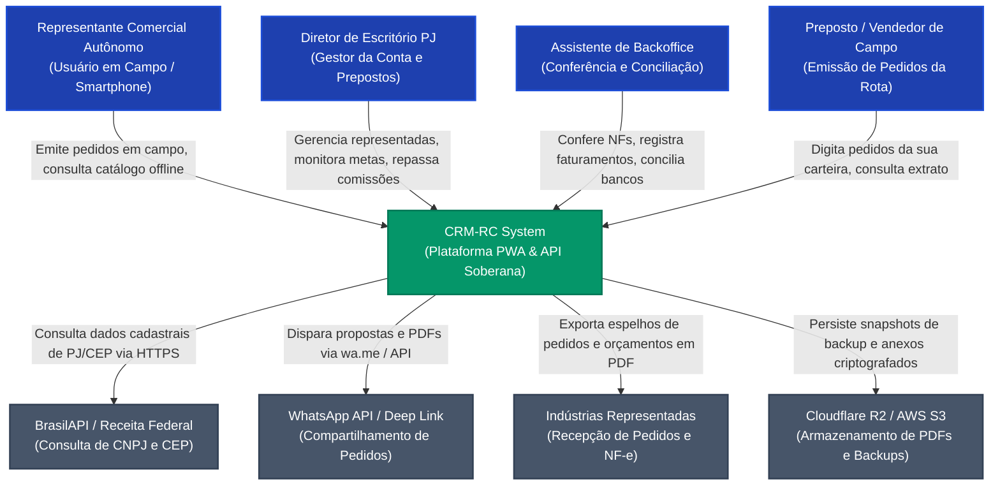
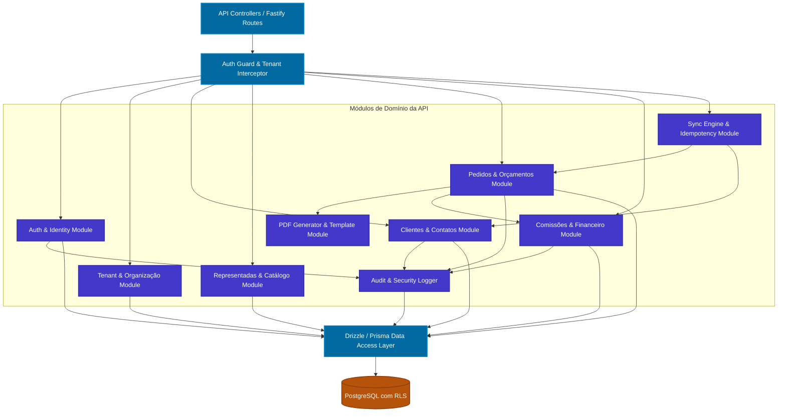

# Arquitetura de Solução, Modelo C4 e Registros de Decisão Arquitetural (ADRs)
## CRM-RC: CRM para Representantes Comerciais Multi-Representadas

---

### 📋 Controle do Documento
| Item | Descrição |
| :--- | :--- |
| **Código do Documento** | `ARCH-SDLC-2.1` |
| **Versão** | `1.0.0` |
| **Status** | Aprovado |
| **Data de Emissão** | 30 de Agosto de 2026 |
| **Épico Vinculado** | [Épico #2: Arquitetura Técnica de Software, Modelo de Dados e Design UI/UX](https://github.com/fabiooliveir/crm-rc/issues/2) |
| **Issue de Entrega** | [Issue #16: [SDLC 2.1] Definição da Stack Tecnológica e Arquitetura de Solução](https://github.com/fabiooliveir/crm-rc/issues/16) |
| **Documentos Relacionados** | [FRD-Especificacao-Requisitos-Funcionais.md](../requirements/FRD-Especificacao-Requisitos-Funcionais.md) (`SDLC 1.1`), [PERSONAS-E-JORNADA-DO-USUARIO.md](../requirements/PERSONAS-E-JORNADA-DO-USUARIO.md) (`SDLC 1.2`), [RNF-Requisitos-Nao-Funcionais-e-LGPD.md](../requirements/RNF-Requisitos-Nao-Funcionais-e-LGPD.md) (`SDLC 1.3`), [MODELAGEM-CONCEITUAL-DE-DOMINIO.md](../requirements/MODELAGEM-CONCEITUAL-DE-DOMINIO.md) (`SDLC 1.4`) |

---

## 1. 🎯 Visão Geral da Arquitetura & Objetivos de Engenharia

O **CRM-RC** foi arquitetado sob o paradigma **Offline-First**, **Mobile-First** e **Multi-Tenant Soberano**, atendendo com extrema agilidade representantes comerciais autônomos e escritórios de representação no mercado brasileiro.

### 📐 Atributos de Qualidade Arquiteturais (Quality Attributes)
1. **Soberania e Blindagem de Dados:** O isolamento de dados entre representantes e indústrias parceiras é garantido a nível de banco de dados por *Row-Level Security* (RLS) mandatória no PostgreSQL.
2. **Resiliência e Desacoplamento Offline:** Toda a operação em campo (cadastro de clientes, consulta de catálogos e emissão de pedidos) é executada localmente no navegador/smartphone via IndexedDB (Dexie.js), sincronizando assincronamente com o backend.
3. **Performance Máxima (Core Web Vitals):** Adoção de Server-Side Rendering (SSR) e Static Site Generation (SSG) no Next.js App Router, garantindo LCP $\le 1.2\text{s}$ sob redes móveis 3G/4G.
4. **Tipagem e Produtividade Full-Stack:** TypeScript de ponta a ponta, compartilhando esquemas de validação (Zod), tipos de domínio e contratos de API entre frontend e backend.

---

## 2. 🏛️ Diagramas de Arquitetura de Software (Modelo C4)

O modelo C4 descreve a arquitetura em diferentes níveis de granularidade:

### 2.1. C4 Nível 1: Diagrama de Contexto de Sistema (System Context)

Mostra como os diferentes atores interagem com o sistema CRM-RC e os limites com serviços externos.



---

### 2.2. C4 Nível 2: Diagrama de Containers (Container Diagram)

Apresenta as aplicações, bancos de dados, storages e serviços executáveis que compõem a solução CRM-RC.

```mermaid
graph TB
    classDef clientStyle fill:#2563eb,stroke:#1d4ed8,stroke-width:2px,color:#ffffff;
    classDef apiStyle fill:#0d9488,stroke:#0f766e,stroke-width:2px,color:#ffffff;
    classDef dbStyle fill:#d97706,stroke:#b45309,stroke-width:2px,color:#ffffff;
    classDef storeStyle fill:#64748b,stroke:#475569,stroke-width:2px,color:#ffffff;

    subgraph Client_Layer [Camada Cliente (Navegador & Mobile PWA)]
        PWA["Frontend PWA Container<br/>(Next.js 15 App Router / React 19 / Tailwind)"]:::clientStyle
        SW["Service Worker Container<br/>(Workbox Cache API & Background Sync)"]:::clientStyle
        IDB[("IndexedDB Storage<br/>(Dexie.js - Cache Offline Local)")]:::dbStyle
    end

    subgraph Edge_Security [Borda e Segurança]
        WAF["Edge Gateway & WAF<br/>(Cloudflare / TLS 1.3 / Rate Limiting)"]:::storeStyle
    end

    subgraph Backend_Layer [Camada de Aplicação & Backend]
        API["Backend API Container<br/>(Node.js / NestJS / Fastify / TypeScript)"]:::apiStyle
        WORKER["Background Worker Container<br/>(BullMQ / Redis - Jobs & Conciliação)"]:::apiStyle
    end

    subgraph Persistence_Layer [Camada de Persistência Central]
        DB[("PostgreSQL 16 Database<br/>(Row-Level Security RLS / Prisma / Drizzle)")]:::dbStyle
        REDIS[("Redis Cache & Queue<br/>(Sessões e Fila de Processamento)")]:::dbStyle
        STORAGE[("Object Storage R2/S3<br/>(PDFs, XMLs e Backups AES-256)")]:::storeStyle
    end

    PWA <-->|Lê/Grava dados locais| IDB
    PWA <-->|Intercepta requisições| SW
    SW -->|Sincroniza mutações offline (HTTPS/JWT)| WAF
    PWA -->|Requisições dinâmicas (HTTPS/JWT)| WAF
    WAF -->|Roteia tráfego seguro| API

    API -->|Consultas e Mutações com RLS| DB
    API -->|Gerencia filas de tarefas e cache de sessão| REDIS
    API -->|Upload e download de documentos| STORAGE
    WORKER -->|Consome fila de background| REDIS
    WORKER -->|Executa rotinas de backup e conciliação| DB
```

---

### 2.3. C4 Nível 3: Diagrama de Componentes (Component Diagram - Backend API & Sync Engine)

Detalha a estrutura modular interna da API de backend e sua engine de sincronização.



---

## 3. 📝 Registros de Decisão Arquitetural (ADRs)

---

### `ADR-001`: Adoção do Next.js (App Router) + React para o Frontend PWA

* **Status:** Aprovado
* **Data:** 30/08/2026
* **Contexto:**
  O sistema requer suporte a Progressive Web App (PWA) instalável em celulares (Android e iOS) sem passar por lojas de aplicativos, altíssima performance de carregamento inicial em conexões 3G/4G (< 1.2s), facilidade de renderização híbrida (SSR para SEO/painéis administrativos e CSR para telas altamente interativas de pedidos).
* **Decisão:**
  Adotar **Next.js 15 (App Router)** com **React 19**, **Tailwind CSS** e **Shadcn UI / Radix UI**.
* **Racional & Vantagens:**
  - *Server-Side Rendering (SSR) & Server Components:* Reduz drasticamente o bundle JavaScript inicial entregue ao navegador móvel.
  - *Ecossistema PWA Maduro:* Suporte nativo a `manifest.json`, Service Workers via `@serwist/next` / Workbox e instalação standalone na tela inicial do smartphone.
  - *Shadcn UI:* Componentes acessíveis (WCAG AA), customizáveis e leves, com touch targets ergonômicos para uso em campo.
* **Alternativas Consideradas:**
  - *SPA puro com Vite / React:* Descartado pela lentidão no primeiro carregamento (Time to Interactive) e falta de suporte nativo a SSR.
  - *React Native / Flutter:* Descartado na v1.0 devido à complexidade de publicação em lojas da Apple/Google, burocracia de aprovação e custo de manter múltiplos codebases.
* **Consequências / Trade-offs:**
  - Exige atenção na separação estrita de Server Components (`async`) e Client Components (`"use client"` para componentes com estado local/IndexedDB).

---

### `ADR-002`: Adoção de Node.js com NestJS / Fastify e TypeScript Unificado

* **Status:** Aprovado
* **Data:** 30/08/2026
* **Contexto:**
  A API precisa processar sincronizações assíncronas de múltiplos pedidos em lote, consultas de catálogos com paginação virtual e validações de regras de negócios fiscais com baixíssima latência ($\text{P95} \le 150\text{ms}$).
* **Decisão:**
  Adotar **Node.js (LTS)** com **NestJS** (utilizando adaptador **Fastify**) e **TypeScript estrito**.
* **Racional & Vantagens:**
  - *Fastify Adapter:* Proporciona vazão de até 30.000 requisições/segundo com overhead de memória 2x menor que o Express.
  - *TypeScript Unificado (Full-Stack):* Permite compartilhar DTOs, esquemas de validação Zod e interfaces de entidades diretamente entre o frontend Next.js e o backend NestJS através de um monorepo ou pacote compartilhado.
  - *Arquitetura Modular:* A estrutura de módulos, injeção de dependência e guards do NestJS facilita a manutenção e a implementação do isolamento Multi-Tenant.
* **Alternativas Consideradas:**
  - *Python com FastAPI:* Descartado para evitar fragmentação de linguagem no time de desenvolvimento (duplicidade de tipos TypeScript vs Pydantic).
  - *Go (Golang):* Excelente desempenho, mas descartado pelo custo mais elevado de modelagem e menor velocidade de prototipação na fase inicial.
* **Consequências / Trade-offs:**
  - Exige disciplina no design de módulos para evitar acoplamento circular entre serviços de pedidos e comissões.

---

### `ADR-003`: PostgreSQL com Row-Level Security (RLS) e Drizzle / Prisma ORM

* **Status:** Aprovado
* **Data:** 30/08/2026
* **Contexto:**
  O sistema gerencia dados concorrentes de múltiplos escritórios e representantes independentes. O vazamento de dados de um cliente de uma representada para outra é um risco crítico inaceitável (`RN-01`).
* **Decisão:**
  Adotar **PostgreSQL 16** com **Row-Level Security (RLS)** nativa ativada em todas as tabelas de negócio, operado via **Drizzle ORM** (ou **Prisma ORM** com extensões de contexto).
* **Racional & Vantagens:**
  - *Segurança em Profundidade:* O RLS garante que mesmo que uma query na camada de aplicação esqueça de filtrar `WHERE tenant_id = ?`, o próprio motor do banco de dados bloqueará o acesso a registros de outros tenants.
  - *Drizzle ORM:* Tipagem TypeScript estrita com zero overhead de runtime, suporte nativo a transações complexas e geração limpa de migrações SQL.
  - *Flexibilidade JSONB:* Permite armazenar metadados variáveis de indústrias e políticas de comissão com alta velocidade de consulta e indexação GIN.
* **Alternativas Consideradas:**
  - *Banco de Dados Separado por Tenant (Multi-DB):* Descartado pelo custo elevado de infraestrutura e complexidade de manutenção de centenas de instâncias de banco.
  - *MongoDB / NoSQL:* Descartado pela necessidade crítica de integridade relacional, chaves estrangeiras e consistência ACID no fechamento de pedidos e comissões.
* **Consequências / Trade-offs:**
  - O pool de conexões (PgBouncer) deve ser configurado no modo de transação para permitir a injeção dinâmica de variáveis de sessão `SET LOCAL app.current_tenant_id = '...'`.

---

### `ADR-004`: Dexie.js (IndexedDB) + Workbox para Persistência Offline-First

* **Status:** Aprovado
* **Data:** 30/08/2026
* **Contexto:**
  Representantes comerciais visitam clientes em armazéns, subsolos e rodovias sem qualquer sinal de rede celular. A emissão de pedidos não pode ser interrompida (`RNF-OFF-01`).
* **Decisão:**
  Utilizar **IndexedDB** encapsulado pela biblioteca **Dexie.js** no client-side, gerenciado por Service Workers construídos com **Workbox**.
* **Racional & Vantagens:**
  - *Capacidade e Estruturação:* O IndexedDB suporta centenas de megabytes de dados (capacidade de armazenar mais de 20.000 produtos com fotos e 2.000 clientes localmente sem estourar quotas).
  - *Dexie.js:* Oferece API idiomática baseada em Promises/TypeScript, suporte a índices compostos e transações atômicas no navegador.
  - *Fila de Saída Idempotente (`outbox_queue`):* Mutações gravadas com UUID v4 são enfileiradas localmente e processadas em lote com retry exponencial ao restabelecer a conexão.
* **Alternativas Consideradas:**
  - *LocalStorage:* Descartado pelo limite estrito de 5 MB, natureza síncrona que trava a thread principal e falta de indexação.
  - *SQLite via WASM (WebAssembly):* Descartado devido ao peso excessivo do binário inicial (~2 MB adicionais de download) e complexidade de compilação.
* **Consequências / Trade-offs:**
  - Exige desenvolvimento de camada de repositório duplo (Repositório Local IndexedDB + Repositório Remoto API) com sincronização transparente.

---

### `ADR-005`: Autenticação JWT com Cookies HttpOnly e Multi-Tenancy Nativo

* **Status:** Aprovado
* **Data:** 30/08/2026
* **Contexto:**
  O sistema precisa garantir autenticação segura em aplicações Web e PWA móveis, protegendo tokens contra ataques XSS e CSRF, com controle estrito de papéis (`ADMIN_TITULAR`, `PREPOSTO_CAMPO`, `ASSISTENTE`).
* **Decisão:**
  Implementar autenticação baseada em **JSON Web Tokens (JWT)** com pares de Access Token (15 min de validade) e Refresh Token (30 dias com rotação), trafegados estritamente em **Cookies `HttpOnly`, `Secure` e `SameSite=Strict`**.
* **Racional & Vantagens:**
  - *Imunidade a Roubo por XSS:* Por estarem em cookies `HttpOnly`, os tokens não podem ser lidos via JavaScript malicioso injetado no navegador.
  - *Contexto de Tenant Embutido:* O payload do Access Token carrega `sub` (User ID), `tenant_id` e `role`, permitindo validação imediata de permissão no backend sem queries adicionais de sessão.
  - *Proteção CSRF Nativa:* O atributo `SameSite=Strict` bloqueia o envio de cookies em requisições cross-site.
* **Alternativas Consideradas:**
  - *Armazenamento de JWT em LocalStorage:* Descartado por alta vulnerabilidade a ataques de extração via XSS.
* **Consequências / Trade-offs:**
  - Requisições feitas pelo Service Worker em background precisam lidar corretamente com credenciais incluídas (`credentials: 'include'`).

---

### `ADR-006`: Geração de PDFs de Pedidos no Client-Side via `@react-pdf/renderer`

* **Status:** Aprovado
* **Data:** 30/08/2026
* **Contexto:**
  O representante comercial precisa gerar e entregar a proposta comercial em PDF no WhatsApp do cliente imediatamente após o fechamento, mesmo estando totalmente offline (`UC-06` / `RNF-PER-06`).
* **Decisão:**
  Adotar a biblioteca **`@react-pdf/renderer`** para compilação e renderização do PDF diretamente na thread do navegador/dispositivo móvel.
* **Racional & Vantagens:**
  - *Zero Dependência de Rede:* O PDF é gerado a partir do estado local do IndexedDB sem necessitar de chamada a endpoints de renderização no servidor.
  - *Velocidade Extrema:* Geração concluída em menos de 800ms em smartphones comuns.
  - *Economia de Infraestrutura:* Elimina custos de servidores dedicados a instâncias de headless browsers (Puppeteer/Chromium).
* **Alternativas Consideradas:**
  - *Puppeteer / Chromium no Backend:* Descartado por ser inoperante em modo offline e pelo consumo altíssimo de CPU e memória RAM em servidores cloud.
  - *jsPDF puro:* Descartado pela dificuldade de manutenção de layouts complexos e falta de suporte a componentes declarativos React.
* **Consequências / Trade-offs:**
  - Layouts de PDF devem ser estilizados utilizando a sintaxe específica de Flexbox e StyleSheet do `@react-pdf/renderer`.

---

## 4. 📊 Matriz de Rastreabilidade (Stack Técnica x Requisitos Não-Funcionais)

| Tecnologia Escolhida | Requisito Não-Funcional Atendido | Justificativa Técnica |
| :--- | :--- | :--- |
| **Next.js 15 App Router** | `RNF-PER-01` (LCP $\le 1.2\text{s}$) | Server Components entregam HTML pré-renderizado ultraleve. |
| **Dexie.js + IndexedDB** | `RNF-OFF-01`, `RNF-OFF-02` (Offline 100%) | Armazena catálogos e clientes com suporte a queries indexadas. |
| **PostgreSQL + RLS** | `RNF-SOB-01`, `RNF-SEC-05` (Isolamento) | Bloqueio nativo no banco contra acesso a dados de outros tenants. |
| **JWT em Cookies HttpOnly** | `RNF-SEC-03`, `RNF-SEC-04` (OWASP/XSS) | Proteção mandatória contra roubo de tokens em navegadores. |
| **`@react-pdf/renderer`** | `RNF-PER-06`, `RNF-OFF-01` (PDF Offline) | Compilação local em $< 800\text{ms}$ sem depender de servidores. |
| **Cloudflare TLS 1.3 / WAF** | `RNF-SEC-01`, `RNF-SEC-06` (Criptografia) | Tráfego criptografado, rate limiting e mitigação de DDoS. |
| **BullMQ + Redis** | `RNF-REL-01`, `RNF-PER-04` (Alta Vazão) | Processamento assíncrono de notificações e conciliações em massa. |
