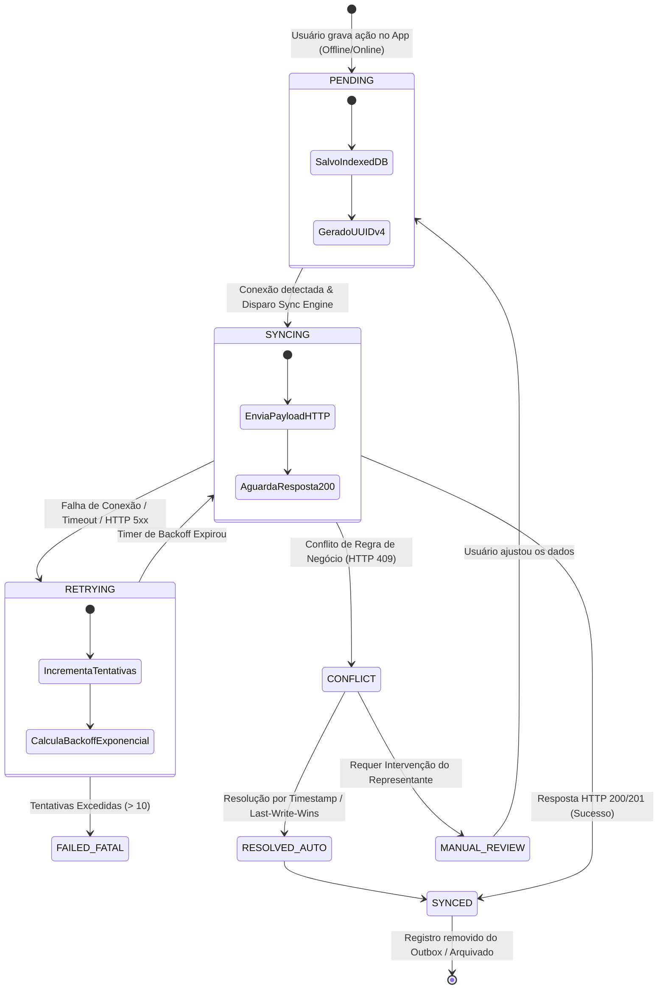
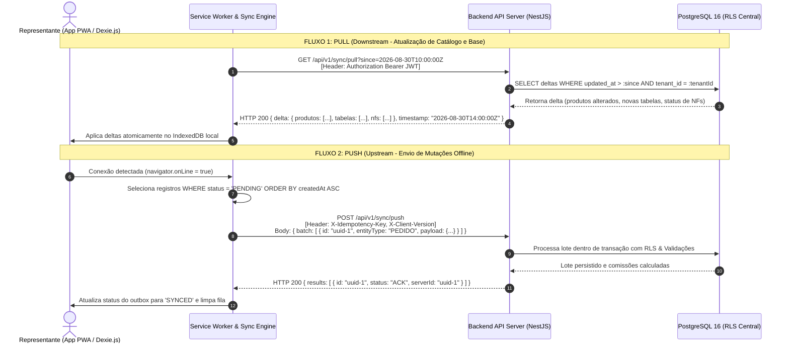
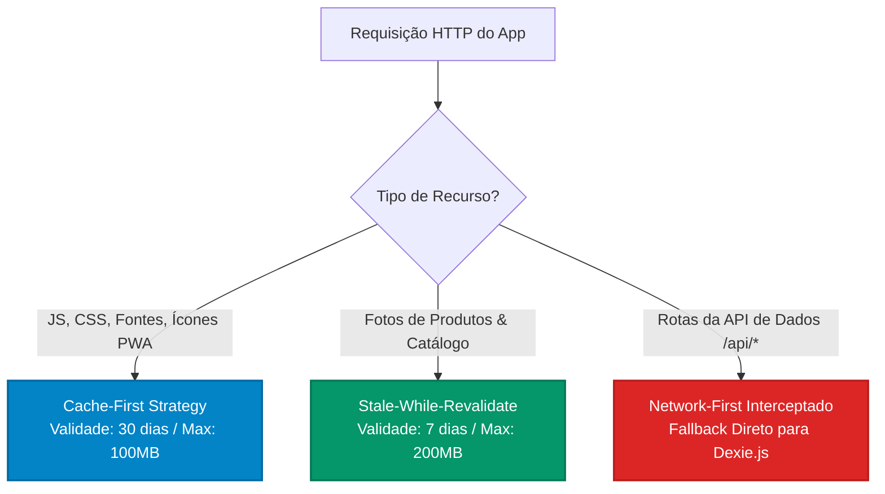

# Estratégia de Cache, Persistência Local e Sincronização Offline-First
## CRM-RC: CRM para Representantes Comerciais Multi-Representadas

---

### 📋 Controle do Documento
| Item | Descrição |
| :--- | :--- |
| **Código do Documento** | `SYNC-SDLC-2.3` |
| **Versão** | `1.0.0` |
| **Status** | Aprovado |
| **Data de Emissão** | 30 de Agosto de 2026 |
| **Épico Vinculado** | [Épico #2: Arquitetura Técnica de Software, Modelo de Dados e Design UI/UX](https://github.com/fabiooliveir/crm-rc/issues/2) |
| **Issue de Entrega** | [Issue #18: [SDLC 2.3] Estratégia de Cache e Sincronização Offline (PWA / IndexedDB)](https://github.com/fabiooliveir/crm-rc/issues/18) |
| **Documentos Relacionados** | [RNF-Requisitos-Nao-Funcionais-e-LGPD.md](../requirements/RNF-Requisitos-Nao-Funcionais-e-LGPD.md) (`SDLC 1.3`), [MODELAGEM-CONCEITUAL-DE-DOMINIO.md](../requirements/MODELAGEM-CONCEITUAL-DE-DOMINIO.md) (`SDLC 1.4`), [ARQUITETURA-DE-SOLUCAO-E-STACK.md](ARQUITETURA-DE-SOLUCAO-E-STACK.md) (`SDLC 2.1`) |

---

## 1. 🎯 Visão Geral da Arquitetura Offline-First

O representante comercial passa grande parte do seu expediente em deslocamento entre cidades, rodovias estaduais, subsolos de shopping centers ou galpões rurais sem cobertura de rede móvel (3G/4G/5G). 

No **CRM-RC**, o modo offline **não é um estado de erro ou contingência degradada**, mas sim um **cidadão de primeira classe da arquitetura de software**.

### 🌟 Princípios de Engenharia Offline
1. **Local-First Writes (Gravação Imediata Local):** Toda operação de criação ou alteração (emissão de pedido, anotação de visita, novo cliente) é gravada **instantaneamente** no banco local IndexedDB antes de qualquer tentativa de comunicação de rede.
2. **Outbox Pattern Idempotente:** Todas as mutações locais são enfileiradas na tabela `outbox_queue` com chaves de idempotência baseadas em UUID v4 (`uuid_offline`).
3. **Delta Sync Assíncrono:** O tráfego de dados entre cliente e nuvem é estritamente incremental, trafegando apenas registros modificados a partir do cursor temporal `last_synced_at`.
4. **Zero Bloqueio de Interface:** A UI responde em $< 50\text{ms}$ a qualquer ação do usuário, independentemente do status de conectividade `navigator.onLine`.

---

## 2. 🔄 Ciclo de Vida da Fila de Sincronização (Outbox Pattern)

O diagrama a seguir descreve a máquina de estados de uma mutação registrada em campo:



---

## 3. 🗄️ Modelagem do Banco Local IndexedDB (Dexie.js)

O banco de dados local do cliente é estruturado através do **Dexie.js** com os seguintes stores e índices:

```typescript
// Estrutura do Banco Local Dexie.js (CrmLocalDatabase)
export interface OutboxItem {
  id: string;                      // UUID v4 local (Chave Primária)
  tenantId: string;                // ID do tenant isolado
  userId: string;                  // Usuário autor da mutação
  entityType: 'PEDIDO' | 'CLIENTE' | 'CONTATO' | 'VISITA';
  operation: 'CREATE' | 'UPDATE' | 'DELETE';
  payload: Record<string, any>;    // Dados completos do objeto
  status: 'PENDING' | 'SYNCING' | 'SYNCED' | 'FAILED' | 'CONFLICT';
  attempts: number;                // Contador de tentativas
  lastAttemptAt?: number;          // Timestamp da última tentativa
  errorMessage?: string;           // Detalhes em caso de falha
  createdAt: number;               // Data de criação local
}

export interface SyncMetadata {
  key: string;                     // Ex: 'catalog_last_synced_at', 'clients_last_synced_at'
  timestamp: string;               // ISO 8601 UTC
}
```

### 📋 Mapeamento de Stores e Índices Dexie
```typescript
const db = new Dexie('crm_rc_local_db');

db.version(1).stores({
  // Stores de Leitura e Trabalho em Campo (Sincronizados via Pull)
  local_clientes: 'id, tenant_id, razao_social, cnpj_cpf, status, uf, cidade, updated_at',
  local_contatos: 'id, cliente_id, nome, whatsapp, cargo',
  local_representadas: 'id, tenant_id, razao_social, status, updated_at',
  local_produtos: 'id, representada_id, codigo_fabrica, ean, categoria, updated_at',
  local_tabelas_preco: 'id, representada_id, nome, vigencia_fim',
  local_itens_tabela: 'id, tabela_id, produto_id, preco_base',
  
  // Store de Pedidos Locais (Histórico recente do representante)
  local_pedidos: 'id, tenant_id, cliente_id, representada_id, status, data_emissao, updated_at',
  
  // Fila de Saída (Outbox Pattern)
  outbox_queue: 'id, tenantId, entityType, operation, status, createdAt, attempts',
  
  // Metadados de Controle de Sincronização
  sync_metadata: 'key'
});
```

---

## 4. 🌐 Protocolo de Sincronização Bidirecional Cliente-Servidor

A sincronização é composta por dois fluxos ortogonais: **Pull (Downstream)** e **Push (Upstream)**.



---

### 4.1. Especificação do Endpoint de Push (Upstream)

* **Rota:** `POST /api/v1/sync/push`
* **Headers Obrigatórios:**
  - `Authorization: Bearer <JWT_TOKEN>`
  - `Content-Type: application/json`
  - `X-Client-Timestamp: 2026-08-30T17:45:00.000Z`
  - `X-Client-Version: 1.0.0`

#### Payload de Exemplo (Envio de Pedido Emitido Offline):
```json
{
  "batchId": "b1f89410-e7f0-4a8e-8a21-9988aabbcc01",
  "mutations": [
    {
      "mutationId": "f47ac10b-58cc-4372-a567-0e02b2c3d479",
      "entityType": "PEDIDO",
      "operation": "CREATE",
      "timestamp": "2026-08-30T14:30:00.000Z",
      "payload": {
        "id": "f47ac10b-58cc-4372-a567-0e02b2c3d479",
        "clienteId": "a1b2c3d4-0000-1111-2222-333344445555",
        "representadaId": "e5f6a7b8-9999-8888-7777-666655554444",
        "tabelaPrecoId": "c9d8e7f6-1234-5678-90ab-cdef12345678",
        "condicaoPagamento": "28/42/56 DDL",
        "tipoFrete": "CIF",
        "totalBruto": 4732.00,
        "totalLiquido": 4732.00,
        "comissaoPrevista": 236.60,
        "itens": [
          {
            "produtoId": "p1-tinta-18l",
            "quantidade": 20,
            "quantidadeCaixas": 10,
            "precoUnitario": 185.00,
            "descontoPct": 0.0,
            "subtotal": 3700.00
          },
          {
            "produtoId": "p2-verniz-3.6l",
            "quantidade": 16,
            "quantidadeCaixas": 4,
            "precoUnitario": 64.50,
            "descontoPct": 0.0,
            "subtotal": 1032.00
          }
        ]
      }
    }
  ]
}
```

#### Resposta de Sucesso do Servidor:
```json
{
  "batchId": "b1f89410-e7f0-4a8e-8a21-9988aabbcc01",
  "processedAt": "2026-08-30T17:45:02.120Z",
  "results": [
    {
      "mutationId": "f47ac10b-58cc-4372-a567-0e02b2c3d479",
      "status": "ACK",
      "entityId": "f47ac10b-58cc-4372-a567-0e02b2c3d479",
      "comissaoId": "com-98765432-aaaa-bbbb-cccc-ddddeeeeffff"
    }
  ]
}
```

---

## 5. 🛡️ Políticas Determinísticas de Resolução de Conflitos

| Tipo de Dado | Natureza da Mutação | Estratégia de Resolução | Racional de Domínio |
| :--- | :--- | :--- | :--- |
| **Pedidos de Venda** | `CREATE` | **Append-Only Idempotente** | O UUID v4 é gerado no smartphone. Não há colisão de chaves nem sobrescrita. |
| **Itens de Pedido** | `CREATE` | **Snapshot Histórico** | Preços e descontos gravados no momento da digitação prevalecem (`RN-02`). |
| **Cadastro de Clientes** | `UPDATE` | **Field-Level Merge com Prioridade Servidor** | Se o escritório alterou o limite de crédito na web enquanto o representante alterou o telefone em campo, ambos os campos são mesclados com sucesso. |
| **Tabelas de Preço** | `UPDATE` | **Server Authoritative** | O servidor é a autoridade máxima em listas de preços e políticas comerciais. |
| **Check-in de Visita** | `CREATE` | **Append-Only Imutável** | Linha do tempo cumulativa de visitas em campo. |

---

## 6. ⚡ Estratégia de Caching com Service Worker (Workbox)

A aplicação PWA utiliza **Workbox** integrado ao Next.js através das seguintes estratégias de cache:



### 📋 Detalhamento das Regras do Service Worker
1. **Assets do Core (`Cache-First`):**
   - Rota: `/_next/static/*`, `/fonts/*`, `/icons/*`, `favicon.ico`.
   - Plugin: `ExpirationPlugin` com maxEntries de 150 itens e maxAgeSeconds de 30 dias.
2. **Imagens de Produtos (`Stale-While-Revalidate`):**
   - Rota: `/media/produtos/*`, `https://*.r2.cloudflarestorage.com/*`.
   - Retorna a foto do cache local imediatamente para a UI não travar e atualiza em segundo plano se houver conexão.
3. **Background Sync API (`sync-outbox-orders`):**
   - O Service Worker registra a tag de sincronização periódica no sistema operacional Android/iOS. Quando a conexão oscilar e voltar, o próprio SO acorda o Service Worker para esvaziar a `outbox_queue`.

---

## 7. 🔗 Rastreabilidade com os Requisitos Não-Funcionais

| Diretriz de Sincronização | Requisito Não-Funcional Atendido |
| :--- | :--- |
| **Operação 100% Offline** | `RNF-OFF-01`, `RNF-OFF-02` |
| **Idempotência por UUID v4** | `RNF-OFF-03`, `RNF-SEC-05` |
| **Performance de Escrita Local $< 50\text{ms}$** | `RNF-PER-01`, `RNF-PER-02` |
| **Armazenamento Seguro de Tokens** | `RNF-SEC-03`, `RNF-SEC-04` |
| **Consistência em Redes Rurais/Instáveis** | `RNF-REL-01`, `RNF-REL-03` |
