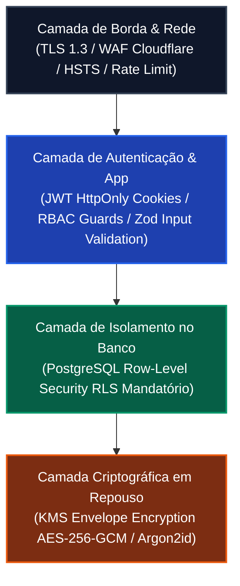
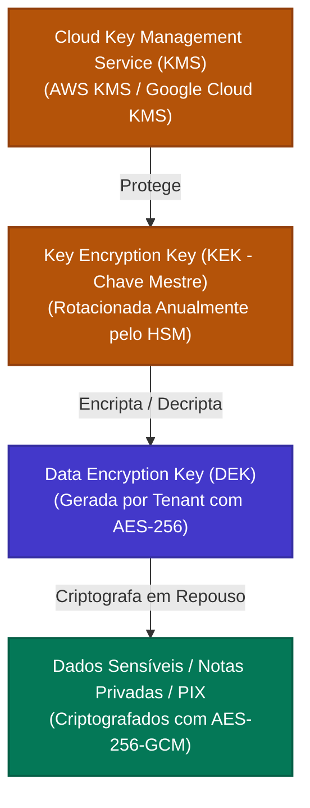

# Política de Segurança da Informação, Criptografia e Isolamento RLS
## CRM-RC: CRM para Representantes Comerciais Multi-Representadas

---

### 📋 Controle do Documento
| Item | Descrição |
| :--- | :--- |
| **Código do Documento** | `SEC-SDLC-2.4` |
| **Versão** | `1.0.0` |
| **Status** | Aprovado |
| **Data de Emissão** | 30 de Agosto de 2026 |
| **Épico Vinculado** | [Épico #2: Arquitetura Técnica de Software, Modelo de Dados e Design UI/UX](https://github.com/fabiooliveir/crm-rc/issues/2) |
| **Issue de Entrega** | [Issue #19: [SDLC 2.4] Política de Segurança, Criptografia e Isolamento de Dados](https://github.com/fabiooliveir/crm-rc/issues/19) |
| **Documentos Relacionados** | [RNF-Requisitos-Nao-Funcionais-e-LGPD.md](../requirements/RNF-Requisitos-Nao-Funcionais-e-LGPD.md) (`SDLC 1.3`), [MODELAGEM-CONCEITUAL-DE-DOMINIO.md](../requirements/MODELAGEM-CONCEITUAL-DE-DOMINIO.md) (`SDLC 1.4`), [ARQUITETURA-DE-SOLUCAO-E-STACK.md](ARQUITETURA-DE-SOLUCAO-E-STACK.md) (`SDLC 2.1`) |

---

## 1. 🛡️ Visão Geral da Arquitetura de Segurança & Soberania

A soberania e a blindagem da carteira de clientes constituem a fundação do **CRM-RC**. A arquitetura de segurança adota o modelo de **Defesa em Profundidade (*Defense-in-Depth*)**, distribuindo controles rigorosos em todas as camadas da aplicação:



---

## 2. 🗄️ Arquitetura de Isolamento Multi-Tenant com Row-Level Security (RLS)

O isolamento de dados no CRM-RC é executado nativamente pelo motor relacional do **PostgreSQL 16**. Mesmo que um desenvolvedor omita uma cláusula `WHERE tenant_id = ?` em uma consulta ORM, a política de RLS filtra automaticamente os registros com base no contexto da transação.

### 2.1. Mecanismo de Injeção de Contexto por Transação

A cada requisição autenticada, o middleware da API obtém o `tenant_id` do payload do token JWT e injeta a variável de sessão local antes de executar qualquer query:

```sql
-- Executado no início de cada transação de banco de dados
SET LOCAL app.current_tenant_id = 'a1b2c3d4-0000-1111-2222-333344445555';
```

### 2.2. Função Auxiliar de Leitura de Tenant Seguro
```sql
CREATE OR REPLACE FUNCTION current_tenant_id() 
RETURNS UUID AS $$
BEGIN
    RETURN NULLIF(current_setting('app.current_tenant_id', true), '')::UUID;
END;
$$ LANGUAGE plpgsql STABLE SECURITY DEFINER;
```

---

### 2.3. Políticas Formais de RLS para Todas as Tabelas de Negócio

Para todas as tabelas, o RLS é ativado e forçado (incluindo para os donos da tabela):

```sql
-- 1. Ativação Mandatória de RLS
ALTER TABLE tenants ENABLE ROW LEVEL SECURITY;
ALTER TABLE tenants FORCE ROW LEVEL SECURITY;

ALTER TABLE users ENABLE ROW LEVEL SECURITY;
ALTER TABLE users FORCE ROW LEVEL SECURITY;

ALTER TABLE representadas ENABLE ROW LEVEL SECURITY;
ALTER TABLE representadas FORCE ROW LEVEL SECURITY;

ALTER TABLE produtos ENABLE ROW LEVEL SECURITY;
ALTER TABLE produtos FORCE ROW LEVEL SECURITY;

ALTER TABLE tabelas_preco ENABLE ROW LEVEL SECURITY;
ALTER TABLE tabelas_preco FORCE ROW LEVEL SECURITY;

ALTER TABLE itens_tabela_preco ENABLE ROW LEVEL SECURITY;
ALTER TABLE itens_tabela_preco FORCE ROW LEVEL SECURITY;

ALTER TABLE regras_comissao ENABLE ROW LEVEL SECURITY;
ALTER TABLE regras_comissao FORCE ROW LEVEL SECURITY;

ALTER TABLE clientes ENABLE ROW LEVEL SECURITY;
ALTER TABLE clientes FORCE ROW LEVEL SECURITY;

ALTER TABLE contatos_cliente ENABLE ROW LEVEL SECURITY;
ALTER TABLE contatos_cliente FORCE ROW LEVEL SECURITY;

ALTER TABLE interacoes_timeline ENABLE ROW LEVEL SECURITY;
ALTER TABLE interacoes_timeline FORCE ROW LEVEL SECURITY;

ALTER TABLE pedidos_venda ENABLE ROW LEVEL SECURITY;
ALTER TABLE pedidos_venda FORCE ROW LEVEL SECURITY;

ALTER TABLE itens_pedido ENABLE ROW LEVEL SECURITY;
ALTER TABLE itens_pedido FORCE ROW LEVEL SECURITY;

ALTER TABLE notas_fiscais ENABLE ROW LEVEL SECURITY;
ALTER TABLE notas_fiscais FORCE ROW LEVEL SECURITY;

ALTER TABLE comissoes ENABLE ROW LEVEL SECURITY;
ALTER TABLE comissoes FORCE ROW LEVEL SECURITY;

ALTER TABLE repasses_preposto ENABLE ROW LEVEL SECURITY;
ALTER TABLE repasses_preposto FORCE ROW LEVEL SECURITY;

ALTER TABLE audit_logs ENABLE ROW LEVEL SECURITY;
ALTER TABLE audit_logs FORCE ROW LEVEL SECURITY;
```

#### Políticas SQL Específicas por Tabela:

```sql
-- Política de Tenants (Usuário só acessa o seu próprio Tenant)
CREATE POLICY tenant_isolation_policy ON tenants
    FOR ALL
    USING (id = current_tenant_id())
    WITH CHECK (id = current_tenant_id());

-- Política de Usuários (Acesso a membros do mesmo Tenant)
CREATE POLICY user_tenant_isolation ON users
    FOR ALL
    USING (tenant_id = current_tenant_id())
    WITH CHECK (tenant_id = current_tenant_id());

-- Política de Representadas
CREATE POLICY representada_tenant_isolation ON representadas
    FOR ALL
    USING (tenant_id = current_tenant_id())
    WITH CHECK (tenant_id = current_tenant_id());

-- Política de Produtos
CREATE POLICY produto_tenant_isolation ON produtos
    FOR ALL
    USING (tenant_id = current_tenant_id())
    WITH CHECK (tenant_id = current_tenant_id());

-- Política de Tabelas de Preço
CREATE POLICY tabela_preco_tenant_isolation ON tabelas_preco
    FOR ALL
    USING (tenant_id = current_tenant_id())
    WITH CHECK (tenant_id = current_tenant_id());

-- Política de Itens de Tabela de Preço
CREATE POLICY item_tabela_tenant_isolation ON itens_tabela_preco
    FOR ALL
    USING (tenant_id = current_tenant_id())
    WITH CHECK (tenant_id = current_tenant_id());

-- Política de Regras de Comissão
CREATE POLICY regra_comissao_tenant_isolation ON regras_comissao
    FOR ALL
    USING (tenant_id = current_tenant_id())
    WITH CHECK (tenant_id = current_tenant_id());

-- Política de Clientes (Propriedade Soberana do Tenant)
CREATE POLICY cliente_tenant_isolation ON clientes
    FOR ALL
    USING (tenant_id = current_tenant_id())
    WITH CHECK (tenant_id = current_tenant_id());

-- Política de Contatos de Clientes
CREATE POLICY contato_tenant_isolation ON contatos_cliente
    FOR ALL
    USING (tenant_id = current_tenant_id())
    WITH CHECK (tenant_id = current_tenant_id());

-- Política de Linha do Tempo e Visitas
CREATE POLICY interacao_tenant_isolation ON interacoes_timeline
    FOR ALL
    USING (tenant_id = current_tenant_id())
    WITH CHECK (tenant_id = current_tenant_id());

-- Política de Pedidos de Venda
CREATE POLICY pedido_tenant_isolation ON pedidos_venda
    FOR ALL
    USING (tenant_id = current_tenant_id())
    WITH CHECK (tenant_id = current_tenant_id());

-- Política de Itens de Pedido
CREATE POLICY item_pedido_tenant_isolation ON itens_pedido
    FOR ALL
    USING (tenant_id = current_tenant_id())
    WITH CHECK (tenant_id = current_tenant_id());

-- Política de Notas Fiscais
CREATE POLICY nota_fiscal_tenant_isolation ON notas_fiscais
    FOR ALL
    USING (tenant_id = current_tenant_id())
    WITH CHECK (tenant_id = current_tenant_id());

-- Política de Comissões
CREATE POLICY comissao_tenant_isolation ON comissoes
    FOR ALL
    USING (tenant_id = current_tenant_id())
    WITH CHECK (tenant_id = current_tenant_id());

-- Política de Repasses a Prepostos
CREATE POLICY repasse_tenant_isolation ON repasses_preposto
    FOR ALL
    USING (tenant_id = current_tenant_id())
    WITH CHECK (tenant_id = current_tenant_id());

-- Política de Audit Logs (Apenas Leitura e Inserção pelo Tenant)
CREATE POLICY audit_log_tenant_isolation ON audit_logs
    FOR SELECT
    USING (tenant_id = current_tenant_id());

CREATE POLICY audit_log_insert_isolation ON audit_logs
    FOR INSERT
    WITH CHECK (tenant_id = current_tenant_id());
```

---

## 3. 🔐 Arquitetura Criptográfica & Gestão de Chaves (KMS)



### 3.1. Envelope Encryption no Nível de Aplicação
* **Chave Mestre (KEK):** Armazenada de forma segura e não exportável dentro de um Módulo de Segurança de Hardware (HSM) no Cloud KMS.
* **Chaves de Criptografia de Dados (DEKs):** Cada Tenant possui uma chave única gerada via `crypto.randomBytes(32)` e armazenada encriptada no banco de dados.
* **Criptografia Simétrica:** Algoritmo **AES-256-GCM** (Galois/Counter Mode) com vetor de inicialização (IV) único de 12 bytes e tag de autenticação de 16 bytes para garantir confidencialidade e integridade contra adulteração.

### 3.2. Criptografia de Senhas e Credenciais
* Algoritmo: **Argon2id** (vencedor do *Password Hashing Competition*).
* Parâmetros recomendados OWASP:
  - Memória: $m = 65.536\text{ KB}$ (64 MB).
  - Iterações: $t = 3$.
  - Paralelismo: $p = 4$.
  - Salt: 16 bytes aleatórios criptograficamente seguros gerados por CSPRNG.

### 3.3. Criptografia em Trânsito (Data in Transit)
* **TLS 1.3 Estrito:** Desativação de cifras fracas (RC4, DES, 3DES, CBC).
* **HSTS Ativado:** `Strict-Transport-Security: max-age=63072000; includeSubDomains; preload`.

---

## 4. 🛡️ Matriz de Mitigação OWASP Top 10 (2021/2026)

| Código OWASP | Categoria de Vulnerabilidade | Vetor de Ameaça no CRM-RC | Controles Técnicos Implementados |
| :--- | :--- | :--- | :--- |
| **A01:2021** | **Broken Access Control** | Usuário de um escritório tentar acessar pedidos de outro representante. | • Row-Level Security (RLS) no PostgreSQL.<br/>• JWT com injeção de Tenant ID.<br/>• RBAC Guards no NestJS. |
| **A02:2021** | **Cryptographic Failures** | Vazamento de senhas ou dados bancários em repouso. | • Argon2id para senhas.<br/>• Envelope Encryption (AES-256-GCM).<br/>• TLS 1.3 com HSTS. |
| **A03:2021** | **Injection** | Injeção SQL em buscas de produtos ou clientes. | • Queries parametrizadas via Prisma / Drizzle ORM.<br/>• Validação estrita de DTOs com Zod schemas. |
| **A04:2021** | **Insecure Design** | Exportação de dados do representante por uma fábrica parceira. | • Arquitetura Soberana: representadas não possuem chave de leitura na base do tenant. |
| **A05:2021** | **Security Misconfiguration** | Headers inseguros ou logs de depuração em produção. | • Helmet middleware com CSP estrita.<br/>• Desativação de stack traces em produção. |
| **A06:2021** | **Vulnerable Components** | Dependências NPM desatualizadas com CVEs. | • Dependabot com scan diário.<br/>• `npm audit --audit-level=high` obrigatório no pipeline de CI/CD. |
| **A07:2021** | **Auth Failures** | Ataques de força bruta contra login do representante. | • Rate Limiting de 5 tentativas/minuto por IP/e-mail.<br/>• Tokens com rotação e expiração curta (15 min). |
| **A08:2021** | **Integrity Failures** | Manipulação de pacotes na sincronização offline. | • Assinatura de payload e validação de UUID v4 idempotente. |
| **A09:2021** | **Logging Failures** | Falta de rastreabilidade de acessos e deleções. | • Tabela `audit_logs` imutável gravando IP, User-Agent, ação e diff JSONB. |
| **A10:2021** | **SSRF** | Chamadas maliciosas a APIs externas de consulta de CNPJ/CEP. | • Whitelist estrita de domínios permitidos (`brasilapi.com.br`, `receitaws.com.br`). |

---

## 5. 📜 Auditoria Imutável de Segurança (`audit_logs`)

Todas as mutações de dados sensíveis (alteração de percentual de comissão, deleção de cliente, troca de permissão de usuário) disparam um gatilho de auditoria:

```sql
CREATE TABLE IF NOT EXISTS audit_logs (
    id UUID PRIMARY KEY DEFAULT gen_random_uuid(),
    tenant_id UUID NOT NULL REFERENCES tenants(id) ON DELETE CASCADE,
    user_id UUID REFERENCES users(id) ON DELETE SET NULL,
    action VARCHAR(50) NOT NULL,
    entity_name VARCHAR(50) NOT NULL,
    entity_id VARCHAR(100) NOT NULL,
    old_data JSONB,
    new_data JSONB,
    ip_address VARCHAR(45) NOT NULL,
    user_agent TEXT NOT NULL,
    created_at TIMESTAMPTZ NOT NULL DEFAULT CURRENT_TIMESTAMP
);

-- Impede qualquer alteração ou exclusão de logs históricos
CREATE OR REPLACE RULE audit_logs_immutable_update AS ON UPDATE TO audit_logs DO INSTEAD NOTHING;
CREATE OR REPLACE RULE audit_logs_immutable_delete AS ON DELETE TO audit_logs DO INSTEAD NOTHING;
```
