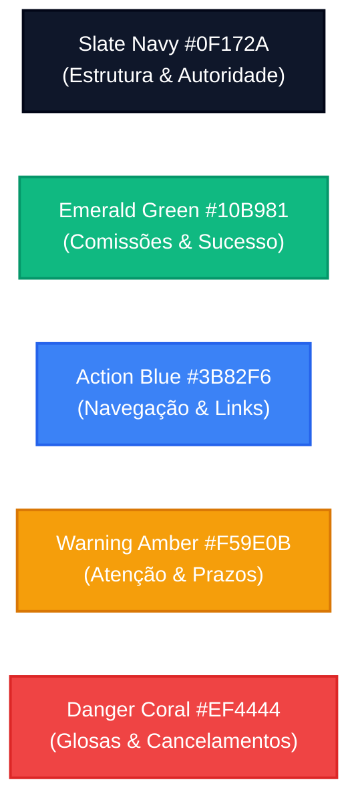

# Design System, Wireframes & Guia de Estilos Mobile-First
## CRM-RC: CRM para Representantes Comerciais Multi-Representadas

---

### 📋 Controle do Documento
| Item | Descrição |
| :--- | :--- |
| **Código do Documento** | `UIX-SDLC-2.2` |
| **Versão** | `1.0.0` |
| **Status** | Aprovado |
| **Data de Emissão** | 30 de Agosto de 2026 |
| **Épico Vinculado** | [Épico #2: Arquitetura Técnica de Software, Modelo de Dados e Design UI/UX](https://github.com/fabiooliveir/crm-rc/issues/2) |
| **Issue de Entrega** | [Issue #17: [SDLC 2.2] Wireframes e Design UI/UX das Telas Principais (Mobile-First)](https://github.com/fabiooliveir/crm-rc/issues/17) |
| **Projeto Stitch MCP** | `projects/17580858458874345646` (`CRM-RC — Mobile-First CRM para Representantes Comerciais`) |
| **Documentos Relacionados** | [PERSONAS-E-JORNADA-DO-USUARIO.md](../requirements/PERSONAS-E-JORNADA-DO-USUARIO.md) (`SDLC 1.2`), [RNF-Requisitos-Nao-Funcionais-e-LGPD.md](../requirements/RNF-Requisitos-Nao-Funcionais-e-LGPD.md) (`SDLC 1.3`), [ARQUITETURA-DE-SOLUCAO-E-STACK.md](../architecture/ARQUITETURA-DE-SOLUCAO-E-STACK.md) (`SDLC 2.1`) |

---

## 1. 🎨 Princípios Fundamentais do Design System

O Design System do **CRM-RC** foi concebido sob a premissa **Mobile-First**, **Operação em Pé / Uma Mão** e **Alta Legibilidade sob Sol Forte**.

### 🌟 Pilares Visuais
1. **Ergonomia do Polegar (Thumb-Driven Interface):** Todas as ações críticas (novo pedido, avançar etapa, busca rápida, discagem de WhatsApp) estão posicionadas na metade inferior da tela do smartphone (Zona de Conforto do Polegar).
2. **Alto Contraste Funcional (Modo Campo):** Paleta calibrada para taxas de contraste WCAG AAA ($\ge 7:1$), evitando tons pasteis ilegíveis sob luz solar direta em pátios e depósitos.
3. **Touch Targets Generosos ($\ge 48\text{px}$):** Botões e seletores com altura mínima de 48px ou 56px para digitação rápida e sem erros de toque.
4. **Densidade de Dados com Clareza:** Apresentação clara de números monetários formatados em fontes tabulares (*Tabular Figures*) e badges de status visualmente distintos.

---

## 2. 🎯 Guia de Estilos & Design Tokens



---

### 2.1. Paleta de Cores (Color Tokens)

| Token Semântico | Hexadecimal | RGB / HSL | Uso Primário na Interface |
| :--- | :--- | :--- | :--- |
| **`color-primary`** (Slate Navy) | `#0F172A` | `rgb(15, 23, 42)` | Header, títulos principais, botões neutros e bordas de foco. |
| **`color-secondary`** (Emerald) | `#10B981` | `rgb(16, 185, 129)` | Botão de Fechar Pedido, valores de comissão recebida, badges de status `Concluído`. |
| **`color-accent`** (Action Blue) | `#3B82F6` | `rgb(59, 130, 246)` | Seletores de abas, links de detalhes e chips de navegação. |
| **`color-whatsapp`** (WA Green) | `#25D366` | `rgb(37, 211, 102)` | Botão direto de disparo de WhatsApp (`wa.me`). |
| **`color-surface`** (Pure White) | `#FFFFFF` | `rgb(255, 255, 255)` | Superfície de cards, modais e inputs de formulário. |
| **`color-background`** (Light Gray) | `#F8FAFC` | `rgb(248, 250, 252)` | Fundo da tela do aplicativo para descanso visual. |
| **`color-border`** (Slate 200) | `#E2E8F0` | `rgb(226, 232, 240)` | Divisores sutis e contornos de cards. |
| **`color-warning`** (Amber) | `#F59E0B` | `rgb(245, 158, 11)` | Pedidos aguardando faturamento, limite de crédito quase no fim. |
| **`color-danger`** (Coral Red) | `#EF4444` | `rgb(239, 68, 68)` | Glosas de comissões, pedidos cancelados, clientes bloqueados. |

---

### 2.2. Tipografia (Typography Scale)

* **Fonte Principal:** `Inter` (Google Fonts / Geist Sans).
* **Renderização Numérica:** `font-variant-numeric: tabular-nums` (alinhamento perfeito de colunas de valores monetários).

| Nível Tipográfico | Tamanho / Line Height | Peso (Weight) | Aplicação Mobile |
| :--- | :--- | :--- | :--- |
| **Display LG** | `32px / 40px` | Bold (700) | Totalizadores financeiros e destaques de comissão do mês. |
| **Headline LG** | `24px / 32px` | SemiBold (600) | Título principal de telas e seções centrais. |
| **Headline Mobile** | `20px / 28px` | SemiBold (600) | Nome de clientes em cards e títulos de produtos. |
| **Body LG** | `18px / 26px` | Regular (400) | Preços unitários e valores em destaque no carrinho. |
| **Body MD** | `16px / 24px` | Regular (400) | Textos de formulários, descrições de produtos e notas. |
| **Label MD** | `14px / 20px` | Medium (500) | Labels de campos, botões de ação e tabs de navegação. |
| **Caption SM** | `12px / 16px` | Regular (400) | Múltiplos de embalagem, códigos NCM, datas e badges de rota. |

---

### 2.3. Espaçamento & Formas (Spacing & Radii Tokens)

* **Grid Base:** Múltiplo de `8px`.
* **Margem Lateral Mobile:** `16px` (com padding seguro para a barra de gestos do iOS/Android).
* **Touch Target Mínimo:** `48px × 48px` (área física de clique).
* **Border Radius:**
  - `radius-sm` (`4px`): Badges e chips de tags.
  - `radius-md` (`8px`): Inputs, botões secundários e cards compactos.
  - `radius-lg` (`12px` / `16px`): Cards de destaque financeiro e bottom sheets.
  - `radius-full` (`9999px`): Botões circulares de ação rápida e FAB flutuante.

---

## 3. 📱 Wireframes & Especificação das 4 Telas Centrais

---

### 3.1. Tela 1: Dashboard Mobile do Representante

```
┌──────────────────────────────────────────────────┐
│ [Foto]  Bom dia, Roberto!                        │
│         Representante Comercial Autônomo         │
│ 🟢 Modo Campo (Offline Ativo)                    │
├──────────────────────────────────────────────────┤
│ 💼 DESEMPENHO DO MÊS (Agosto/2026)               │
│                                                  │
│ ┌──────────────────────┐ ┌─────────────────────┐ │
│ │ 📈 Vendas Fechadas   │ │ 💰 Comissão Prevista│ │
│ │ R$ 148.500,00        │ │ R$ 7.425,00 (5%)    │ │
│ └──────────────────────┘ └─────────────────────┘ │
│ ┌──────────────────────┐ ┌─────────────────────┐ │
│ │ 🚚 Faturado a Receber│ │ 🏦 Recebido no Mês  │ │
│ │ R$ 4.850,00          │ │ R$ 5.920,00         │ │
│ └──────────────────────┘ └─────────────────────┘ │
├──────────────────────────────────────────────────┤
│ 📅 VISITAS AGENDADAS PARA HOJE (3)               │
│                                                  │
│ ┌──────────────────────────────────────────────┐ │
│ │ Depósito São José • 10:00                    │ │
│ │ 📍 Centro • Ribeirão Preto                   │ │
│ │ [💬 WhatsApp] [📞 Ligar] [🗺️ Rota GPS]        │ │
│ └──────────────────────────────────────────────┘ │
│ ┌──────────────────────────────────────────────┐ │
│ │ Tintas & Cores • 14:30                       │ │
│ │ 📍 Jd. Paulista • Ribeirão Preto             │ │
│ │ [💬 WhatsApp] [📞 Ligar] [🗺️ Rota GPS]        │ │
│ └──────────────────────────────────────────────┘ │
├──────────────────────────────────────────────────┤
│ 🎯 METAS POR REPRESENTADA                        │
│ Tintas Real:        [████████████░░] 85%         │
│ Ferramentas Fort:   [████████░░░░░░] 62%         │
├──────────────────────────────────────────────────┤
│                                                  │
│          [ ➕ EMITIR NOVO PEDIDO EXPRESS ]       │
│                                                  │
├──────────────────────────────────────────────────┤
│  🏠 Início  │  📦 Pedidos  │  👥 Clientes  │  📖 Catálogo │
└──────────────────────────────────────────────────┘
```

#### Elementos e Comportamentos Chave:
- **Header:** Saudação com avatar, status de sincronização e sinalização de operação offline.
- **Hero Grid 2x2:** Indicadores financeiros consolidados e calculados em tempo real a partir do banco local IndexedDB.
- **Agenda de Visitas:** Acesso instantâneo aos 3 atalhos de campo: **WhatsApp**, **Telefone** e **GPS** (Google Maps / Waze).
- **Botão Central Flutuante:** `[+ Emitir Novo Pedido Express]` em destaque esmeralda para acesso imediato com o polegar.

---

### 3.2. Tela 2: Emissão Expressa de Pedido em Campo (3 Etapas)

```
┌──────────────────────────────────────────────────┐
│ ← Voltar        NOVO PEDIDO         Passo 2 de 3 │
├──────────────────────────────────────────────────┤
│ [1. Cliente/Fábrica ✓] ➔ [2. ITENS ●] ➔ [3. Envio]│
├──────────────────────────────────────────────────┤
│ 🏢 Cliente: Depósito São José (12.345.678/0001)  │
│ 🏭 Representada: Tintas Real (Tabela Atacado)    │
├──────────────────────────────────────────────────┤
│ 🔍 [ Buscar por código, nome ou EAN... ] [📷 Bip]│
├──────────────────────────────────────────────────┤
│ ┌──────────────────────────────────────────────┐ │
│ │ 🎨 Tinta Acrílica Fosca 18L Branco Neve     │ │
│ │ Cód: TR-1042 • NCM 3209.10 • R$ 185,00/un   │ │
│ │ 📦 Múltiplo: Caixa c/ 2 un (R$ 370,00/cx)    │ │
│ │                                              │ │
│ │ [-]   [  10 caixas (20 un)  ]   [+]          │ │
│ │ Subtotal: R$ 3.700,00  │ Desc: [ 5% ]        │ │
│ └──────────────────────────────────────────────┘ │
│ ┌──────────────────────────────────────────────┐ │
│ │ 🖌️ Verniz Marítimo 3.6L Brilhante            │ │
│ │ Cód: TR-2015 • NCM 3208.20 • R$ 64,50/un    │ │
│ │ 📦 Múltiplo: Caixa c/ 4 un (R$ 258,00/cx)    │ │
│ │                                              │ │
│ │ [-]   [   4 caixas (16 un)  ]   [+]          │ │
│ │ Subtotal: R$ 1.032,00  │ Desc: [ 0% ]        │ │
│ └──────────────────────────────────────────────┘ │
├──────────────────────────────────────────────────┤
│ ════════════════════════════════════════════════ │
│ 🛒 2 Itens Selecionados   Total: R$ 4.732,00     │
│ 💰 Comissão Prevista: R$ 236,60 (5,0%)           │
│                                                  │
│ [ AVANÇAR PARA PAGAMENTO & ENVIAR WHATSAPP → ]   │
└──────────────────────────────────────────────────┘
```

#### Elementos e Comportamentos Chave:
- **Stepper Superior:** Indica progresso claro de 3 etapas rápidas.
- **Validação de Caixa Fechada (`RN-03`):** Os botões `+` e `-` incrementam automaticamente de acordo com o múltiplo cadastrado (ex: caixas com 2, 4 ou 12 unidades).
- **Cálculo de Comissão em Tempo Real:** O representante visualiza o valor de comissão sendo projetado à medida que insere os itens.
- **Barra de Checkout Fixa (Sticky Bottom):** Mantém o botão de avanço sempre visível sem necessidade de rolar a página até o fim.

---

### 3.3. Tela 3: Ficha 360° do Cliente & Contatos

```
┌──────────────────────────────────────────────────┐
│ ← Voltar          FICHA DO CLIENTE               │
├──────────────────────────────────────────────────┤
│ 🏢 Depósito São José Materiais de Const. Ltda    │
│    Nome Fantasia: Depósito São José              │
│    CNPJ: 12.345.678/0001-90                      │
│    📍 Av. Saudade, 1420 - Ribeirão Preto / SP    │
│    🟢 Status: Cliente Ativo • Curva A (Ouro)     │
├──────────────────────────────────────────────────┤
│ ⚡ AÇÕES RÁPIDAS EM 1 TOQUE:                     │
│ [ 💬 WhatsApp ]    [ 📞 Ligar ]    [ 🗺️ GPS Waze ]│
├──────────────────────────────────────────────────┤
│ 📊 HISTÓRICO DE COMPRAS                          │
│ Total em 2026: R$ 94.200,00 │ Última Compra: 14/08│
│ Limite de Crédito: R$ 25.000 (Disp: R$ 14.800)   │
├──────────────────────────────────────────────────┤
│ ┌─[Contatos]─┬─[Pedidos]─┬─[Timeline]─┬─[Notas]─┐│
│ │                                               ││
│ │ 👤 Carlos Eduardo (Comprador Principal)       ││
│ │    📱 +55 (16) 99888-1122  [💬 Abrir Chat]     ││
│ │    ✉️ carlos@depositosaojose.com.br           ││
│ │                                               ││
│ │ 👤 Mariana Lima (Gerente Financeiro)          ││
│ │    📱 +55 (16) 99777-3344  [💬 Abrir Chat]     ││
│ └───────────────────────────────────────────────┘│
├──────────────────────────────────────────────────┤
│           [ ➕ NOVO PEDIDO PARA ESTE CLIENTE ]   │
└──────────────────────────────────────────────────┘
```

#### Elementos e Comportamentos Chave:
- **Ações Imediatas:** 3 botões circulares principais (WhatsApp, Telefone e Rota GPS) para contato sem necessidade de salvar na agenda física do celular.
- **Tabs de Inteligência:** Alternância ágil entre *Contatos*, *Histórico de Pedidos*, *Linha do Tempo de Visitas* e *Notas Privadas* do representante.
- **Soberania Absoluta (`RN-01`):** Nenhuma anotação privada ou contato é exportado para as indústrias representadas.

---

### 3.4. Tela 4: Catálogo Multi-Representadas e Produtos

```
┌──────────────────────────────────────────────────┐
│ 📖 CATÁLOGO DE PRODUTOS                          │
│ 🔍 [ Digite código, nome ou passe o leitor...  ] │
├──────────────────────────────────────────────────┤
│ 🏭 FILTRAR POR REPRESENTADA:                     │
│ ( Todas ) [ Tintas Real ✓ ] ( Fort ) ( Tigre )   │
├──────────────────────────────────────────────────┤
│ 📋 Tabela: [ Tabela Distribuidor 2026 ▾ ]        │
├──────────────────────────────────────────────────┤
│ ┌──────────────────────────────────────────────┐ │
│ │ 🖼️ [Foto]  Tinta Acrílica Premium 18L Fosco │ │
│ │ Código: TR-1042 • NCM: 3209.10.10            │ │
│ │ 📦 Múltiplo de Venda: Caixa c/ 2 unidades    │ │
│ │                                              │ │
│ │ Preço Unitário: R$ 185,00                    │ │
│ │ Preço Caixa:    R$ 370,00                    │ │
│ │                                              │ │
│ │        [ 🛒 ADICIONAR AO PEDIDO ATIVO ]      │ │
│ └──────────────────────────────────────────────┘ │
│ ┌──────────────────────────────────────────────┐ │
│ │ 🖼️ [Foto]  Esmalte Sintético 3.6L Alto Brilho│ │
│ │ Código: TR-1088 • NCM: 3208.20.10            │ │
│ │ 📦 Múltiplo de Venda: Caixa c/ 4 unidades    │ │
│ │                                              │ │
│ │ Preço Unitário: R$ 64,50                     │ │
│ │ Preço Caixa:    R$ 258,00                    │ │
│ │                                              │ │
│ │        [ 🛒 ADICIONAR AO PEDIDO ATIVO ]      │ │
│ └──────────────────────────────────────────────┘ │
├──────────────────────────────────────────────────┤
│  🏠 Início  │  📦 Pedidos  │  👥 Clientes  │  📖 Catálogo*│
└──────────────────────────────────────────────────┘
```

#### Elementos e Comportamentos Chave:
- **Chips de Representada em Carrossel Horizontal:** Troca de catálogo em 1 toque sem recarregar a tela.
- **Identificação Visual do Múltiplo de Venda:** Preço unitário e preço por caixa fechada exibidos lado a lado para evitar dúvidas durante a cotação.
- **Inserção Direta no Carrinho:** Botão `[Adicionar ao Pedido Ativo]` para compor orçamentos com extrema rapidez.

---

## 4. 📐 Ergonomia da "Thumb Zone" (Operação com Uma Mão)

```
┌──────────────────────────────────────────────────┐
│                   ZONA DIFÍCIL                   │
│   (Avatar, Status de Sincronização, Título)     │
├──────────────────────────────────────────────────┤
│                                                  │
│                  ZONA NATURAL                    │
│      (Cards de Resumo, Busca, Lista Itens)       │
│                                                  │
├──────────────────────────────────────────────────┤
│                   ZONA FÁCIL                     │
│    (Botão + Pedido, Ações WhatsApp/Ligar,        │
│     Seletor de Quantidades, Barra de Checkout)   │
│                                                  │
│ [ Barra de Navegação Inferior com 4 Abas ]       │
└──────────────────────────────────────────────────┘
```

- **Zona Fácil (Alcance Natural do Polegar):** Localização de todos os botões de ação primária (Checkout, Disparo WhatsApp, Steppers de quantidade).
- **Zona Difícil (Topo):** Exclusiva para informações estáticas de leitura (Saudação, ID de tela e status de bateria/sincronização).

---

## 5. 🔗 Rastreabilidade com os Épicos e Requisitos do SDLC

| Componente de UI/UX | Requisito Funcional / Não-Funcional Atendido | Épico SDLC |
| :--- | :--- | :--- |
| **Dashboard Mobile** | `RF-COM-06`, `RNF-PER-01`, `RNF-USA-01` | Épico #2 / #17; Épico #7 / #32 |
| **Emissão Expressa de Pedido** | `RF-PED-01`, `RF-PED-02`, `RN-03`, `RNF-OFF-01` | Épico #2 / #17; Épico #6 / #29 |
| **Ficha 360° do Cliente** | `RF-CLI-01`, `RF-CLI-03`, `RN-01`, `RNF-SOB-01` | Épico #2 / #17; Épico #5 / #27 |
| **Catálogo Multi-Representadas**| `RF-REP-01`, `RF-REP-02`, `RN-02`, `RNF-PER-07` | Épico #2 / #17; Épico #4 / #25 |
