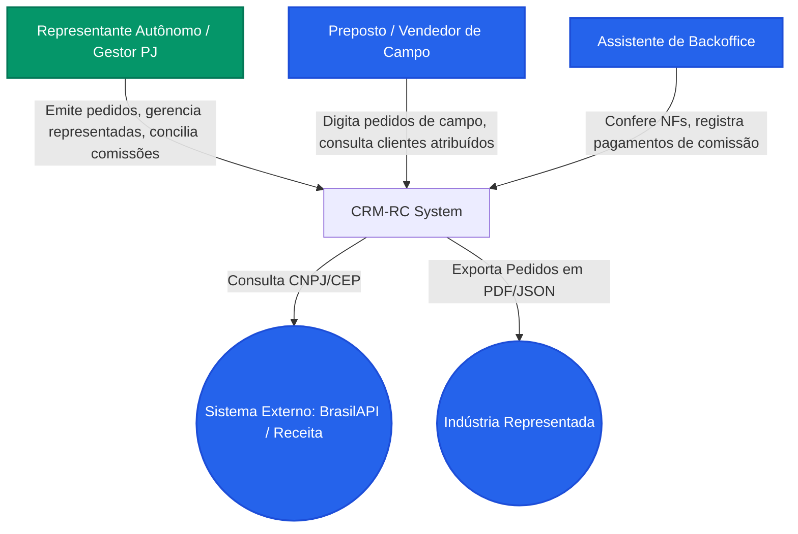
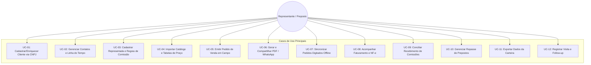
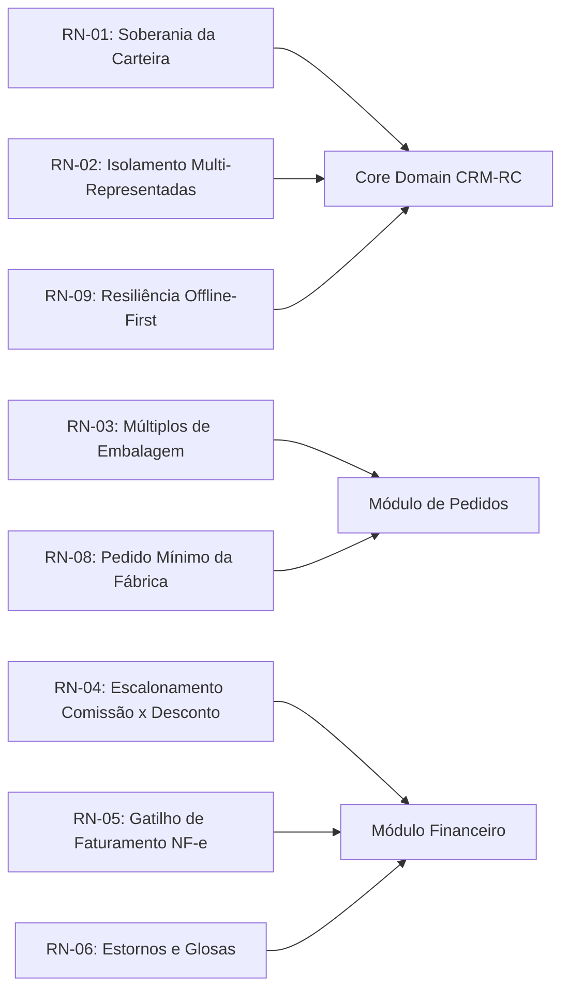
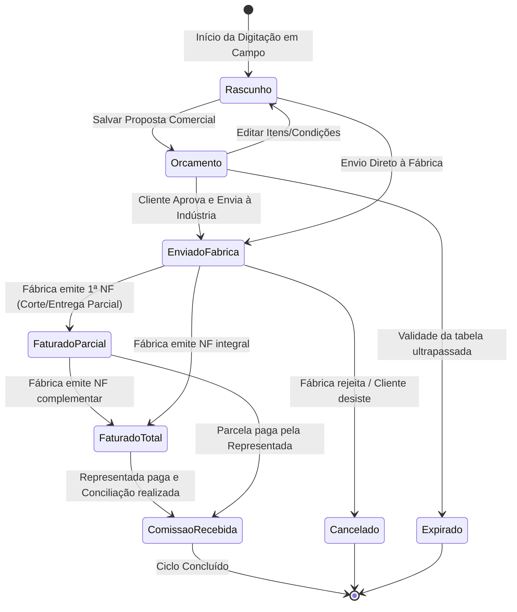
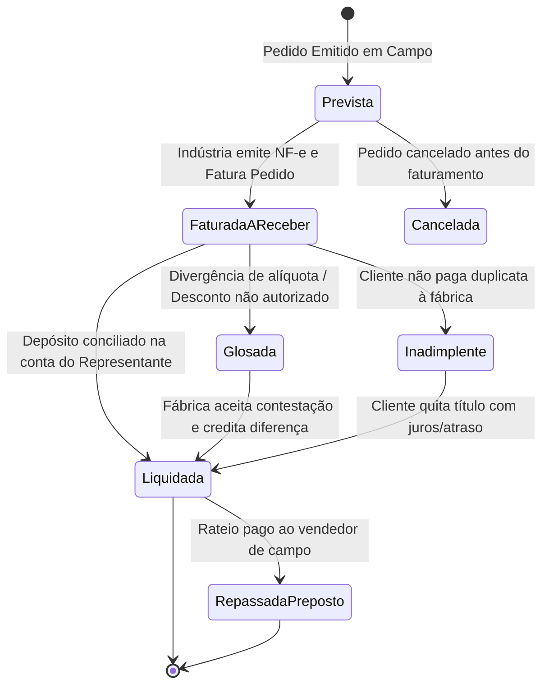

# Especificação de Requisitos Funcionais (FRD) & Casos de Uso
## CRM-RC: CRM para Representantes Comerciais Multi-Representadas

---

### 📋 Controle do Documento
| Item | Descrição |
| :--- | :--- |
| **Código do Documento** | `FRD-SDLC-1.1` |
| **Versão** | `1.0.0` |
| **Status** | Aprovado |
| **Data de Emissão** | 30 de Agosto de 2026 |
| **Épico Vinculado** | [Épico #1: Concepção de Produto, Requisitos Funcionais e Regras de Negócio](https://github.com/fabiooliveir/crm-rc/issues/1) |
| **Issue de Entrega** | [Issue #12: [SDLC 1.1] Especificação de Requisitos Funcionais (FRD) e Casos de Uso](https://github.com/fabiooliveir/crm-rc/issues/12) |
| **Autor / Responsável** | Equipe de Engenharia de Requisitos CRM-RC |

---

## 1. 🎯 Visão Geral do Produto e Princípios Fundamentais

O **CRM-RC** é uma plataforma concebida para atender as necessidades operacionais, estratégicas e financeiras de **Representantes Comerciais Autônomos**, **Escritórios de Representação (PJ)** e seus **Prepostos (Vendedores de Campo)**.

Diferente de CRMs corporativos contratados por indústrias, o **CRM-RC** adota os seguintes pilares inegociáveis:

1. **Soberania Absoluta da Carteira de Clientes:** Os dados cadastrais, anotações de visitas, históricos de negociações e preferências dos clientes pertencem estritamente ao Representante Comercial. Nenhuma indústria representada possui acesso à base global de clientes do representante.
2. **Multi-Representadas e Múltiplos Catálogos:** Suporte nativo à segregação de produtos, tabelas de preços, políticas de frete, comissionamento e regras comerciais específicas por indústria/fornecedor parceiro.
3. **Operação em Campo e Offline-First:** Capacidade de emitir pedidos, consultar catálogos e cadastrar clientes mesmo em locais sem conectividade celular/internet, sincronizando de forma transparente e determinística quando a conexão for restabelecida.
4. **Cálculo Preciso e Conciliação de Comissões:** Acompanhamento do ciclo de vida financeiro completo da comissão: *Prevista* (na emissão do pedido) ➔ *Faturada* (na emissão da NF-e pela indústria) ➔ *Recebida / Conciliada* (na liquidação da duplicata pelo cliente).
5. **Portabilidade e Zero Vendor Lock-in:** O representante pode exportar a qualquer momento sua carteira, histórico e catálogos em formatos abertos (JSON, CSV, XLSX).

---

## 2. 👥 Atores do Sistema

| Ator | Descrição e Papel no Sistema |
| :--- | :--- |
| **`Representante Titular / Gestor PJ`** | Dono da conta do CRM, proprietário legal da carteira. Tem acesso total a clientes, representadas, tabelas de preço, configuração de comissões, relatórios consolidados e conciliação bancária. |
| **`Preposto / Vendedor de Campo`** | Profissional contratado ou associado ao escritório de representação. Tem permissão para consultar catálogos, emitir pedidos e gerenciar os clientes de sua rota de atendimento. Visualiza apenas suas próprias comissões repassadas. |
| **`Assistente de Backoffice`** | Profissional operacional responsável por conferir pedidos digitados, acompanhar status de faturamento junto às representadas, anexar espelhos de notas fiscais e alimentar datas de pagamento de comissões. |
| **`BrasilAPI / Receita Federal` (Sistema Externo)** | Serviço consumido via API para enriquecimento automático de dados cadastrais de Pessoa Jurídica via CNPJ e validação de CEP. |
| **`Indústria Representada` (Entidade Externa)** | Parceira comercial que recebe os pedidos gerados (via PDF, e-mail ou integração) e emite as notas fiscais e relatórios de comissão. |

---

## 3. 📦 Catálogo de Requisitos Funcionais (RF)

### 3.1. Módulo Clientes & Contatos (Soberania de Carteira - `RF-CLI`)
- **`RF-CLI-01`**: O sistema deve permitir o cadastro e edição de clientes Pessoa Jurídica (PJ) e Pessoa Física (PF).
- **`RF-CLI-02`**: O sistema deve integrar-se a serviços de consulta pública (BrasilAPI/ReceitaWS) para autopreenchimento de Razão Social, Nome Fantasia, CNAE principal/secundários, Inscrição Estadual, Endereço completo e Situação Cadastral ao informar o CNPJ.
- **`RF-CLI-03`**: O sistema deve permitir o cadastro de múltiplos contatos por cliente, registrando Nome, Cargo/Função (ex: Comprador, Financeiro, Diretor), Telefones, E-mails e atalho de acionamento direto via WhatsApp (`wa.me`).
- **`RF-CLI-04`**: O sistema deve permitir a categorização de clientes por Tags personalizadas, Ramo de Atividade, Região/Rota de Visitas e Status de Ativação (Prospect, Ativo, Inativo, Bloqueado).
- **`RF-CLI-05`**: O sistema deve manter uma linha do tempo (timeline) cronológica com histórico de visitas, reuniões, ligações telefônicas, anotações de negociação e pedidos emitidos.
- **`RF-CLI-06`**: O sistema deve permitir vincular limites de crédito e prazos médios de pagamento concedidos individualmente por representada para cada cliente.
- **`RF-CLI-07`**: O sistema deve garantir que nenhum dado de clientes cadastrados seja compartilhado ou visível entre diferentes representadas parceiras.

### 3.2. Módulo Representadas, Catálogos e Tabelas de Preço (`RF-REP`)
- **`RF-REP-01`**: O sistema deve permitir o cadastro de múltiplas indústrias/empresas representadas com Razão Social, CNPJ, Contatos comerciais da fábrica, políticas de frete e prazos de entrega padrão.
- **`RF-REP-02`**: O sistema deve permitir o cadastro e a importação em lote (via planilha Excel/CSV) do catálogo de produtos por representada contendo: Código de Fábrica, Código de Barras (EAN), Descrição, NCM, Unidade de Medida, Múltiplo de Embalagem (Ex: caixa com 12 un.), IPI (%), ST estimada e Galeria de Fotos.
- **`RF-REP-03`**: O sistema deve suportar múltiplas Tabelas de Preços por representada (ex: Balcão, Atacado, Distribuidor, Prazo 30/60/90), com datas de vigência e desconto máximo permitido.
- **`RF-REP-04`**: O sistema deve permitir a configuração de regras de comissionamento por representada: % padrão linear, % diferenciado por linha/família de produtos ou % escalonado conforme faixa de desconto concedido.
- **`RF-REP-05`**: O sistema deve permitir configurar valor mínimo de pedido (faturamento mínimo) e condições de frete (CIF/FOB) por representada e por região.

### 3.3. Módulo Pedidos de Venda e Orçamentos em Campo (`RF-PED`)
- **`RF-PED-01`**: O sistema deve permitir a criação ágil de Pedidos de Venda e Orçamentos comerciais em fluxo contínuo de 4 etapas: Seleção do Cliente ➔ Seleção da Representada e Tabela ➔ Seleção de Itens com Quantidades e Descontos ➔ Condições de Pagamento e Frete.
- **`RF-PED-02`**: O sistema deve validar automaticamente se a quantidade inserida atende ao múltiplo de embalagem cadastrado para o produto, alertando ou ajustando automaticamente para a caixa fechada superior.
- **`RF-PED-03`**: O sistema deve calcular em tempo real o Subtotal dos Itens, Descontos aplicados, Valor de IPI, Valor de ST (quando aplicável), Frete, Total Geral e a Projeção da Comissão do Representante.
- **`RF-PED-04`**: O sistema deve permitir salvar o pedido como "Rascunho", "Orçamento / Proposta Comercial" ou "Pedido Fechado".
- **`RF-PED-05`**: O sistema deve gerar documento formal em PDF do Pedido/Orçamento, customizado com logotipo do representante, dados da representada, itens detalhados e termos comerciais.
- **`RF-PED-06`**: O sistema deve permitir o compartilhamento imediato do PDF gerado e do resumo do pedido via WhatsApp e E-mail diretamente do dispositivo.
- **`RF-PED-07`**: O sistema deve suportar funcionamento completo offline (PWA + IndexedDB), gravando pedidos no cache local e permitindo emissão de propostas sem acesso à internet.
- **`RF-PED-08`**: O sistema deve controlar o ciclo de vida e status do pedido: `Rascunho` ➔ `Orçamento` ➔ `Enviado à Fábrica` ➔ `Faturado Parcial` ➔ `Faturado Total` ➔ `Comissão Paga` ➔ `Cancelado`.

### 3.4. Módulo Financeiro & Controle de Comissões (`RF-COM`)
- **`RF-COM-01`**: O sistema deve calcular automaticamente o valor previsto de comissão no momento do fechamento do pedido, com base nas regras da representada e descontos concedidos.
- **`RF-COM-02`**: O sistema deve permitir registrar os dados da Nota Fiscal emitida pela fábrica (Número da NF, Chave de Acesso, Data de Emissão, Valor Faturado e Data Prevista de Pagamento da Comissão).
- **`RF-COM-03`**: O sistema deve tratar faturamento parcial, permitindo vincular múltiplos números de notas fiscais a um único pedido de venda, recalculando a comissão faturada correspondente.
- **`RF-COM-04`**: O sistema deve permitir a conciliação financeira de comissões, registrando a data de crédito bancário, valor efetivamente recebido, eventuais deduções/impostos retidos na fonte e apontando divergências de centavos ou de alíquota.
- **`RF-COM-05`**: O sistema deve permitir o controle de repasse de comissões para prepostos e vendedores parceiros, calculando a fatia devida (ex: repasse de 30% da comissão recebida) e gerando o extrato de repasses do período.
- **`RF-COM-06`**: O sistema deve fornecer painel financeiro (Dashboard) com indicadores de: Comissões Previstas no Mês, Comissões Faturadas a Receber, Comissões Recebidas no Mês e Comissões Vencidas/Atrasadas por representada.

### 3.5. Módulo Soberania, Portabilidade & Auditoria (`RF-POR` / `RF-AUD`)
- **`RF-POR-01`**: O sistema deve disponibilizar funcionalidade de exportação completa da base de dados em formatos estruturados (.xlsx e .json), abrangendo clientes, contatos, histórico de visitas, catálogo de produtos e histórico de pedidos.
- **`RF-POR-02`**: O sistema deve disponibilizar rotina de backup pontual e agendado dos dados do representante com criptografia em repouso.
- **`RF-AUD-01`**: O sistema deve registrar trilha de auditoria para exclusão e alteração de registros sensíveis (pedidos, clientes e conciliações financeiras).

---

## 4. 🔄 Casos de Uso Detalhados (Use Cases)

---

### `UC-01`: Cadastrar e Enriquecer Dados de Cliente via CNPJ
* **Ator Principal:** Representante Comercial / Preposto
* **Pré-condições:** Usuário autenticado na aplicação.
* **Gatilho:** O representante encontra um novo potencial comprador ou visita um novo estabelecimento comercial em campo.
* **Fluxo Principal:**
  1. O usuário acessa o menu **Clientes** e clica em **Novo Cliente**.
  2. O usuário seleciona o tipo **Pessoa Jurídica** e digita os 14 dígitos do **CNPJ**.
  3. O sistema dispara requisição assíncrona para a API de dados públicos (BrasilAPI).
  4. O sistema preenche automaticamente: Razão Social, Nome Fantasia, Logradouro, Número, Bairro, Cidade, UF, CEP, CNAE Principal e Situação Cadastral.
  5. O usuário complementa com Inscrição Estadual, E-mail Financeiro, Telefone Principal, Tags de Segmentação e Limite de Crédito interno.
  6. O usuário clica em **Salvar Cliente**.
  7. O sistema valida os dados obrigatórios, grava o registro no banco local/remoto e exibe notificação de sucesso com atalho para cadastrar contatos ou iniciar um pedido.
* **Fluxos Alternativos:**
  * **FA-01 (Cadastro de Pessoa Física):** No passo 2, o usuário seleciona **Pessoa Física**, informa o CPF, Nome Completo, Endereço e dados de contato manualmente, prosseguindo para o passo 6.
  * **FA-02 (Operação Sem Conexão / Offline):** No passo 3, caso o dispositivo esteja sem internet, o sistema informa que a consulta online está indisponível, permite o preenchimento manual de todos os campos e agenda a validação para o próximo momento online.
* **Fluxos de Exceção:**
  * **FE-01 (CNPJ Inexistente ou Inválido):** No passo 3, se o algoritmo de validação do CNPJ falhar ou a API retornar registro não encontrado, o sistema exibe alerta *"CNPJ inválido ou não localizado"* e permite correção manual ou continuar como rascunho.
  * **FE-02 (CNPJ Inapto / Baixado na Receita Federal):** No passo 4, se a situação cadastral constar como "Baixada", "Inapta" ou "Nula", o sistema exibe um aviso em destaque vermelho alertando o representante sobre o risco comercial, mas não bloqueia arbitrariamente caso o representante queira manter o prospect histórico.
* **Pós-condições:** O cliente fica disponível na carteira soberana do representante para emissão de orçamentos e agendamento de visitas.
* **Regras de Negócio:** `RN-01`, `RN-02`, `RN-10`.

---

### `UC-02`: Gerenciar Múltiplos Contatos e Linha do Tempo do Cliente
* **Ator Principal:** Representante Comercial / Assistente
* **Pré-condições:** Cliente cadastrado no sistema.
* **Gatilho:** O representante necessita registrar novo comprador, financeiro ou histórico de negociação de um cliente.
* **Fluxo Principal:**
  1. O usuário abre o perfil detalhado do Cliente.
  2. Na aba **Contatos**, clica em **Adicionar Contato**.
  3. O usuário informa: Nome, Cargo/Função (Comprador Principal, Auxiliar de Compras, Gerente Financeiro, Proprietário), Telefone celular, Telefone fixo, E-mail e Aniversário.
  4. O usuário salva o contato. O sistema exibe o card do contato com botões de ação rápida: *Ligar*, *Enviar E-mail* e *Abrir WhatsApp*.
  5. Na aba **Histórico & Linha do Tempo**, o usuário clica em **Novo Registro**.
  6. O usuário seleciona o tipo (Visita Presencial, Telefonema, WhatsApp, Reunião Online), descreve o resumo dos tópicos tratados e estipula a data do próximo follow-up.
  7. O sistema grava o evento na timeline e cria lembrete no dashboard.
* **Fluxos Alternativos:**
  * **FA-01 (Acionamento Direto de WhatsApp):** No passo 4, o usuário clica no ícone do WhatsApp. O sistema abre o aplicativo WhatsApp com o link parametrizado (`https://wa.me/55...`), permitindo envio imediato de mensagem.
* **Fluxos de Exceção:**
  * **FE-01 (Telefone Celular em Formato Inválido):** No passo 3, caso o número não possua DDD válido, o sistema solicita correção com máscara visual `(XX) 9XXXX-XXXX`.
* **Pós-condições:** Histórico de relacionamento atualizado e contatos preservados sob propriedade exclusiva do representante.
* **Regras de Negócio:** `RN-01`, `RN-11`.

---

### `UC-03`: Cadastrar Representada e Configurar Políticas Comerciais
* **Ator Principal:** Representante Titular / Gestor PJ
* **Pré-condições:** Usuário com perfil de Administrador da conta.
* **Gatilho:** O representante firma contrato de representação com uma nova fábrica/indústria parceira.
* **Fluxo Principal:**
  1. O usuário acessa o menu **Representadas** e clica em **Nova Representada**.
  2. O usuário informa Razão Social, Nome Fantasia, CNPJ da representada, E-mail de Envio de Pedidos da Fábrica, Contato do Gerente Regional e Prazo Médio de Produção/Entrega.
  3. Na seção **Políticas Comerciais**, define: Valor Mínimo de Pedido (ex: R$ 1.500,00), Tipo Padrão de Frete (CIF / FOB) e Prazo Padrão de Pagamento.
  4. Na seção **Regras de Comissão**, seleciona a modalidade:
     * *Opção A:* Alíquota Fixa Global (ex: 5% sobre faturamento líquido).
     * *Opção B:* Tabela Escalonada por Desconto (ex: 0% desconto = 6% comissão; até 5% desc. = 4% comissão; até 10% desc. = 2% comissão).
     * *Opção C:* Comissão diferenciada por Linha/Grupo de Produtos.
  5. O usuário clica em **Salvar Representada**.
  6. O sistema inicializa a estrutura isolada de catálogo e tabelas para a nova parceira.
* **Fluxos Alternativos:**
  * **FA-01 (Dedução de Impostos na Base de Comissão):** No passo 4, o usuário marca se a comissão é calculada sobre o Valor Bruto, Valor Líquido de IPI ou Valor Líquido de ST/IPI/ICMS-ST.
* **Fluxos de Exceção:**
  * **FE-01 (Faixas de Desconto Conflitantes):** No passo 4 (Opção B), se as faixas de desconto se sobrepuserem, o sistema destaca os intervalos em conflito e exige ajuste antes do salvamento.
* **Pós-condições:** Representada habilitada para receber produtos, tabelas de preço e emissão de pedidos.
* **Regras de Negócio:** `RN-02`, `RN-04`, `RN-08`.

---

### `UC-04`: Importar e Manter Catálogo de Produtos e Tabelas de Preços
* **Ator Principal:** Representante Titular / Assistente
* **Pré-condições:** Representada cadastrada no sistema.
* **Gatilho:** A fábrica envia nova tabela de preços ou atualização de catálogo de itens em planilha Excel/CSV.
* **Fluxo Principal:**
  1. O usuário seleciona a Representada e clica em **Catálogo de Produtos** ➔ **Importar Planilha**.
  2. O usuário seleciona o arquivo (.xlsx ou .csv) fornecido pela representada.
  3. O sistema exibe assistente de mapeamento visual de colunas: *Código*, *Descrição*, *NCM*, *EAN*, *Preço Base*, *Múltiplo/Embalagem*, *IPI (%)* e *Unidade*.
  4. O usuário valida a pré-visualização das 10 primeiras linhas e clica em **Confirmar Importação**.
  5. O sistema processa o arquivo, criando produtos novos e atualizando registros existentes sem duplicar códigos de referência.
  6. O sistema exibe relatório do processamento: *"450 produtos importados, 32 atualizados, 0 erros"*.
  7. O usuário acessa **Tabelas de Preços**, cria a tabela "Tabela Distribuidor 2026", aplica um multiplicador ou margem específica e define a vigência.
* **Fluxos Alternativos:**
  * **FA-01 (Cadastro Manual de Produto):** No passo 1, o usuário clica em **Novo Produto Individual**, preenche os campos manualmente, anexa foto do produto e salva.
* **Fluxos de Exceção:**
  * **FE-01 (Planilha com Linhas Inválidas / Preços Não Numéricos):** No passo 4, caso haja linhas com valores corrompidos, o sistema aponta as linhas com erro, permite exportar o log de inconsistências e importa as linhas válidas.
* **Pós-condições:** Catálogo atualizado e disponível para digitação rápida de pedidos em campo.
* **Regras de Negócio:** `RN-02`, `RN-03`, `RN-12`.

---

### `UC-05`: Emitir Pedido de Venda em Campo (Mobile / Offline-First)
* **Ator Principal:** Representante Comercial / Preposto
* **Pré-condições:** Catálogo e clientes previamente sincronizados no dispositivo.
* **Gatilho:** O representante está no estabelecimento do cliente e o comprador decide fechar o pedido de compra.
* **Fluxo Principal:**
  1. O usuário clica no botão de ação rápida **+ Emitir Pedido**.
  2. O usuário seleciona o **Cliente** (busca rápida por Nome Fantasia, Razão Social ou Cidade).
  3. O usuário seleciona a **Representada** e a **Tabela de Preços** desejada.
  4. O sistema carrega os produtos da representada. O usuário digita o nome ou código de fábrica no campo de busca ou filtra por categoria.
  5. O usuário informa a quantidade desejada de cada item. O sistema valida os múltiplos de embalagem (ex: caixas com 12 unidades) e atualiza o totalizador instantaneamente.
  6. O usuário concede desconto unitário ou desconto global (caso permitido pela alçada da tabela). O sistema recalcula automaticamente a projeção de comissão do representante.
  7. O usuário seleciona a Condição de Pagamento (ex: 28/56 dias), Tipo de Frete (CIF/FOB), Transportadora de preferência do cliente e anotações adicionais para a fábrica.
  8. O usuário clica em **Finalizar Pedido**.
  9. O sistema gera o número sequencial do pedido no formato `PED-AAAA-XXXXX`, grava o registro e exibe a tela de confirmação com opções de geração de PDF e envio imediato.
* **Fluxos Alternativos:**
  * **FA-01 (Operação Totalmente Offline):** Durante todos os passos de 1 a 9, o dispositivo está sem sinal de internet. O sistema grava o pedido localmente no IndexedDB com status `Pendente de Sincronização`, gera o PDF em tempo real no navegador do celular e permite o compartilhamento local via Bluetooth/WhatsApp (se houver cache) sem nenhuma perda de funcionalidade.
  * **FA-02 (Conversão de Orçamento em Pedido):** O usuário abre um orçamento previamente salvo com status `Orçamento / Proposta`, clica em **Converter em Pedido**, revisa as quantidades e avança diretamente para o passo 8.
* **Fluxos de Exceção:**
  * **FE-01 (Valor Total Abaixo do Pedido Mínimo da Fábrica):** No passo 8, se o subtotal for inferior ao faturamento mínimo da representada (ex: R$ 800,00 para mínimo de R$ 1.500,00), o sistema exibe alerta impeditivo: *"Valor abaixo do pedido mínimo da fábrica (Faltam R$ 700,00)"*, exigindo inclusão de mais itens ou autorização expressa de exceção.
  * **FE-02 (Desconto Acima do Limite Permitido):** No passo 6, se o usuário informar desconto superior ao teto configurado para a tabela (ex: 15% quando o teto é 10%), o sistema bloqueia e solicita readequação do percentual.
* **Pós-condições:** Pedido gravado, comissão prevista calculada e documento pronto para transmissão.
* **Regras de Negócio:** `RN-02`, `RN-03`, `RN-04`, `RN-08`, `RN-09`.

---

### `UC-06`: Gerar e Compartilhar Orçamento / Proposta Comercial em PDF via WhatsApp
* **Ator Principal:** Representante Comercial / Preposto
* **Pré-condições:** Pedido ou Orçamento preenchido no sistema.
* **Gatilho:** O cliente solicita a proposta comercial formalizada para aprovação interna da diretoria.
* **Fluxo Principal:**
  1. Na tela do pedido/orçamento, o usuário clica em **Gerar PDF**.
  2. O sistema processa o layout profissional do documento contendo:
     * Cabeçalho com dados e logotipo do Representante Comercial.
     * Dados completos do Cliente e Comprador.
     * Identificação clara da Indústria Representada.
     * Grade tabular com Código, Descrição, NCM, Quantidade, Unidade, Preço Unitário, Desconto, Valor Total e Alíquotas de IPI/ST.
     * Condições de Pagamento, Modalidade de Frete e Prazo Estimado de Faturamento.
     * Campo para assinatura do comprador / carimbo da empresa.
  3. O usuário visualiza o preview na tela e clica em **Compartilhar WhatsApp**.
  4. O sistema monta a mensagem de texto pré-formatada com o resumo do pedido (Cliente, Valor Total, Itens principais) e anexa/compartilha o arquivo PDF gerado diretamente na conversa com o contato do comprador.
* **Fluxos Alternativos:**
  * **FA-01 (Envio por E-mail):** No passo 3, o usuário escolhe **Enviar por E-mail**. O sistema dispara o e-mail transacional com o PDF anexado para o comprador e com cópia oculta (BCC) para o representante.
* **Fluxos de Exceção:**
  * **FE-01 (Falha ao Abrir WhatsApp API no Dispositivo):** Caso o aplicativo do WhatsApp não esteja instalado no desktop, o sistema faz o download direto do arquivo PDF e copia a mensagem de texto para a área de transferência.
* **Pós-condições:** Proposta entregue ao comprador de maneira instantânea e profissional.
* **Regras de Negócio:** `RN-01`, `RN-05`.

---

### `UC-07`: Sincronizar Pedidos Digitados Offline com a Nuvem
* **Ator Principal:** Sistema (Automático) / Representante Comercial
* **Pré-condições:** Existência de pedidos ou clientes criados localmente em modo offline.
* **Gatilho:** O dispositivo móvel reconecta-se à internet (Wi-Fi ou Dados Móveis).
* **Fluxo Principal:**
  1. O *Service Worker* da aplicação detecta o evento de conectividade `online`.
  2. O sistema exibe indicador visual no topo: *"Sincronizando 3 pedidos pendentes..."*.
  3. A engine de sincronização empacota as transações locais gravadas no IndexedDB e as envia para o backend central via endpoint idempotente de sincronização.
  4. O backend valida a integridade, persiste os registros no banco de dados principal (PostgreSQL), atribui IDs globais definitivos e retorna status de sucesso para cada transação.
  5. O client local atualiza o status dos pedidos para `Sincronizado / Nuvem` e limpa as flags da fila de saída offline.
  6. O sistema exibe notificação: *"Sincronização concluída com sucesso! Todos os pedidos estão seguros na nuvem."*
* **Fluxos Alternativos:**
  * **FA-01 (Sincronização Manual Forçada):** O usuário acessa **Configurações** ➔ **Status de Conexão** e clica em **Forçar Sincronização Agora**.
* **Fluxos de Exceção:**
  * **FE-01 (Conexão Interrompida Durante Envio):** Se a conexão cair antes da confirmação do servidor, o sistema mantém os dados intactos no banco local e tenta novamente no próximo ciclo sem duplicar registros.
* **Pós-condições:** Base de dados central consolidada e consistente com os dados digitados em campo.
* **Regras de Negócio:** `RN-09`, `RN-13`.

---

### `UC-08`: Acompanhar Faturamento do Pedido e Registro de NF-e
* **Ator Principal:** Assistente de Backoffice / Representante Comercial
* **Pré-condições:** Pedido no status `Enviado à Fábrica`.
* **Gatilho:** A indústria representada fatura o pedido e envia o DANFE/XML da Nota Fiscal.
* **Fluxo Principal:**
  1. O usuário localiza o pedido na lista de pedidos em aberto.
  2. O usuário clica em **Registrar Faturamento / NF-e**.
  3. O usuário informa: Número da Nota Fiscal, Série, Data de Emissão, Valor Total da NF, Data de Vencimento dos Títulos/Duplicatas e anexa o PDF do DANFE/XML.
  4. O sistema compara o valor faturado pela fábrica com o valor original do pedido emitido:
     * Se o valor for idêntico, o status do pedido avança para `Faturado Total`.
     * Se o valor for inferior (corte de itens na fábrica), o sistema registra `Faturado Parcial`, identifica quais itens foram cortados e recalcula a comissão devida com base no valor efetivamente faturado.
  5. O sistema converte a **Comissão Prevista** em **Comissão Faturada a Receber** e agenda a data de previsão de pagamento conforme o prazo acordado com a representada.
* **Fluxos Alternativos:**
  * **FA-01 (Faturamento em Múltiplas Notas Fiscais):** No passo 3, o usuário informa uma primeira NF parcial (ex: R$ 5.000 de um pedido de R$ 10.000). O pedido permanece como `Faturado Parcial` até que a segunda NF seja lançada.
* **Fluxos de Exceção:**
  * **FE-01 (Cancelamento do Pedido pela Fábrica por Falta de Estoque):** No passo 2, se a fábrica informar impossibilidade de atendimento, o usuário altera o status para `Cancelado pela Fábrica` e insere o motivo. O sistema zera a comissão prevista e registra o histórico.
* **Pós-condições:** Status do pedido atualizado e título de comissão gerado no contas a receber da representação.
* **Regras de Negócio:** `RN-05`, `RN-06`, `RN-07`.

---

### `UC-09`: Conciliar Recebimento de Comissões por Representada
* **Ator Principal:** Representante Titular / Assistente de Backoffice
* **Pré-condições:** Pedidos faturados com títulos de comissão pendentes de liquidação.
* **Gatilho:** A representada efetua o depósito do relatório mensal de comissões na conta bancária do representante.
* **Fluxo Principal:**
  1. O usuário acessa o módulo **Financeiro** ➔ **Conciliação de Comissões**.
  2. O usuário seleciona a **Representada** e o **Mês/Ano de Competência**.
  3. O sistema lista todos os pedidos faturados daquela representada aguardando pagamento no período, exibindo Valor do Pedido, Número da NF, % de Comissão e Valor de Comissão Calculado.
  4. O usuário confere os itens com base no demonstrativo/espelho enviado pela fábrica e marca os pedidos contemplados no pagamento.
  5. O usuário informa eventuais deduções legais (ex: Retenção de IRRF 1,5% conforme Lei 4.886/65, estornos de devoluções anteriores ou taxa de antecipação).
  6. O usuário clica em **Confirmar Liquidação / Baixar Comissões**.
  7. O sistema altera o status dos pedidos para `Comissão Paga`, alimenta os gráficos de faturamento real do mês e gera o comprovante de conciliação.
* **Fluxos Alternativos:**
  * **FA-01 (Divergência de Valor de Comissão):** No passo 4, se a representada pagou percentual menor do que o calculado pelo sistema, o usuário clica em **Apontar Glosa/Divergência**, digita o valor real creditado e o sistema registra uma pendência de contestação junto à representada.
* **Fluxos de Exceção:**
  * **FE-01 (Inadimplência do Cliente com Suspensão de Comissão):** Caso a fábrica retenha o pagamento da comissão alegando que o cliente não pagou a duplicata, o usuário altera o status para `Comissão Suspensa por Inadimplência do Cliente`, mantendo o valor rastreável para cobrança futura.
* **Pós-condições:** Contas a receber conciliadas com precisão contábil e histórico de comissões liquidado.
* **Regras de Negócio:** `RN-04`, `RN-05`, `RN-06`, `RN-14`.

---

### `UC-10`: Gerenciar Repasse de Comissões para Prepostos / Vendedores
* **Ator Principal:** Representante Titular / Gestor PJ
* **Pré-condições:** Comissões de pedidos emitidos por prepostos devidamente conciliadas e recebidas da fábrica.
* **Gatilho:** Fechamento quinzenal ou mensal da folha de repasses aos vendedores parceiros da representação.
* **Fluxo Principal:**
  1. O usuário acessa **Financeiro** ➔ **Repasse de Prepostos**.
  2. O usuário seleciona o **Preposto** e o período de apuração.
  3. O sistema calcula a participação do preposto sobre cada pedido recebido no período (ex: se o escritório recebeu 5% da fábrica e o preposto tem 60% de repasse, a fatia calculada é de 3% sobre o faturamento).
  4. O sistema deduz adiantamentos previamente concedidos ou despesas de combustível acordadas.
  5. O usuário revisa o extrato e clica em **Fechar Folha de Repasse**.
  6. O sistema gera o relatório em PDF **Extrato de Comissões do Preposto** discriminando pedido a pedido, nota a nota e valores líquidos a transferir.
  7. O usuário anexa o comprovante de PIX/Transferência bancária e marca o repasse como `Liquidado`.
* **Fluxos Alternativos:**
  * **FA-01 (Visão do Preposto no App):** O preposto loga com sua conta de acesso restrito, visualiza em tempo real seu extrato pessoal de comissões a receber e o histórico de repasses pagos, sem ter visibilidade das margens globais de outros prepostos.
* **Fluxos de Exceção:**
  * **FE-01 (Estorno de Pedido Já Repassado):** Se um pedido for cancelado após o repasse ao preposto, o sistema cria automaticamente um lançamento de débito na próxima apuração do profissional.
* **Pós-condições:** Folha de prepostos fechada e transparência de repasses assegurada.
* **Regras de Negócio:** `RN-06`, `RN-15`.

---

### `UC-11`: Exportar Carteira Completa e Histórico de Dados (Soberania)
* **Ator Principal:** Representante Titular
* **Pré-condições:** Usuário autenticado como Administrador.
* **Gatilho:** O representante deseja realizar backup de segurança, gerar relatórios em ferramentas externas de BI ou migrar de provedor.
* **Fluxo Principal:**
  1. O usuário acessa **Configurações** ➔ **Soberania e Exportação de Dados**.
  2. O usuário seleciona o escopo de exportação: *Toda a Base*, *Apenas Clientes e Contatos*, *Apenas Histórico de Pedidos* ou *Catálogos e Tabelas*.
  3. O usuário seleciona o formato de saída desejado: **Pasta de Trabalho Excel (.xlsx)**, **Arquivos CSV (.csv)** ou **Dump Estruturado JSON (.json)**.
  4. O usuário clica em **Gerar Pacote de Exportação**.
  5. O sistema processa o arquivo contendo todas as tabelas normalizadas, relacionamentos e anotações.
  6. O download do arquivo compactado (.zip) é iniciado no dispositivo local.
* **Fluxos de Exceção:**
  * **FE-01 (Usuário Não Autorizado / Preposto):** Se um preposto tentar acessar o módulo de exportação global da base, o sistema bloqueia o acesso e emite alerta de violação de permissão.
* **Pós-condições:** Cópia fiel de toda a inteligência comercial sob guarda do representante.
* **Regras de Negócio:** `RN-01`, `RN-16`.

---

### `UC-12`: Registrar Visita Presencial e Definir Follow-up de Venda
* **Ator Principal:** Representante Comercial / Preposto
* **Pré-condições:** Cliente cadastrado no sistema.
* **Gatilho:** O representante conclui uma visita de relacionamento ou prospecção na sede do cliente.
* **Fluxo Principal:**
  1. O usuário abre o aplicativo no celular e clica em **Check-in de Visita**.
  2. O sistema sugere os clientes mais próximos com base no GPS do smartphone (ou o usuário pesquisa o cliente manualmente).
  3. O usuário seleciona o contato atendido (ex: Comprador Carlos).
  4. O usuário registra os pontos-chave discutidos (ex: *"Cliente com estoque alto da Linha X; prometeu pedido da Linha Y no dia 15"*).
  5. O usuário agenda a data do próximo contato/visita de retorno e ativa a notificação de lembrete.
  6. O usuário clica em **Salvar Visita**.
  7. O evento é registrado na linha do tempo do cliente e o lembrete é indexado no calendário de visitas do representante.
* **Pós-condições:** Registro de visita gravado e compromisso futuro agendado.
* **Regras de Negócio:** `RN-01`, `RN-11`.

---

## 5. ⚖️ Regras de Negócio do Setor de Representação Comercial (RN)

| ID | Nome da Regra de Negócio | Descrição Normativa e Regra de Validação |
| :--- | :--- | :--- |
| **`RN-01`** | **Soberania Exclusiva dos Dados** | Toda a base de clientes, contatos, anotações e histórico pertence exclusivamente ao representante titular da conta (Lei 4.886/65 e LGPD). Em nenhuma hipótese dados de clientes de uma representada serão compartilhados com outra parceira. |
| **`RN-02`** | **Segregação Estrita de Pedidos por Representada** | Um pedido de venda só pode conter itens pertencentes a uma **única representada**. Não é permitido misturar itens de indústrias distintas em um mesmo pedido, pois cada representada possui seu próprio faturamento e regras de emissão de NF-e. |
| **`RN-03`** | **Múltiplo Obrigatório de Embalagem** | Produtos com restrição de embalagem industrial (ex: venda somente em caixas de 6, 12, 24 ou 50 unidades) não podem ter quantidades fracionadas. O sistema deve validar `(Quantidade % MultiploEmbalagem) == 0`. Caso o usuário digite valor incompatível, o sistema deve sugerir o arredondamento para cima. |
| **`RN-04`** | **Escalonamento de Comissões por Desconto** | Quando a representada adota política de desconto flexível com redução de comissão, o sistema deve aplicar a tabela parametrizada. Exemplo: Desconto 0% ➔ Comissão Cheia (5%); Desconto de 1% a 5% ➔ Comissão Reduzida (3,5%); Desconto acima de 5% ➔ Comissão Mínima (2%). |
| **`RN-05`** | **Gatilho de Reconhecimento de Comissão** | A comissão tem status **Prevista** na emissão do pedido, passa a **Faturada / A Receber** quando a fábrica emite a NF-e e só se torna **Liquidada / Recebida** quando a representada credita o valor e o representante faz a conciliação bancária. |
| **`RN-06`** | **Tratamento de Estornos e Devoluções** | Em caso de devolução total ou parcial de mercadorias pelo cliente com emissão de NF de devolução, a comissão correspondente ao valor devolvido deve ser estornada ou deduzida no próximo fechamento com a representada. |
| **`RN-07`** | **Suporte a Faturamentos Parciais (Cortes de Fábrica)** | Quando uma indústria fatura apenas parte dos itens solicitados no pedido devido a falta de estoque, o saldo remanescente do pedido pode ser mantido em aberto como *Pendente de Faturamento* ou cancelado. A comissão é apurada estritamente sobre a parcela faturada na NF-e. |
| **`RN-08`** | **Validação de Faturamento Mínimo por Pedido** | Caso a representada possua valor mínimo estipulado para faturamento com frete CIF ou FOB, o sistema deve impedir a finalização do pedido com status `Fechado` caso o total seja inferior ao piso, exceto se marcado explicitamente como autorização especial. |
| **`RN-09`** | **Resiliência Offline-First e Conflitos Determinísticos** | Toda a interface de emissão de pedidos e consulta de clientes deve operar normalmente sem internet. Em caso de conflito de sincronização, a versão criada localmente com timestamp mais recente prevalece para novos pedidos e entidades operadas pelo representante. |
| **`RN-10`** | **Validação de Documentos Fiscais Brasileiros** | O sistema deve aplicar validação formal dos dígitos verificadores de CNPJ e CPF antes de autorizar o salvamento de clientes e representadas. |
| **`RN-11`** | **Privacidade e Sigilo das Anotações de Campo** | Anotações inseridas pelo representante na timeline do cliente possuem nível de visibilidade estritamente interno e nunca constarão nos PDFs ou propostas compartilhadas com compradores ou fábricas. |
| **`RN-12`** | **Imutabilidade de Preços em Pedidos Fechados** | Após o fechamento e envio do pedido à fábrica, os preços unitários e condições não sofrem reajuste retroativo automático, mesmo que a tabela de preços da representada seja alterada posteriormente. |
| **`RN-13`** | **Idempotência na Sincronização de Pedidos** | Cada pedido emitido offline recebe um UUID v4 único no momento da criação local. O servidor garante que retransmissões do mesmo pacote não criarão pedidos duplicados. |
| **`RN-14`** | **Retenção na Fonte de IRRF (Lei 4.886/65)** | Na conciliação de comissões pagas por Pessoas Jurídicas a Representantes Comerciais Pessoas Jurídicas, o sistema deve prever o campo de desconto do IRRF retido na fonte (alíquota padrão de 1,5%), facilitando a contabilidade anual do representante (DIRF/Informe de Rendimentos). |
| **`RN-15`** | **Hierarquia de Visibilidade de Prepostos** | Prepostos e vendedores associados só têm acesso aos clientes de sua respectiva carteira/rota e aos pedidos por eles emitidos. O representante titular (Gestor) visualiza todos os dados consolidados. |
| **`RN-16`** | **Exportabilidade Irrestrita de Dados** | Nenhum recurso de exportação pode ser condicionado a cobranças adicionais ou bloqueios contratuais, garantindo conformidade com as boas práticas de portabilidade da LGPD. |

---

## 6. 🗺️ Matriz de Rastreabilidade de Requisitos (RTM)

A matriz abaixo estabelece a rastreabilidade bidirecional entre os Requisitos Funcionais, Casos de Uso, Regras de Negócio, Entidades de Domínio e Fases do SDLC:

| ID Requisito | Descrição Resumida | Caso de Uso Vinculado | Regras de Negócio | Entidade de Domínio | Épico / Issue SDLC |
| :--- | :--- | :--- | :--- | :--- | :--- |
| **`RF-CLI-01`** | Cadastro de Clientes PJ/PF | `UC-01` | `RN-01`, `RN-10` | `Cliente` | Épico #1 / #12, #14 |
| **`RF-CLI-02`** | Enriquecimento via CNPJ (BrasilAPI) | `UC-01` | `RN-10` | `Cliente`, `Endereco` | Épico #1 / #12; Épico #5 / #27 |
| **`RF-CLI-03`** | Múltiplos Contatos e WhatsApp | `UC-02` | `RN-01` | `ContatoCliente` | Épico #1 / #12; Épico #5 / #27 |
| **`RF-CLI-04`** | Tags, Segmentação e Rotas | `UC-01`, `UC-12` | `RN-01`, `RN-15` | `Cliente`, `Tag` | Épico #1 / #12; Épico #5 / #27 |
| **`RF-CLI-05`** | Timeline e Histórico de Interações | `UC-02`, `UC-12` | `RN-01`, `RN-11` | `InteracaoTimeline` | Épico #1 / #12; Épico #5 / #28 |
| **`RF-REP-01`** | Cadastro de Representadas e Políticas | `UC-03` | `RN-02`, `RN-08` | `Representada` | Épico #1 / #12; Épico #4 / #24 |
| **`RF-REP-02`** | Catálogo e Importação de Produtos | `UC-04` | `RN-02`, `RN-03` | `Produto`, `FotoProduto` | Épico #1 / #12; Épico #4 / #25 |
| **`RF-REP-03`** | Múltiplas Tabelas de Preços | `UC-04` | `RN-02`, `RN-12` | `TabelaPreco`, `ItemTabela` | Épico #1 / #12; Épico #4 / #24 |
| **`RF-REP-04`** | Configuração de Regras de Comissão | `UC-03` | `RN-04`, `RN-05` | `RegraComissao` | Épico #1 / #12; Épico #7 / #32 |
| **`RF-REP-05`** | Pedido Mínimo e Políticas de Frete | `UC-03` | `RN-08` | `Representada` | Épico #1 / #12; Épico #4 / #24 |
| **`RF-PED-01`** | Emissão Ágil de Pedidos em 4 Etapas | `UC-05` | `RN-02`, `RN-03` | `PedidoVenda`, `ItemPedido` | Épico #1 / #12; Épico #6 / #29 |
| **`RF-PED-02`** | Validação de Múltiplos de Embalagem | `UC-05` | `RN-03` | `ItemPedido`, `Produto` | Épico #1 / #12; Épico #6 / #29 |
| **`RF-PED-03`** | Cálculo Dinâmico de Descontos e ST | `UC-05` | `RN-04` | `ItemPedido`, `PedidoVenda` | Épico #1 / #12; Épico #6 / #29 |
| **`RF-PED-04`** | Gestão de Orçamentos e Propostas | `UC-05`, `UC-06` | `RN-05` | `PedidoVenda` | Épico #1 / #12; Épico #6 / #29 |
| **`RF-PED-05`** | Geração de PDF Profissional | `UC-06` | `RN-01`, `RN-05` | `DocumentoPDF` | Épico #1 / #12; Épico #6 / #30 |
| **`RF-PED-06`** | Compartilhamento via WhatsApp/E-mail | `UC-06` | `RN-01` | `DocumentoPDF` | Épico #1 / #12; Épico #6 / #30 |
| **`RF-PED-07`** | Emissão e Cache Offline-First | `UC-05`, `UC-07` | `RN-09`, `RN-13` | `PedidoVenda` (IndexedDB) | Épico #1 / #12; Épico #6 / #31 |
| **`RF-PED-08`** | Ciclo de Vida e Estados do Pedido | `UC-05`, `UC-08` | `RN-05`, `RN-07` | `PedidoVenda`, `StatusHistorico`| Épico #1 / #12; Épico #6 / #29 |
| **`RF-COM-01`** | Projeção Automática de Comissão | `UC-05` | `RN-04`, `RN-05` | `Comissao` | Épico #1 / #12; Épico #7 / #32 |
| **`RF-COM-02`** | Registro de Faturamento e NF-e | `UC-08` | `RN-05`, `RN-07` | `NotaFiscal`, `PedidoVenda` | Épico #1 / #12; Épico #7 / #33 |
| **`RF-COM-03`** | Gestão de Faturamentos Parciais | `UC-08` | `RN-07` | `NotaFiscal`, `ItemPedido` | Épico #1 / #12; Épico #7 / #33 |
| **`RF-COM-04`** | Conciliação Bancária de Comissões | `UC-09` | `RN-05`, `RN-14` | `ConciliacaoComissao` | Épico #1 / #12; Épico #7 / #33 |
| **`RF-COM-05`** | Gestão de Repasses para Prepostos | `UC-10` | `RN-15` | `RepassePreposto`, `Preposto` | Épico #1 / #12; Épico #7 / #34 |
| **`RF-COM-06`** | Dashboard e Indicadores Financeiros | `UC-09` | `RN-05` | `DashboardMetric` | Épico #1 / #12; Épico #7 / #32 |
| **`RF-POR-01`** | Exportação Completa (Excel/JSON/CSV) | `UC-11` | `RN-01`, `RN-16` | `BackupExport` | Épico #1 / #12; Épico #8 / #35 |
| **`RF-POR-02`** | Backup Criptografado dos Dados | `UC-11` | `RN-01`, `RN-16` | `BackupSnapshot` | Épico #1 / #12; Épico #8 / #36 |
| **`RF-AUD-01`** | Trilha de Auditoria de Operações | `UC-01` a `UC-11` | `RN-01` | `AuditLog` | Épico #1 / #12; Épico #9 / #43 |

---

## 7. 📊 Ciclos de Vida e Diagramas de Estado

### 7.1. Diagrama de Transição de Estados do Pedido de Venda

### 7.2. Diagrama de Ciclo de Vida da Comissão

---

## 8. 🔍 Próximos Passos no SDLC (Fase 1 e Fase 2)

Com a aprovação deste documento de especificação funcional (FRD - SDLC 1.1), as tarefas subsequentes do roadmap estão aptas para execução:
- [ ] **[SDLC 1.2] Mapeamento de Personas e Jornada do Usuário** ([Issue #13](https://github.com/fabiooliveir/crm-rc/issues/13))
- [ ] **[SDLC 1.3] Definição de Requisitos Não-Funcionais** ([Issue #14](https://github.com/fabiooliveir/crm-rc/issues/14))
- [ ] **[SDLC 1.4] Modelagem Conceitual de Domínio de Entidades** ([Issue #15](https://github.com/fabiooliveir/crm-rc/issues/15))
