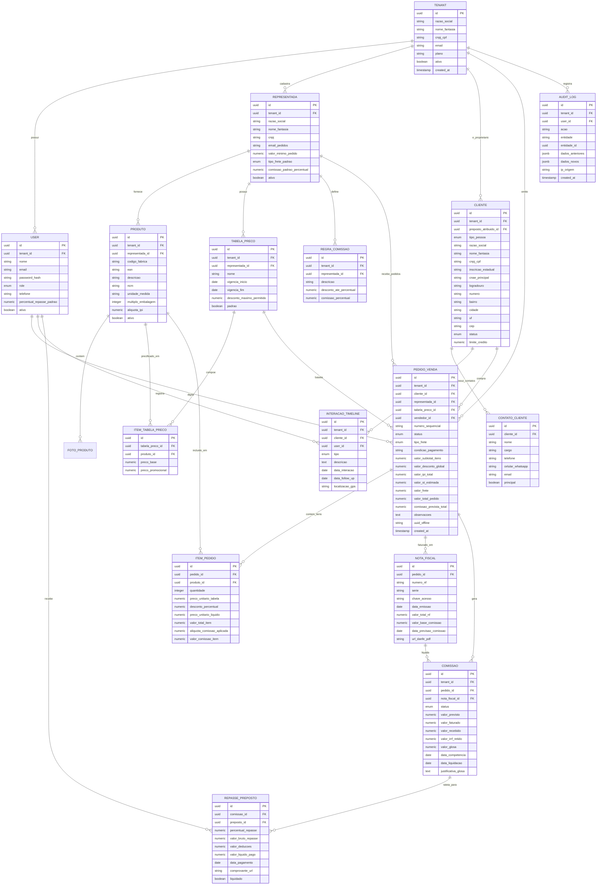

# Modelagem Conceitual de Domínio e Dicionário de Dados
## CRM-RC: CRM para Representantes Comerciais Multi-Representadas

---

### 📋 Controle do Documento
| Item | Descrição |
| :--- | :--- |
| **Código do Documento** | `DATA-SDLC-1.4` |
| **Versão** | `1.0.0` |
| **Status** | Aprovado |
| **Data de Emissão** | 30 de Agosto de 2026 |
| **Épico Vinculado** | [Épico #1: Concepção de Produto, Requisitos Funcionais e Regras de Negócio](https://github.com/fabiooliveir/crm-rc/issues/1) |
| **Issue de Entrega** | [Issue #15: [SDLC 1.4] Modelagem Conceitual de Domínio e Entidades de Negócio](https://github.com/fabiooliveir/crm-rc/issues/15) |
| **Documentos Relacionados** | [FRD-Especificacao-Requisitos-Funcionais.md](FRD-Especificacao-Requisitos-Funcionais.md) (`SDLC 1.1`), [PERSONAS-E-JORNADA-DO-USUARIO.md](PERSONAS-E-JORNADA-DO-USUARIO.md) (`SDLC 1.2`), [RNF-Requisitos-Nao-Funcionais-e-LGPD.md](RNF-Requisitos-Nao-Funcionais-e-LGPD.md) (`SDLC 1.3`) |

---

## 1. 🎯 Visão Geral do Modelo de Domínio

O modelo de dados do **CRM-RC** foi concebido para suportar a operação real do representante comercial no Brasil, garantindo:
1. **Multi-Tenancy Soberano:** A entidade `Tenant` representa a pessoa física ou jurídica do representante comercial. Toda a base de clientes, contatos e pedidos pertence ao `Tenant`. As representadas não têm acesso aos clientes de outras fábricas.
2. **Segregação Estrita de Catálogos:** Cada `Representada` possui seu catálogo isolado de `Produto`, suas próprias `TabelaPreco` e `RegraComissao`.
3. **Desacoplamento Cliente x Representada:** Um `Cliente` é cadastrado uma única vez na base do representante e pode receber pedidos emitidos para diferentes indústrias representadas ao longo do tempo.
4. **Ciclo de Vida Transacional Completo:** Acompanhamento desde a cotação/pedido (`PedidoVenda` ➔ `ItemPedido`), passando pelo faturamento (`NotaFiscal`) até a liquidação contábil (`Comissao`) e eventual rateio (`RepassePreposto`).

---

## 2. 🗄️ Diagrama Entidade-Relacionamento Conceitual (DER)



---

## 3. 📖 Dicionário de Dados Detalhado (Data Dictionary)

---

### 3.1. Tabela `tenants` (Organização / Conta Soberana)
* **Descrição:** Representa a conta mestre do representante comercial ou escritório de representação. É a raiz de isolamento multi-tenant (RLS).

| Atributo | Tipo de Dado | Chave | Nulo | Default | Restrições / Índices | Descrição e Regras |
| :--- | :--- | :--- | :--- | :--- | :--- | :--- |
| `id` | `UUID` | **PK** | NOT NULL | `gen_random_uuid()` | `PRIMARY KEY` | Identificador único universal do tenant. |
| `razao_social` | `VARCHAR(200)` | - | NOT NULL | - | - | Razão Social da representação PJ ou Nome do autônomo. |
| `nome_fantasia`| `VARCHAR(150)` | - | NULL | - | - | Nome comercial/marca do escritório de representação. |
| `cnpj_cpf` | `VARCHAR(18)` | - | NOT NULL | - | `UNIQUE` | CNPJ ou CPF do titular (validado com máscara). |
| `email` | `VARCHAR(150)` | - | NOT NULL | - | `UNIQUE` | E-mail principal da conta. |
| `plano` | `VARCHAR(50)` | - | NOT NULL | `'PRO'` | - | Plano de assinatura (FREE, PRO, ENTERPRISE). |
| `ativo` | `BOOLEAN` | - | NOT NULL | `true` | `INDEX` | Flag de status da conta. |
| `created_at` | `TIMESTAMPTZ` | - | NOT NULL | `NOW()` | - | Data de criação do registro. |
| `updated_at` | `TIMESTAMPTZ` | - | NOT NULL | `NOW()` | - | Data da última atualização. |

---

### 3.2. Tabela `users` (Usuários do Sistema)
* **Descrição:** Usuários que operam o sistema (Titular, Prepostos e Assistentes de Backoffice).

| Atributo | Tipo de Dado | Chave | Nulo | Default | Restrições / Índices | Descrição e Regras |
| :--- | :--- | :--- | :--- | :--- | :--- | :--- |
| `id` | `UUID` | **PK** | NOT NULL | `gen_random_uuid()` | `PRIMARY KEY` | Identificador do usuário. |
| `tenant_id` | `UUID` | **FK** | NOT NULL | - | `REFERENCES tenants(id) ON DELETE CASCADE` | Vínculo mandatória ao tenant. |
| `nome` | `VARCHAR(150)` | - | NOT NULL | - | - | Nome completo do usuário. |
| `email` | `VARCHAR(150)` | - | NOT NULL | - | `UNIQUE(tenant_id, email)` | E-mail de login. |
| `password_hash`| `VARCHAR(255)` | - | NOT NULL | - | - | Hash seguro de senha (Argon2id). |
| `role` | `ENUM` | - | NOT NULL | `'PREPOSTO_CAMPO'` | `UserRole` | Papel: `ADMIN_TITULAR`, `PREPOSTO_CAMPO`, `ASSISTENTE_BACKOFFICE`. |
| `telefone` | `VARCHAR(20)` | - | NULL | - | - | Telefone celular do profissional. |
| `percentual_repasse_padrao` | `NUMERIC(5,2)` | - | NOT NULL | `0.00` | `CHECK (>= 0 AND <= 100)` | % padrão de comissão repassada para este preposto (ex: 60.00%). |
| `ativo` | `BOOLEAN` | - | NOT NULL | `true` | `INDEX` | Status de ativação do usuário. |
| `created_at` | `TIMESTAMPTZ` | - | NOT NULL | `NOW()` | - | Data de cadastro. |

---

### 3.3. Tabela `representadas` (Indústrias Parceiras)
* **Descrição:** Empresas e indústrias cujos produtos são comercializados pelo representante.

| Atributo | Tipo de Dado | Chave | Nulo | Default | Restrições / Índices | Descrição e Regras |
| :--- | :--- | :--- | :--- | :--- | :--- | :--- |
| `id` | `UUID` | **PK** | NOT NULL | `gen_random_uuid()` | `PRIMARY KEY` | Identificador da representada. |
| `tenant_id` | `UUID` | **FK** | NOT NULL | - | `REFERENCES tenants(id) ON DELETE CASCADE` | Isolamento por tenant. |
| `razao_social` | `VARCHAR(200)` | - | NOT NULL | - | - | Razão Social da fábrica/indústria. |
| `nome_fantasia`| `VARCHAR(150)` | - | NOT NULL | - | `INDEX` | Nome fantasia da marca parceira. |
| `cnpj` | `VARCHAR(18)` | - | NOT NULL | - | - | CNPJ da matriz da indústria parceira. |
| `email_pedidos`| `VARCHAR(150)` | - | NOT NULL | - | - | E-mail para onde os pedidos fechados são enviados. |
| `valor_minimo_pedido` | `NUMERIC(12,2)` | - | NOT NULL | `0.00` | `CHECK (>= 0)` | Piso de faturamento mínimo por pedido (`RN-08`). |
| `tipo_frete_padrao` | `ENUM` | - | NOT NULL | `'CIF'` | `FreteTipo` | Frete padrão: `CIF`, `FOB`, `SEM_FRETE`. |
| `comissao_padrao_percentual` | `NUMERIC(5,2)` | - | NOT NULL | `5.00` | `CHECK (>= 0 AND <= 100)` | Alíquota linear padrão da fábrica (`RN-04`). |
| `ativo` | `BOOLEAN` | - | NOT NULL | `true` | `INDEX` | Status de representação ativa. |
| `created_at` | `TIMESTAMPTZ` | - | NOT NULL | `NOW()` | - | Data de inclusão da parceira. |

---

### 3.4. Tabela `produtos` (Catálogo de Itens)
* **Descrição:** Produtos pertencentes ao catálogo da representada.

| Atributo | Tipo de Dado | Chave | Nulo | Default | Restrições / Índices | Descrição e Regras |
| :--- | :--- | :--- | :--- | :--- | :--- | :--- |
| `id` | `UUID` | **PK** | NOT NULL | `gen_random_uuid()` | `PRIMARY KEY` | Identificador do produto. |
| `tenant_id` | `UUID` | **FK** | NOT NULL | - | `REFERENCES tenants(id)` | Vínculo tenant. |
| `representada_id` | `UUID` | **FK** | NOT NULL | - | `REFERENCES representadas(id) ON DELETE RESTRICT` | Fábrica proprietária do item (`RN-02`). |
| `codigo_fabrica` | `VARCHAR(50)` | - | NOT NULL | - | `UNIQUE(representada_id, codigo_fabrica)` | Código SKU ou referência de catálogo. |
| `ean` | `VARCHAR(14)` | - | NULL | - | `INDEX` | Código de barras GTIN/EAN-13. |
| `descricao` | `VARCHAR(255)` | - | NOT NULL | - | `INDEX (Full-Text)` | Descrição comercial completa do produto. |
| `ncm` | `VARCHAR(10)` | - | NOT NULL | - | - | Nomenclatura Comum do Mercosul (8 dígitos). |
| `unidade_medida` | `VARCHAR(10)` | - | NOT NULL | `'UN'` | - | Unidade: UN, CX, PC, KG, MT, LT. |
| `multiplo_embalagem` | `INTEGER` | - | NOT NULL | `1` | `CHECK (>= 1)` | Múltiplo de venda obrigatório (`RN-03`). |
| `aliquota_ipi` | `NUMERIC(5,2)` | - | NOT NULL | `0.00` | `CHECK (>= 0)` | Alíquota de IPI (%) incidente sobre o produto. |
| `ativo` | `BOOLEAN` | - | NOT NULL | `true` | `INDEX` | Flag de disponibilidade no catálogo. |

---

### 3.5. Tabela `tabelas_preco` e `itens_tabela_preco`
* **Descrição:** Condições comerciais de preços por canal/prazo da representada.

#### Tabela `tabelas_preco`
| Atributo | Tipo de Dado | Chave | Nulo | Default | Restrições / Índices | Descrição |
| :--- | :--- | :--- | :--- | :--- | :--- | :--- |
| `id` | `UUID` | **PK** | NOT NULL | `gen_random_uuid()` | `PRIMARY KEY` | Identificador da tabela. |
| `tenant_id` | `UUID` | **FK** | NOT NULL | - | `REFERENCES tenants(id)` | Isolamento tenant. |
| `representada_id` | `UUID` | **FK** | NOT NULL | - | `REFERENCES representadas(id) ON DELETE CASCADE` | Vínculo com a representada. |
| `nome` | `VARCHAR(100)` | - | NOT NULL | - | - | Nome: "Atacado 30dd", "Distribuidor 2026". |
| `vigencia_inicio` | `DATE` | - | NOT NULL | `CURRENT_DATE` | - | Início da vigência. |
| `vigencia_fim` | `DATE` | - | NULL | - | - | Fim da vigência (se houver). |
| `desconto_maximo_permitido` | `NUMERIC(5,2)` | - | NOT NULL | `0.00` | `CHECK (>= 0)` | Teto máximo de desconto no pedido. |
| `padrao` | `BOOLEAN` | - | NOT NULL | `false` | - | Indica se é a tabela padrão da fábrica. |

#### Tabela `itens_tabela_preco`
| Atributo | Tipo de Dado | Chave | Nulo | Default | Restrições / Índices | Descrição |
| :--- | :--- | :--- | :--- | :--- | :--- | :--- |
| `id` | `UUID` | **PK** | NOT NULL | `gen_random_uuid()` | `PRIMARY KEY` | Identificador do item da tabela. |
| `tabela_preco_id` | `UUID` | **FK** | NOT NULL | - | `REFERENCES tabelas_preco(id) ON DELETE CASCADE` | Tabela pai. |
| `produto_id` | `UUID` | **FK** | NOT NULL | - | `REFERENCES produtos(id) ON DELETE CASCADE` | Produto precificado. |
| `preco_base` | `NUMERIC(12,4)` | - | NOT NULL | - | `CHECK (>= 0)` | Preço unitário tabelado. |
| `preco_promocional` | `NUMERIC(12,4)` | - | NULL | - | - | Preço promocional temporário. |

---

### 3.6. Tabela `clientes` (Carteira Soberana)
* **Descrição:** Base de clientes pertencente exclusivamente ao representante.

| Atributo | Tipo de Dado | Chave | Nulo | Default | Restrições / Índices | Descrição e Regras |
| :--- | :--- | :--- | :--- | :--- | :--- | :--- |
| `id` | `UUID` | **PK** | NOT NULL | `gen_random_uuid()` | `PRIMARY KEY` | Identificador único do cliente. |
| `tenant_id` | `UUID` | **FK** | NOT NULL | - | `REFERENCES tenants(id) ON DELETE CASCADE` | Vínculo de soberania da carteira (`RN-01`). |
| `preposto_atribuido_id` | `UUID` | **FK** | NULL | - | `REFERENCES users(id) ON DELETE SET NULL` | Vendedor de campo responsável pela carteira (`RN-15`). |
| `tipo_pessoa` | `ENUM` | - | NOT NULL | `'PJ'` | `PessoaTipo` | `PJ` (Pessoa Jurídica) ou `PF` (Pessoa Física). |
| `razao_social` | `VARCHAR(200)` | - | NOT NULL | - | `INDEX (Full-Text)` | Razão social ou Nome completo. |
| `nome_fantasia`| `VARCHAR(150)` | - | NULL | - | `INDEX (Full-Text)` | Nome fantasia da loja/empresa. |
| `cnpj_cpf` | `VARCHAR(18)` | - | NOT NULL | - | `UNIQUE(tenant_id, cnpj_cpf)` | CNPJ/CPF único por tenant (`RN-10`). |
| `inscricao_estadual` | `VARCHAR(30)` | - | NULL | - | - | Inscrição Estadual (IE). |
| `cnae_principal` | `VARCHAR(15)` | - | NULL | - | - | Código CNAE de atividade econômica. |
| `logradouro` | `VARCHAR(200)` | - | NOT NULL | - | - | Rua, Avenida, etc. |
| `numero` | `VARCHAR(30)` | - | NOT NULL | - | - | Número do imóvel. |
| `complemento` | `VARCHAR(100)` | - | NULL | - | - | Sala, Galpão, Bloco. |
| `bairro` | `VARCHAR(100)` | - | NOT NULL | - | - | Bairro. |
| `cidade` | `VARCHAR(100)` | - | NOT NULL | - | `INDEX` | Cidade da sede do cliente. |
| `uf` | `VARCHAR(2)` | - | NOT NULL | - | `INDEX` | Estado (Sigla UF). |
| `cep` | `VARCHAR(10)` | - | NOT NULL | - | - | CEP formatado `XXXXX-XXX`. |
| `status` | `ENUM` | - | NOT NULL | `'PROSPECT'` | `ClienteStatus` | `PROSPECT`, `ATIVO`, `INATIVO`, `BLOQUEADO`. |
| `limite_credito` | `NUMERIC(12,2)` | - | NOT NULL | `0.00` | `CHECK (>= 0)` | Limite de crédito interno concedido. |
| `deleted_at` | `TIMESTAMPTZ` | - | NULL | - | `INDEX` | Soft delete para conformidade LGPD. |
| `created_at` | `TIMESTAMPTZ` | - | NOT NULL | `NOW()` | - | Data de cadastro. |

---

### 3.7. Tabela `pedidos_venda` e `itens_pedido`
* **Descrição:** Transação de venda emitida em campo pelo representante.

#### Tabela `pedidos_venda`
| Atributo | Tipo de Dado | Chave | Nulo | Default | Restrições / Índices | Descrição |
| :--- | :--- | :--- | :--- | :--- | :--- | :--- |
| `id` | `UUID` | **PK** | NOT NULL | `gen_random_uuid()` | `PRIMARY KEY` | Identificador do pedido. |
| `tenant_id` | `UUID` | **FK** | NOT NULL | - | `REFERENCES tenants(id)` | Isolamento por tenant. |
| `cliente_id` | `UUID` | **FK** | NOT NULL | - | `REFERENCES clientes(id) ON DELETE RESTRICT` | Comprador do pedido. |
| `representada_id` | `UUID` | **FK** | NOT NULL | - | `REFERENCES representadas(id) ON DELETE RESTRICT` | Indústria parceira (`RN-02`). |
| `tabela_preco_id` | `UUID` | **FK** | NOT NULL | - | `REFERENCES tabelas_preco(id)` | Tabela base de preços. |
| `vendedor_id` | `UUID` | **FK** | NOT NULL | - | `REFERENCES users(id)` | Usuário emissor do pedido. |
| `numero_sequencial` | `VARCHAR(30)` | - | NOT NULL | - | `UNIQUE(tenant_id, numero_sequencial)` | Código legível `PED-2026-0001`. |
| `status` | `ENUM` | - | NOT NULL | `'RASCUNHO'` | `PedidoStatus` | `RASCUNHO`, `ORCAMENTO`, `ENVIADO_FABRICA`, `FATURADO_PARCIAL`, `FATURADO_TOTAL`, `COMISSAO_PAGA`, `CANCELADO`, `EXPIRADO`. |
| `tipo_frete` | `ENUM` | - | NOT NULL | `'CIF'` | `FreteTipo` | `CIF`, `FOB`, `SEM_FRETE`. |
| `condicao_pagamento` | `VARCHAR(100)` | - | NOT NULL | - | - | Ex: "28/42/56 dias via Boleto". |
| `valor_subtotal_itens` | `NUMERIC(12,2)` | - | NOT NULL | `0.00` | - | Subtotal dos produtos sem impostos. |
| `valor_desconto_global`| `NUMERIC(12,2)` | - | NOT NULL | `0.00` | - | Desconto em R$ concedido no total. |
| `valor_ipi_total` | `NUMERIC(12,2)` | - | NOT NULL | `0.00` | - | Somatório de IPI calculado. |
| `valor_st_estimada` | `NUMERIC(12,2)` | - | NOT NULL | `0.00` | - | Estimativa de ICMS-ST. |
| `valor_frete` | `NUMERIC(12,2)` | - | NOT NULL | `0.00` | - | Valor de frete (quando FOB cobrado). |
| `valor_total_pedido` | `NUMERIC(12,2)` | - | NOT NULL | `0.00` | - | Valor final faturável do pedido. |
| `comissao_prevista_total` | `NUMERIC(12,2)`| - | NOT NULL | `0.00` | - | Projeção da comissão calculada (`RN-04`). |
| `uuid_offline` | `UUID` | - | NULL | - | `INDEX` | UUID gerado no client offline (`RN-13`). |
| `created_at` | `TIMESTAMPTZ` | - | NOT NULL | `NOW()` | `INDEX` | Data de emissão. |

#### Tabela `itens_pedido`
| Atributo | Tipo de Dado | Chave | Nulo | Default | Restrições / Índices | Descrição |
| :--- | :--- | :--- | :--- | :--- | :--- | :--- |
| `id` | `UUID` | **PK** | NOT NULL | `gen_random_uuid()` | `PRIMARY KEY` | Identificador do item. |
| `pedido_id` | `UUID` | **FK** | NOT NULL | - | `REFERENCES pedidos_venda(id) ON DELETE CASCADE` | Pedido pai. |
| `produto_id` | `UUID` | **FK** | NOT NULL | - | `REFERENCES produtos(id) ON DELETE RESTRICT` | Produto pedido. |
| `quantidade` | `INTEGER` | - | NOT NULL | - | `CHECK (> 0)` | Quantidade respeitando múltiplo (`RN-03`). |
| `preco_unitario_tabela` | `NUMERIC(12,4)` | - | NOT NULL | - | - | Preço unitário da tabela vigente. |
| `desconto_percentual` | `NUMERIC(5,2)` | - | NOT NULL | `0.00` | `CHECK (>= 0)` | % de desconto concedido no item. |
| `preco_unitario_liquido` | `NUMERIC(12,4)`| - | NOT NULL | - | - | Preço líquido final do item. |
| `valor_total_item` | `NUMERIC(12,2)` | - | NOT NULL | - | - | `quantidade * preco_unitario_liquido`. |
| `aliquota_comissao_aplicada` | `NUMERIC(5,2)` | - | NOT NULL | - | - | Alíquota de comissão calculada para o item. |
| `valor_comissao_item` | `NUMERIC(12,2)` | - | NOT NULL | - | - | Valor de comissão projetado no item. |

---

### 3.8. Tabela `comissoes` e `repasses_preposto`
* **Descrição:** Controle contábil de comissões por pedido/NF e rateio para equipe.

#### Tabela `comissoes`
| Atributo | Tipo de Dado | Chave | Nulo | Default | Restrições / Índices | Descrição e Regras |
| :--- | :--- | :--- | :--- | :--- | :--- | :--- |
| `id` | `UUID` | **PK** | NOT NULL | `gen_random_uuid()` | `PRIMARY KEY` | Identificador da comissão. |
| `tenant_id` | `UUID` | **FK** | NOT NULL | - | `REFERENCES tenants(id)` | Isolamento tenant. |
| `pedido_id` | `UUID` | **FK** | NOT NULL | - | `REFERENCES pedidos_venda(id) ON DELETE RESTRICT` | Pedido que gerou o título. |
| `nota_fiscal_id` | `UUID` | **FK** | NULL | - | `REFERENCES notas_fiscais(id) ON DELETE SET NULL` | NF correspondente. |
| `status` | `ENUM` | - | NOT NULL | `'PREVISTA'` | `ComissaoStatus` | `PREVISTA`, `FATURADA_A_RECEBER`, `LIQUIDADA`, `GLOSADA`, `SUSPENSA`, `CANCELADA`. |
| `valor_previsto` | `NUMERIC(12,2)` | - | NOT NULL | - | - | Valor apurado na digitação do pedido. |
| `valor_faturado` | `NUMERIC(12,2)` | - | NULL | - | - | Valor recalculado sobre NF-e (`RN-07`). |
| `valor_recebido` | `NUMERIC(12,2)` | - | NULL | - | - | Valor creditado em conta bancária. |
| `valor_irrf_retido` | `NUMERIC(12,2)` | - | NOT NULL | `0.00` | - | Retenção de IRRF 1,5% (`RN-14`). |
| `valor_glosa` | `NUMERIC(12,2)` | - | NOT NULL | `0.00` | - | Divergência/desconto contestado. |
| `data_competencia` | `DATE` | - | NOT NULL | `CURRENT_DATE` | `INDEX` | Mês/Ano de competência contábil. |
| `data_liquidacao` | `DATE` | - | NULL | - | `INDEX` | Data efetiva do crédito bancário. |
| `justificativa_glosa` | `TEXT` | - | NULL | - | - | Motivo de divergência ou estorno. |

---

## 4. 🔠 Tipos Enumerados do Domínio (Enums)

```sql
-- Papéis de Usuários do Sistema
CREATE TYPE UserRole AS ENUM (
    'ADMIN_TITULAR',
    'PREPOSTO_CAMPO',
    'ASSISTENTE_BACKOFFICE'
);

-- Tipo de Pessoa Jurídica ou Física
CREATE TYPE PessoaTipo AS ENUM (
    'PJ',
    'PF'
);

-- Status do Cliente na Carteira
CREATE TYPE ClienteStatus AS ENUM (
    'PROSPECT',
    'ATIVO',
    'INATIVO',
    'BLOQUEADO'
);

-- Ciclo de Vida do Pedido de Venda
CREATE TYPE PedidoStatus AS ENUM (
    'RASCUNHO',
    'ORCAMENTO',
    'ENVIADO_FABRICA',
    'FATURADO_PARCIAL',
    'FATURADO_TOTAL',
    'COMISSAO_PAGA',
    'CANCELADO',
    'EXPIRADO'
);

-- Modalidades de Frete Comercial
CREATE TYPE FreteTipo AS ENUM (
    'CIF',
    'FOB',
    'SEM_FRETE'
);

-- Ciclo Financeiro da Comissão
CREATE TYPE ComissaoStatus AS ENUM (
    'PREVISTA',
    'FATURADA_A_RECEBER',
    'LIQUIDADA',
    'GLOSADA',
    'SUSPENSA',
    'CANCELADA'
);

-- Tipos de Interações na Timeline
CREATE TYPE InteracaoTipo AS ENUM (
    'VISITA_PRESENCIAL',
    'WHATSAPP',
    'TELEFONEMA',
    'REUNIAO_ONLINE',
    'ANOTACAO_INTERNA'
);
```

---

## 5. 🎯 Conclusão da Fase 1 do SDLC

Com a conclusão deste documento (`SDLC 1.4`), a **Fase 1: Requisitos & Concepção de Produto** (`phase:1-requirements` / [Épico #1](https://github.com/fabiooliveir/crm-rc/issues/1)) atinge 100% de cobertura formal:
- ✅ **SDLC 1.1:** [Especificação de Requisitos Funcionais (FRD) e Casos de Uso](FRD-Especificacao-Requisitos-Funcionais.md) ([Issue #12](https://github.com/fabiooliveir/crm-rc/issues/12))
- ✅ **SDLC 1.2:** [Mapeamento de Personas e Jornada do Usuário](PERSONAS-E-JORNADA-DO-USUARIO.md) ([Issue #13](https://github.com/fabiooliveir/crm-rc/issues/13))
- ✅ **SDLC 1.3:** [Requisitos Não-Funcionais e Diretrizes de Segurança LGPD](RNF-Requisitos-Nao-Funcionais-e-LGPD.md) ([Issue #14](https://github.com/fabiooliveir/crm-rc/issues/14))
- ✅ **SDLC 1.4:** [Modelagem Conceitual de Domínio e Dicionário de Dados](MODELAGEM-CONCEITUAL-DE-DOMINIO.md) ([Issue #15](https://github.com/fabiooliveir/crm-rc/issues/15))

O projeto está formalmente pronto para transicionar para a **Fase 2: Design de Sistema & Arquitetura** (`phase:2-architecture` / Épico #2).
