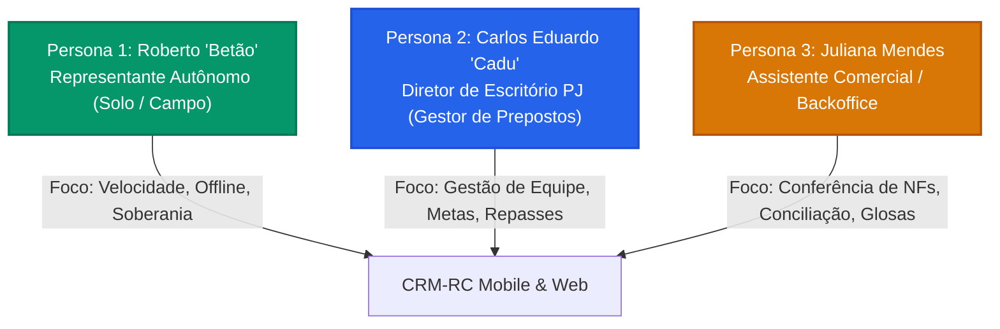
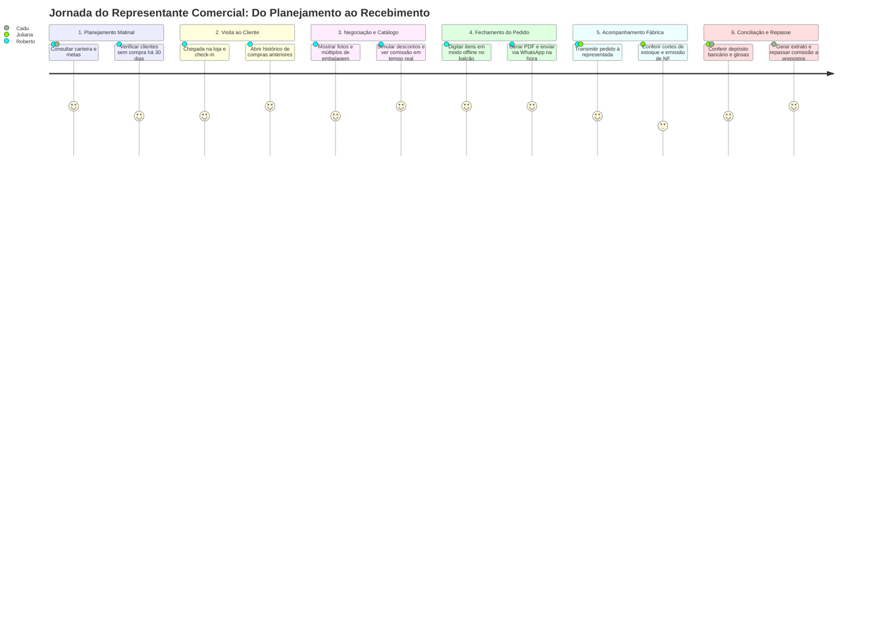
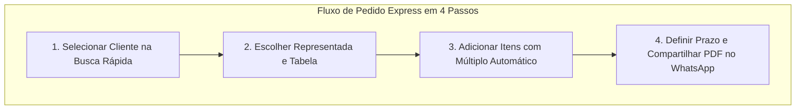

# Mapeamento de Personas e Jornada do Usuário (Customer Journey Map)
## CRM-RC: CRM para Representantes Comerciais Multi-Representadas

---

### 📋 Controle do Documento
| Item | Descrição |
| :--- | :--- |
| **Código do Documento** | `UXD-SDLC-1.2` |
| **Versão** | `1.0.0` |
| **Status** | Aprovado |
| **Data de Emissão** | 30 de Agosto de 2026 |
| **Épico Vinculado** | [Épico #1: Concepção de Produto, Requisitos Funcionais e Regras de Negócio](https://github.com/fabiooliveir/crm-rc/issues/1) |
| **Issue de Entrega** | [Issue #13: [SDLC 1.2] Mapeamento de Personas e Jornada do Usuário](https://github.com/fabiooliveir/crm-rc/issues/13) |
| **Documento Relacionado** | [FRD-Especificacao-Requisitos-Funcionais.md](FRD-Especificacao-Requisitos-Funcionais.md) (`SDLC 1.1`) |

---

## 1. 🎯 Introdução e Contexto Operacional

O trabalho do **Representante Comercial** no Brasil possui peculiaridades que inviabilizam a adoção de CRMs corporativos tradicionais (como Salesforce, HubSpot ou PipeDrive). 

O representante comercial opera em trânsito constante, sob incidência de luz solar direta, com conexões celulares instáveis nas rodovias e cidades do interior, lidando simultaneamente com:
- **Múltiplos Catálogos:** De 3 a 10 indústrias fabricantes com regras comerciais concorrentes.
- **Risco de Perda de Carteira:** Constante ameaça de indústrias tentarem absorver o contato direto com compradores consolidados.
- **Complexidade Tributária e Comercial:** Múltiplos de embalagem, substituição tributária (ST), IPI, faixas de desconto e tabelas de frete (CIF/FOB).
- **Conciliação Financeira Morosa:** Necessidade de conferir centenas de notas fiscais emitidas pelas fábricas contra comissões depositadas.

Este documento consolida o mapa detalhado de **Personas**, a **Jornada do Usuário (Customer Journey Map)** e os **Fluxos Operacionais Mobile-First** para nortear a experiência e usabilidade da plataforma CRM-RC.

---

## 2. 👤 Personas Detalhadas

---

### Persona 1: Roberto "Betão" Silveira
**Perfil:** Representante Comercial Autônomo (Trabalha Sozinho em Campo)

| Atributo | Detalhe |
| :--- | :--- |
| **Idade / Formação** | 52 anos, Ensino Médio completo com cursos em Técnicas de Vendas e Negociação. |
| **Tempo de Profissão** | 24 anos como representante comercial (Core registrado). |
| **Segmento de Atuação** | Materiais de Construção, Ferramentas e Ferragens. |
| **Portfólio Atendido** | Representa 4 indústrias complementares (Fábrica de Tintas, Ferramentas Manuais, Parafusos e Tubos de PVC). |
| **Carteira Ativa** | 160 lojas de materiais e depósitos distribuídos em um raio de 250 km. |
| **Ambiente de Trabalho** | 80% do tempo em trânsito no veículo ou no balcão de compradores; 20% em casa à noite. |
| **Dispositivos** | Smartphone Android intermediário (tela de 6.5"), suporte veicular e notebook usado em casa. |

#### 💢 Dores e Frustrações Reais
1. **Perda de Anotações e Histórico:** Usa blocos de papel e conversas de WhatsApp para anotar cotações. Quando precisa lembrar o que o comprador pediu há 3 semanas, perde tempo buscando mensagens antigas.
2. **Dependência de Internet:** Em cidades menores e rodovias, o sinal 4G/5G oscila constantemente. CRMs baseados em nuvem pura travam e fazem com que ele perca o ritmo da reunião com o cliente.
3. **Erros de Digitação de Múltiplos:** Esquece que determinado parafuso só vende em caixas de 500 unidades e digita 350. O pedido é devolvido pela fábrica dois dias depois com o item cortado.
4. **Desconfiança quanto à Soberania dos Dados:** Já trabalhou com o aplicativo de uma indústria que, após 5 anos de parceria, rescindiu o contrato e reteve toda a lista de compradores e contatos que ele havia cadastrado.
5. **Incerteza sobre Quanto Vai Receber:** Não sabe exatamente o valor de comissão que entrará na conta no dia 15 ou 20, pois não consegue controlar quais pedidos foram efetivamente faturados pela fábrica.

#### 🎯 Objetivos e Motivações
- Digitar e fechar um pedido completo de 15 itens em **menos de 2 minutos** na frente do comprador.
- Gerar na hora um PDF limpo e profissional com o resumo do pedido e enviar no WhatsApp do comprador antes de sair da loja.
- Ter a garantia de que sua carteira de 160 clientes é sua propriedade privada e nunca será acessada pelas indústrias.
- Saber com um toque no celular quanto vendeu no mês e quanto tem de comissão prevista para receber.

#### 📱 Comportamento e Hábitos Tecnológicos
- **Alta Proficiência em WhatsApp e Áudios:** Prefere mandar áudio e fotos a digitar textos longos.
- **Aversão a Telas Poluídas:** Se a tela tiver muitos botões pequenos ou campos obrigatórios irrelevantes, ele abandona o sistema.
- **Necessidade de Botões Grandes:** Digita frequentemente com uma mão enquanto segura amostras de produtos ou catálogo físico com a outra.

---

### Persona 2: Carlos Eduardo "Cadu" Fontes
**Perfil:** Sócio-Diretor de Escritório de Representação Comercial (PJ)

| Atributo | Detalhe |
| :--- | :--- |
| **Idade / Formação** | 44 anos, Graduação em Administração de Empresas. |
| **Estrutura da Empresa** | Escritório de Representação com sede própria, 4 prepostos de campo (vendedores) e 1 assistente backoffice. |
| **Segmento de Atuação** | Alimentos, Bebidas e Distribuição para Supermercados / Atacarejos. |
| **Portfólio Atendido** | 6 indústrias de bens de consumo não duráveis. |
| **Carteira Ativa** | 480 clientes cadastrados (redes de supermercados, mercearias e atacados regionais). |
| **Ambiente de Trabalho** | 50% em reuniões estratégicas com diretores de indústrias; 50% no escritório gerenciando equipe. |
| **Dispositivos** | iPhone topo de linha, iPad para apresentações comerciais e MacBook no escritório. |

#### 💢 Dores e Frustrações Reais
1. **Falta de Padronização da Equipe de Prepostos:** Cada vendedor anota pedidos de um jeito diferente (um por e-mail, outro por planilha, outro por foto de papel no WhatsApp).
2. **Cálculo Complexo de Repasse de Comissões:** Todo fechamento de mês vira uma maratona de planilhas de Excel para calcular quanto cada um dos 4 prepostos tem direito a receber (descontando adiantamentos e deduções).
3. **Risco de Fuga de Clientes com Prepostos:** Se um preposto se desliga da empresa, há o risco de ele levar os contatos dos clientes daquela rota se os dados não estiverem centralizados na empresa.
4. **Falta de Visão Consolidada por Representada:** Dificuldade para saber qual fábrica está crescendo e qual está perdendo faturamento trimestre a trimestre.
5. **Glosas Não Identificadas:** Fábricas parceiras pagam comissões com descontos indevidos e o escritório não tem tempo hábil para contestar nota por nota.

#### 🎯 Objetivos e Motivações
- Centralizar 100% dos pedidos da equipe em uma única plataforma padronizada.
- Automatizar o fechamento mensal da folha de repasses dos prepostos com emissão de extratos individuais transparentes.
- Proteger a base de clientes do escritório, concedendo acesso aos prepostos apenas aos clientes de suas respectivas rotas.
- Ter dashboards em tempo real com curva ABC de clientes e atingimento de metas por fábrica.

#### 📱 Comportamento e Hábitos Tecnológicos
- **Foco em Indicadores e Gráficos:** Gosta de visualizar resumos consolidados, valores faturados no mês e comparativos anuais.
- **Valoriza Segurança e Permissões:** Exige controle rigoroso de quem pode ver o quê dentro da empresa.

---

### Persona 3: Juliana Mendes
**Perfil:** Assistente Comercial e Backoffice da Representação

| Atributo | Detalhe |
| :--- | :--- |
| **Idade / Formação** | 29 anos, Cursando Ciências Contábeis. |
| **Tempo na Empresa** | 3 anos trabalhando no escritório de representação. |
| **Rotina Principal** | Recepção de pedidos de campo, conferência de regras de fábrica, lançamento de notas fiscais emitidas e conciliação bancária. |
| **Volume Operacional** | Processa cerca de 35 a 60 pedidos por dia e confere cerca de 300 notas fiscais por mês de 6 indústrias diferentes. |
| **Ambiente de Trabalho** | 100% no escritório em estação de trabalho fixa com dois monitores. |
| **Dispositivos** | Desktop Windows 11 com teclado numérico dedicado, leitor de código de barras e smartphone corporativo. |

#### 💢 Dores e Frustrações Reais
1. **Pedidos com Dados Faltantes:** Vendedores de campo enviam pedidos sem informar CNPJ correto, sem inscrição estadual ou com condições de pagamento incompatíveis com a fábrica.
2. **Cortes de Estoque Não Rastreados:** A fábrica fatura 80% do pedido por falta de estoque e Juliana precisa descobrir manualmente quais produtos ficaram para trás.
3. **Conferência Manual de Relatórios em PDF da Fábrica:** Recebe relatórios estáticos em PDF das indústrias e passa dias digitando linha por linha para cruzar com o extrato bancário.
4. **Cobrança Constante dos Vendedores:** Os prepostos ligam diariamente perguntando se a fábrica X já faturou o pedido do cliente Y e quando a comissão vai cair.

#### 🎯 Objetivos e Motivações
- Lançar o faturamento de pedidos e notas fiscais de forma ultrarrápida (com suporte a leitor de chave de NF-e / XML).
- Identificar divergências de centavos e glosas em menos de 10 minutos por lote de faturamento.
- Permitir que os vendedores consultem o status de seus próprios pedidos no app sem precisar interrompê-la a todo momento.
- Gerar relatórios de conciliação impecáveis para a contabilidade e diretoria.

#### 📱 Comportamento e Hábitos Tecnológicos
- **Uso Extensivo de Teclado e Atalhos:** Dá preferência absoluta a telas com navegação por teclado (`Tab`, `Enter`, `Esc`) e atalhos rápidos.
- **Visualização Tabular Densa:** Prefere tabelas compactas com muitos dados visíveis simultaneamente a cards espaçados.

---

## 3. 🗺️ Customer Journey Map (Jornada do Usuário Ponta a Ponta)

---

### Matriz Detalhada de Fases, Pontos de Fricção e Soluções no CRM-RC

| Fase da Jornada | Ações do Usuário | Ponto de Contato (Touchpoint) | Emoções / Pensamentos | ⚠️ Ponto de Fricção Crítico | 💡 Solução Projetada no CRM-RC |
| :--- | :--- | :--- | :--- | :--- | :--- |
| **1. Planejamento Matinal** | Roberto revisa sua rota do dia no carro; identifica quais clientes estão na região da visita. | Celular / Dashboard Mobile | 🧐 *"Quem está precisando repor estoque hoje na cidade X?"* | Falta de visibilidade rápida de clientes inativos por rota. | **Filtro de Clientes por Rota / Tags** e alerta automático: *"12 clientes na sua rota não compram há mais de 45 dias"*. |
| **2. Chegada no Estabelecimento** | Entra na loja, cumprimenta o comprador Carlos e quer saber o que ele comprou na última visita. | Perfil do Cliente no App | 🤝 *"Preciso lembrar o preço que fechei na última compra dele."* | Ter que rolar conversas antigas de WhatsApp para achar o preço combinado. | **Aba Histórico e Timeline em 1 Toque**, exibindo os últimos 3 pedidos, itens comprados e notas privadas de negociação. |
| **3. Apresentação de Catálogo** | Abre o catálogo de produtos da fábrica para apresentar lançamentos e promoções. | Catálogo Digital no Celular/Tablet | 😃 *"Esse produto novo tem uma margem excelente para a loja dele."* | Catálogo impresso pesado e desatualizado; PDF pesado que demora para carregar. | **Catálogo Digital Offline Leve**, com galeria de fotos, filtro por família e destaque para múltiplos de venda. |
| **4. Digitação do Pedido em Campo** | Comprador dita os itens: *"Me vê 10 caixas do item A e 50 unidades do B"*. | Carrinho de Pedidos Mobile | ⏱️ *"Tenho que digitar rápido antes que ele mude de ideia ou atenda o telefone."* | Sinal 4G oscila e o app trava; digitação de quantidades fora do múltiplo de embalagem. | **Modo 100% Offline (IndexedDB)** com ajuste automático para caixas fechadas (`RN-03`) e cálculo de comissão em tempo real. |
| **5. Formalização e Envio** | Roberto revisa o total, condições de frete (CIF/FOB) e gera o documento oficial. | Tela de Finalização do Pedido | 😎 *"Pedido fechado! Vou mandar no WhatsApp dele agora mesmo."* | Formulários complexos de e-mail; demora para exportar documento. | **Botão WhatsApp Direto (`wa.me`)** que gera o PDF profissional customizado com logo e envia a mensagem em 1 clique (`UC-06`). |
| **6. Acompanhamento de Faturamento** | A fábrica recebe o pedido, processa no ERP industrial e emite o DANFE/NF-e. | Painel Web / Backoffice | 🤞 *"Espero que a fábrica não corte nenhum produto por falta de matéria-prima."* | Fábrica fatura valor menor sem discriminar os itens cortados; vendedor fica no escuro. | **Módulo de Faturamento Parcial (`UC-08`)** que compara o pedido com a NF-e e aponta exatamente as sobras e cortes. |
| **7. Conciliação de Comissões** | No dia 15, a representada deposita o relatório mensal de comissões na conta bancária. | Módulo Financeiro Web | 🔍 *"Será que o valor bate com o que vendemos? Teve retenção de IRRF?"* | Planilhas manuais cansativas; divergências de alíquotas e comissões pagas a menor sem detecção. | **Conciliação de Comissões (`UC-09`)** com cálculo automático de IRRF 1,5% (`RN-14`) e ferramenta de apontamento de glosas. |
| **8. Repasse para Prepostos** | Cadu fecha o mês e apura a comissão dos 4 prepostos do escritório de representação. | Painel de Repasses PJ | 📊 *"Quero pagar meus vendedores com precisão e total transparência."* | Prepostos desconfiam dos valores calculados ou questionam descontos de adiantamento. | **Extrato de Repasse do Preposto em PDF (`UC-10`)** discriminando cada venda, comissões brutas, taxa de repasse e comprovante PIX. |

---

## 4. 📱 Fluxos Mínimos para Operação em Smartphone (Mobile-First)

Para assegurar que o representante autônomo (Persona 1) utilize o sistema diariamente com prazer e rapidez, os fluxos móveis foram projetados com foco em **baixa fricção cognitiva** e **operação em uma mão**.

---

### Fluxo Mobile 1: Emissão de Pedido Express em Campo (< 90 Segundos)
1. **Passo 1 (Seleção do Cliente):**
   - O representante toca no botão flutuante **[+ Pedido]** na barra inferior do app.
   - Digita 3 letras do nome da loja no campo de busca (ou seleciona da lista de "Clientes Próximos via GPS").
2. **Passo 2 (Seleção da Representada):**
   - Toca no card com o logo da indústria desejada (ex: *Fábrica Tintas Real*). A tabela de preço padrão é selecionada automaticamente.
3. **Passo 3 (Seleção de Produtos):**
   - A lista de produtos é exibida com cards compactos.
   - O usuário digita o código ou toca em `+` / `-`. O seletor avança de acordo com o múltiplo da embalagem (ex: 0 ➔ 12 ➔ 24 ➔ 36).
   - O rodapé fixo atualiza em tempo real: `Total: R$ 3.840,00 | Comissão Estimada: R$ 192,00 (5%)`.
4. **Passo 4 (Condições e Envio):**
   - Toca em **Avançar**. Seleciona o prazo (ex: *28/42 dias*) e modalidade de frete (*CIF*).
   - Toca no botão verde em destaque **[Salvar e Enviar WhatsApp]**.
   - O sistema gera o PDF no próprio dispositivo e abre o WhatsApp diretamente na conversa com o comprador.

---

### Fluxo Mobile 2: Consulta e Acionamento de Cliente em 1 Toque
1. O representante abre a aba **Clientes**.
2. No card do cliente, são visíveis 3 botões de ação direta:
   - 📞 **Ligar:** Dispara discagem telefônica direta.
   - 💬 **WhatsApp:** Abre mensagem pré-formatada sem precisar salvar o contato na agenda telefônica do aparelho.
   - 🗺️ **Navegar:** Abre a rota no Google Maps / Waze para o endereço do cliente.

---

### Fluxo Mobile 3: Check-in de Visita e Registro por Voz
1. Ao sair da reunião, o representante clica em **[Registrar Visita]**.
2. Toca no ícone de microfone do teclado do celular e dita o resumo da visita: *"Cliente pediu para ligar no dia 10 para renovar o estoque da linha de esmaltes."*
3. Seleciona a data do follow-up e clica em **Salvar**.
4. O compromisso é sincronizado na agenda do app.

---

### Fluxo Mobile 4: Consulta Financeira Instantânea no Celular
1. O representante abre a aba **Financeiro** no celular.
2. O topo exibe 3 cartões diretos e objetivos:
   - 💵 **Previsto no Mês:** `R$ 8.450,00` (Pedidos digitados aguardando faturamento).
   - 🚚 **Faturado a Receber:** `R$ 14.200,00` (Notas fiscais emitidas pelas fábricas).
   - 🏦 **Recebido no Mês:** `R$ 11.350,00` (Comissões conciliadas e depositadas).
3. Ao tocar em qualquer cartão, o app lista pedido a pedido com indicação da fábrica e previsão de crédito.

---

## 5. 🎨 Diretrizes Ergonômicas de UI/UX Mobile (Design System)

Para atender ao contexto de uso em campo, a interface do CRM-RC deve obrigatoriamente seguir as seguintes diretrizes:

1. **Touch Target Mínimo de 48x48px:** Todos os botões interativos e seletores devem possuir área de toque ampla para evitar cliques acidentais em telas touch em movimento.
2. **Modo Alto Contraste Solar:** Cores e tipografia calibradas com taxa de contraste WCAG AAA para leitura sob sol forte em pátios de lojas e depósitos.
3. **Teclado Numérico Automático:** Inputs de quantidade e preço devem abrir nativamente o teclado `inputmode="decimal"` ou `inputmode="numeric"` no celular, evitando teclados alfanuméricos desnecessários.
4. **Feedback de Operação Offline Indestrutível:** Quando sem conexão, o cabeçalho exibe um discreto badge verde *"Modo Campo (Offline Ativo)"*, assegurando ao representante que seus dados estão 100% seguros e serão salvos localmente.
5. **Zero Modais Bloqueantes Críticos:** Evitar diálogos modais intrusivos que interrompam o fluxo de digitação em telas pequenas.

---

## 6. 🔗 Rastreabilidade com os Épicos do SDLC

| Persona / Jornada | Requisitos Funcionais Associados | Módulo Técnico SDLC |
| :--- | :--- | :--- |
| **Roberto (Autônomo)** | `RF-CLI-01`, `RF-PED-01`, `RF-PED-07`, `RF-COM-01` | Módulo de Clientes (E05) & Pedidos Mobile (E06) |
| **Cadu (Gestor PJ)** | `RF-REP-01`, `RF-COM-05`, `RF-POR-01`, `RF-AUD-01` | Módulo Representadas (E04), Repasses (E07) & Segurança (E08) |
| **Juliana (Backoffice)** | `RF-REP-02`, `RF-COM-02`, `RF-COM-04` | Importador Catálogo (E04) & Conciliação NFs (E07) |
