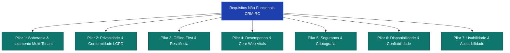
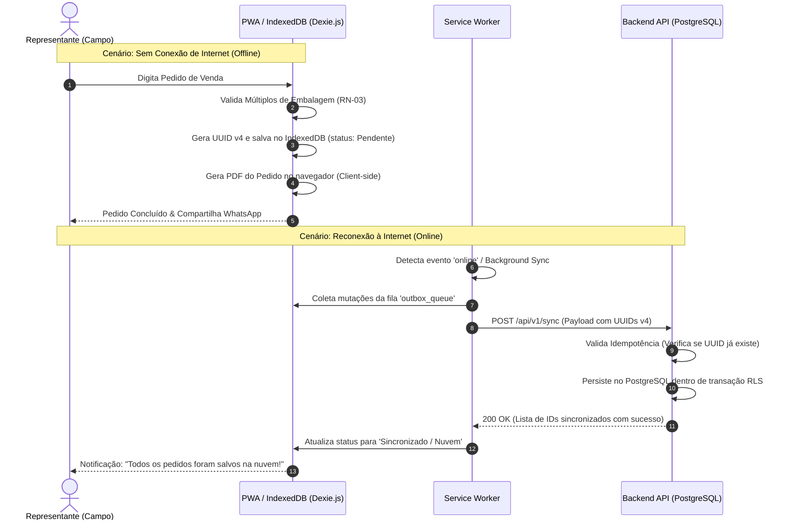
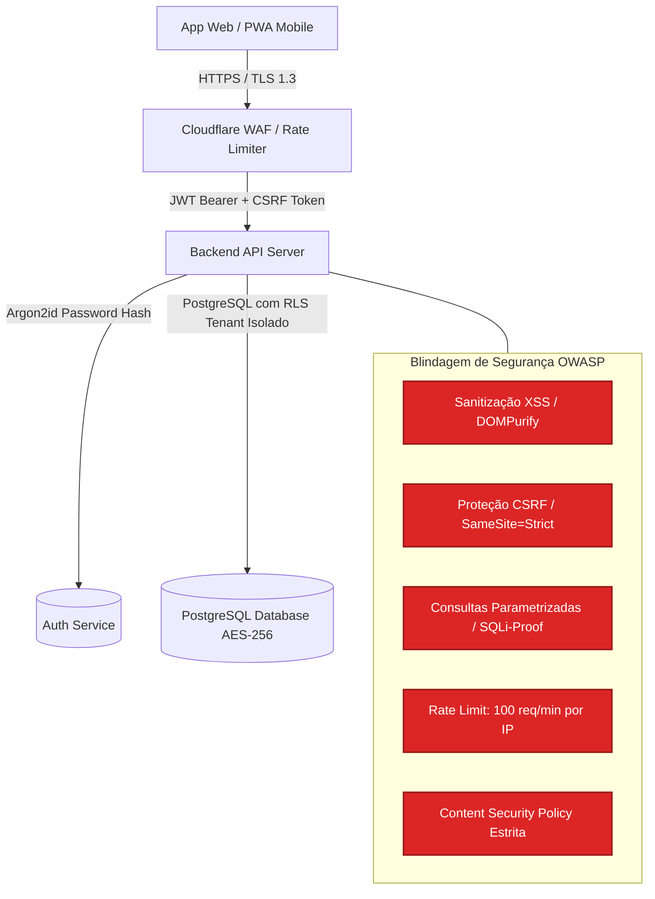

# Especificação de Requisitos Não-Funcionais (RNF) e Governança LGPD
## CRM-RC: CRM para Representantes Comerciais Multi-Representadas

---

### 📋 Controle do Documento
| Item | Descrição |
| :--- | :--- |
| **Código do Documento** | `NFR-SDLC-1.3` |
| **Versão** | `1.0.0` |
| **Status** | Aprovado |
| **Data de Emissão** | 30 de Agosto de 2026 |
| **Épico Vinculado** | [Épico #1: Concepção de Produto, Requisitos Funcionais e Regras de Negócio](https://github.com/fabiooliveir/crm-rc/issues/1) |
| **Issue de Entrega** | [Issue #14: [SDLC 1.3] Definição de Requisitos Não-Funcionais e Segurança LGPD](https://github.com/fabiooliveir/crm-rc/issues/14) |
| **Documentos Relacionados** | [FRD-Especificacao-Requisitos-Funcionais.md](FRD-Especificacao-Requisitos-Funcionais.md) (`SDLC 1.1`), [PERSONAS-E-JORNADA-DO-USUARIO.md](PERSONAS-E-JORNADA-DO-USUARIO.md) (`SDLC 1.2`) |

---

## 1. 🎯 Visão Geral dos Requisitos Não-Funcionais

Os Requisitos Não-Funcionais (RNFs / NFRs) do **CRM-RC** estabelecem os critérios de qualidade, segurança, robustez operacional e conformidade legal que a arquitetura do sistema deve garantir.

Como o representante comercial opera com a sua carteira de clientes como seu maior patrimônio profissional, a plataforma assume 4 pilares tecnológicos prioritários:
1. **Soberania Absoluta e Multi-Tenancy Blindado:** Nenhum dado comercial é vazado ou compartilhado com fornecedores e indústrias parceiras.
2. **Conformidade Rigorosa com a LGPD (Lei nº 13.709/2018):** Proteção integral de dados pessoais de compradores, contatos e representantes, com atendimento transparente a todos os direitos dos titulares.
3. **Resiliência Offline-First:** Capacidade total de consulta e emissão de pedidos no dispositivo móvel em locais sem sinal de internet, com reconciliação assíncrona automática e determinística.
4. **Performance Extrema em Dispositivos Móveis:** Carregamento ultra-rápido (< 1.5s) e renderização instantânea sob redes móveis instáveis (3G/4G).

---

## 2. 🛡️ Catálogo de Requisitos Não-Funcionais (ISO/IEC 25010)



---

### 2.1. Pilar 1: Soberania, Privacidade e Isolamento Multi-Tenancy (`RNF-SOB`)

| Código | Requisito Não-Funcional | Métrica / Critério de Aceite | Método de Verificação |
| :--- | :--- | :--- | :--- |
| **`RNF-SOB-01`** | **Isolamento Lógico Estrito por Tenant (RLS)** | O banco de dados central (PostgreSQL) deve implementar *Row-Level Security* (RLS) mandatória em todas as tabelas transacionais (`clientes`, `pedidos`, `comissoes`, `contatos`), garantindo que consultas sem a chave de tenant autenticada (`tenant_id` / `org_id`) retornem zero registros. | Testes de invasão automatizados e testes unitários de queries RLS com diferentes tokens de autenticação. |
| **`RNF-SOB-02`** | **Incomunicabilidade entre Representadas** | O sistema não deve permitir que nenhuma indústria representada tenha acesso de leitura, exportação ou telemetria sobre a carteira de clientes de outras indústrias cadastradas pelo mesmo representante. | Auditoria de rotas de API e validação de escopo de permissão de usuários convidados. |
| **`RNF-SOB-03`** | **Portabilidade Irrestrita (Zero Lock-in)** | A exportação integral da base de dados do representante deve estar disponível nos formatos abertos `.xlsx` (Excel), `.csv` e `.json` em menos de 10 segundos para bases de até 10.000 clientes e 50.000 pedidos. | Teste de carga de exportação com geração de dump compactado (.zip). |

---

### 2.2. Pilar 2: Conformidade com a LGPD (Lei nº 13.709/2018) (`RNF-LGP`)

| Código | Requisito Não-Funcional | Métrica / Critério de Aceite | Método de Verificação |
| :--- | :--- | :--- | :--- |
| **`RNF-LGP-01`** | **Bases Legais e Registro de Operações (ROPA)** | Todos os dados pessoais cadastrados (Nome, CPF, E-mail, Celular, Cargo de compradores) devem possuir base legal documentada no sistema (Execução de Contrato Comercial - Art. 7º, V ou Legítimo Interesse - Art. 7º, IX da LGPD). | Mapeamento no Registro de Operações de Tratamento de Dados (ROPA). |
| **`RNF-LGP-02`** | **Direito de Eliminação e Anonimização** | Ao receber solicitação formal de exclusão de dados por um titular, o sistema deve executar a anonimização irreversível dos dados pessoais (substituindo Nome por `Titular Anonimizado`, CPF por `000.***.***-00` e E-mail por hash SHA-256), preservando dados fiscais históricos exigidos pela legislação tributária brasileira (Art. 16, I da LGPD). | Teste automatizado de fluxo de exclusão/anonimização com conferência de banco de dados. |
| **`RNF-LGP-03`** | **Sanitização de Logs e Telemetria (Data Masking)** | Nenhuma informação pessoal identificável (PII) — tais como CPFs, telefones, e-mails de compradores ou anotações confidenciais — deve ser gravada em logs de aplicação, ferramentas de rastreamento de erros (Sentry/GlitchTip) ou telemetria. | Auditoria estática de código (SAST) e inspeção de payloads enviados ao Sentry. |
| **`RNF-LGP-04`** | **Trilha de Auditoria de Acesso a Dados Pessoais** | O sistema deve registrar log imutável de auditoria contendo: ID do Usuário, IP de Origem, Timestamp UTC, Operação Realizada (Leitura em lote, Edição, Exclusão) e Entidade Afetada, com retenção mínima de 12 meses. | Verificação da tabela `audit_logs` no banco de dados. |

---

### 2.3. Pilar 3: Arquitetura Offline-First & Resiliência (`RNF-OFF`)



| Código | Requisito Não-Funcional | Métrica / Critério de Aceite | Método de Verificação |
| :--- | :--- | :--- | :--- |
| **`RNF-OFF-01`** | **Operabilidade 100% Offline das Telas Principais** | As telas de Consulta de Clientes, Consulta de Catálogo de Produtos com Fotos em Cache, Digitação de Pedidos/Orçamentos e Geração de PDF devem funcionar sem conexão de rede ativa. | Teste de desconexão (Network Throttling = Offline no DevTools) em dispositivo real. |
| **`RNF-OFF-02`** | **Armazenamento Local Persistente (IndexedDB)** | O armazenamento local deve utilizar IndexedDB gerenciado com Dexie.js, com suporte a cache de até 20.000 produtos, 2.000 clientes e 1.000 pedidos em aberto (consumo estimado < 50 MB de armazenamento local). | Teste de preenchimento de banco local e medição via Storage Manager API. |
| **`RNF-OFF-03`** | **Sincronização Idempotente via UUID v4** | Todas as entidades criadas offline devem receber um identificador único universal (UUID v4) gerado no client-side. O endpoint de sincronização do backend deve ser estritamente idempotente, garantindo que retransmissões de pacotes de rede não gerem duplicidades. | Teste de disparo duplo e triplo do mesmo payload de sincronização contra a API. |
| **`RNF-OFF-04`** | **Resolução Determinística de Conflitos** | Em caso de concorrência na sincronização: entidades exclusivas do representante adotam *Last-Write-Wins* (LWW) baseado em timestamp confiável; dados compartilhados de pedidos faturados pela fábrica tratam a versão da NF-e como autoritativa. | Teste de simulação de edição simultânea offline/online com validação do estado final. |
| **`RNF-OFF-05`** | **Retry Automático com Exponential Backoff** | Em caso de falha de conexão durante a sincronização, o Service Worker deve tentar novamente em intervalos progressivos (1s, 2s, 5s, 15s, 30s, 60s) sem sobrecarregar a bateria do aparelho. | Validação da fila de reprocessamento no Service Worker. |

---

### 2.4. Pilar 4: Desempenho, Core Web Vitals & Eficiência (`RNF-PER`)

| Código | Requisito Não-Funcional | Métrica Alvo | Condição de Teste |
| :--- | :--- | :--- | :--- |
| **`RNF-PER-01`** | **Largest Contentful Paint (LCP)** | $\le 1.2\text{ s}$ (Mobile) / $\le 0.8\text{ s}$ (Desktop) | Rede 4G simulada (Fast 3G / Slow 4G) no Google Lighthouse. |
| **`RNF-PER-02`** | **Interaction to Next Paint (INP) / Responsividade** | $\le 100\text{ ms}$ em todas as interações de toque e teclado | Dispositivo móvel intermediário (ex: Moto G / Galaxy A). |
| **`RNF-PER-03`** | **Cumulative Layout Shift (CLS)** | $\le 0.05$ (quase zero deslocamento visual) | Carregamento completo da tela de emissão de pedidos. |
| **`RNF-PER-04`** | **Tempo de Resposta de API (Backend Latency)** | $\text{P95} \le 150\text{ ms}$ / $\text{P99} \le 300\text{ ms}$ | Teste de carga com 100 requisições simultâneas via k6 / Autocannon. |
| **`RNF-PER-05`** | **Tamanho do Bundle JavaScript Inicial** | $\le 160\text{ KB}$ (gzipped / brotli comprimido) | Análise de build via `@next/bundle-analyzer` ou Rollup visualizer. |
| **`RNF-PER-06`** | **Geração de PDF no Client-Side** | $\le 800\text{ ms}$ para pedidos de até 50 itens | Execução local no navegador do smartphone sem chamada de rede. |
| **`RNF-PER-07`** | **Virtualização de Listas de Produtos** | Renderização fluida a 60 FPS em catálogos com mais de 5.000 produtos ativos | Uso de Virtual Scrolling / Windowing (TanStack Virtual / React Virtualized). |

---

### 2.5. Pilar 5: Segurança da Informação & Gestão de Identidade (`RNF-SEC`)



| Código | Requisito Não-Funcional | Métrica / Critério de Aceite | Método de Verificação |
| :--- | :--- | :--- | :--- |
| **`RNF-SEC-01`** | **Criptografia de Dados em Trânsito e Repouso** | 100% do tráfego deve trafegar sobre HTTPS com protocolo **TLS 1.3** obrigatório (HSTS habilitado com `max-age=31536000`). Os volumes de banco de dados e backups devem ser criptografados em repouso com algoritmo **AES-256**. | Análise de SSL Server Test (Qualys SSL Labs com nota A+) e inspeção de infraestrutura cloud. |
| **`RNF-SEC-02`** | **Armazenamento Seguro de Credenciais** | Senhas de usuários devem ser hasheadas com **Argon2id** (ou bcrypt com fator de custo $\ge 12$). Nenhuma senha em texto claro pode existir em nenhuma camada. | Inspeção de código de autenticação e banco de dados. |
| **`RNF-SEC-03`** | **Gestão de Sessão e Tokens (JWT + Refresh Tokens)** | Access Tokens JWT com expiração curta (15 minutos) e Refresh Tokens seguros gravados exclusivamente em cookies com as flags `HttpOnly`, `Secure` e `SameSite=Strict`. | Teste de segurança de inspeção de cookies e validação de rotação de tokens. |
| **`RNF-SEC-04`** | **Mitigação OWASP Top 10** | O sistema deve possuir defesas ativas contra XSS (sanitização de inputs via DOMPurify), SQL Injection (uso exclusivo de ORM parametrizado - Prisma/Drizzle), CSRF e injeção de cabeçalhos. | Execução de scanner de vulnerabilidades DAST (OWASP ZAP) sem achados de severidade Alta ou Média. |
| **`RNF-SEC-05`** | **Controle de Acesso Baseado em Papéis (RBAC)** | Segregação estrita de permissões entre os perfis: `Admin/Titular` (acesso irrestrito à conta), `Preposto/Vendedor` (apenas seus clientes/pedidos/repasses) e `Assistente` (conferência operacional de NFs). | Testes de matriz de permissão de endpoints de API com tentativas de elevação de privilégio. |
| **`RNF-SEC-06`** | **Proteção contra Ataques de Força Bruta (Rate Limiting)** | Endpoints de autenticação (`/login`, `/reset-password`) devem limitar tentativas a no máximo 5 requisições por minuto por endereço IP, aplicando bloqueio temporário de 15 minutos em caso de excesso. | Teste de estresse com tentativas automatizadas de login. |

---

### 2.6. Pilar 6: Confiabilidade, Disponibilidade & Backup (`RNF-REL`)

| Código | Requisito Não-Funcional | Métrica Alvo | Descrição e Procedimento |
| :--- | :--- | :--- | :--- |
| **`RNF-REL-01`** | **SLA de Disponibilidade do Serviço (Uptime)** | $\ge 99.8\%$ em regime 24/7 (tolerância máxima de ~1h26m de indisponibilidade não planejada por mês). | Monitoramento sintético contínuo (BetterUptime / Datadog Synthetic) com checagem a cada 60s. |
| **`RNF-REL-02`** | **RPO (Recovery Point Objective)** | $\le 1\text{ hora}$ | Snapshots automatizados de banco de dados e Write-Ahead Logging (WAL) contínuo com replicação geográfica. |
| **`RNF-REL-03`** | **RTO (Recovery Time Objective)** | $\le 2\text{ horas}$ | Procedimento de Disaster Recovery documentado com restauração automatizada de containers e banco. |
| **`RNF-REL-04`** | **Rotina de Backup Automatizado** | Diário às 03:00 UTC com retenção de 30 dias | Backups criptografados transferidos para armazenamento em nuvem secundário (S3 / Cloudflare R2). |

---

### 2.7. Pilar 7: Usabilidade, Acessibilidade & Ergonomia (`RNF-USA`)

| Código | Requisito Não-Funcional | Métrica / Critério de Aceite | Método de Verificação |
| :--- | :--- | :--- | :--- |
| **`RNF-USA-01`** | **Acessibilidade Visual (WCAG 2.1 Nível AA)** | Taxa de contraste mínima de 4.5:1 para textos normais e 3:1 para elementos de interface e textos em destaque, garantindo legibilidade sob incidência direta de luz solar. | Verificação automatizada via Axe DevTools e auditoria visual no Lighthouse. |
| **`RNF-USA-02`** | **Área de Toque Ergonômica (Touch Targets)** | Todos os botões, checkboxes e elementos interativos em smartphones devem possuir área física de clique mínima de $48 \times 48\text{ pixels}$ com espaçamento mínimo de $8\text{ px}$. | Inspeção de CSS e testes com navegação por toque em tela móvel. |
| **`RNF-USA-03`** | **Responsividade Fluida (Breakpoints)** | A interface deve se adaptar com layout otimizado desde telas ultra-compactas de smartphones (360px) até monitores desktop ultrawide (4K). | Teste em múltiplos viewports: 360px, 390px, 768px, 1024px, 1440px e 1920px. |
| **`RNF-USA-04`** | **Teclados Otimizados para Campo** | Campos de digitação de quantidades, valores e descontos devem abrir nativamente teclados numéricos (`inputmode="decimal"` ou `inputmode="numeric"`), reduzindo o tempo de digitação em 50%. | Teste prático em dispositivos iOS e Android. |

---

## 3. 📄 Matriz de Conformidade e Governança LGPD (RIPD)

Mapeamento formal dos dados tratados pelo sistema CRM-RC em conformidade com os princípios de finalidade, adequação e necessidade (Art. 6º da LGPD):

| Categoria do Dado | Campos Tratados | Finalidade Comercial | Base Legal (LGPD) | Período de Retenção | Medidas de Segurança |
| :--- | :--- | :--- | :--- | :--- | :--- |
| **Dados do Representante** | Nome, CPF/CNPJ, E-mail, Telefone, CORE, Senha Hasheada. | Gestão da conta, autenticação, conciliação e emissão de propostas. | Execução de Contrato (Art. 7º, V) | Enquanto durar a conta ativa + 5 anos fiscais. | Argon2id, RLS, TLS 1.3, Backups AES-256. |
| **Dados de Compradores / Clientes** | Nome do Contato, Cargo, E-mail, Celular/WhatsApp. | Identificação do destinatário de pedidos e propostas comerciais. | Execução de Contrato (Art. 7º, V) / Legítimo Interesse (Art. 7º, IX) | Enquanto houver relacionamento comercial ativo + histórico legal. | RLS por Tenant, anonimização a pedido, sem logs de PII. |
| **Dados Fiscais / PJ** | Razão Social, CNPJ, Inscrição Estadual, Endereço, CNAE. | Emissão de pedidos de venda e faturamento de notas fiscais pela indústria. | Obrigação Legal / Fiscal (Art. 7º, II) | 5 anos (Prazo prescricional do Código Tributário Nacional). | Armazenamento seguro, validação de integridade. |
| **Dados de Visitas / Anotações** | Histórico de conversas, preferências de compra, datas de follow-up. | Inteligência comercial exclusiva do representante. | Legítimo Interesse (Art. 7º, IX) | Conforme gestão soberana do titular da conta. | Sigilo interno absoluto; nunca exportado para fábricas. |

---

## 4. 📊 Resumo Executivo das Métricas de Qualidade

```
┌───────────────────────────────────────────────────────────────────────────┐
│                      CRM-RC QUALITY SCORECARD                             │
├─────────────────────────┬────────────────────────┬────────────────────────┤
│ Métrica                 │ Meta Obrigatória       │ Status Arquitetural    │
├─────────────────────────┼────────────────────────┼────────────────────────┤
│ Performance Mobile      │ LCP ≤ 1.2s             │ Validado (Next/PWA)    │
│ Operação Offline        │ 100% Telas Críticas    │ Dexie.js + IndexedDB   │
│ Disponibilidade (SLA)   │ ≥ 99.8% (24/7)         │ Multi-AZ Cloud Ready   │
│ Isolamento de Dados     │ RLS PostgreSQL         │ Blindagem por Tenant   │
│ Conformidade LGPD       │ 100% Direitos Atendidos│ Anonimização + ROPA    │
│ Segurança OWASP         │ Zero Achados Críticos  │ Headers + CSP + JWT    │
└─────────────────────────┴────────────────────────┴────────────────────────┘
```
