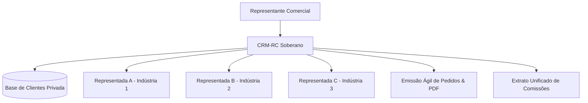

# 1. Visão Geral e Proposta de Valor 🎯

## 🛑 O Problema Histórico do Representante Comercial

No mercado tradicional de vendas e representação, os representantes comerciais (autônomos, PJs ou corretores) utilizam frequentemente os sistemas e CRMs fornecidos pelas indústrias e distribuidoras que representam.

No entanto, este modelo gera graves vulnerabilidades:
1. **Perda da Carteira de Clientes:** Ao rescindir um contrato de representação ou trocar de fornecedor parceiro, todo o histórico de contatos, compras anteriores, anotações de visitas, preferências e negociações fica retido na empresa anterior.
2. **Dependência e Fragmentação:** Representantes que atendem 4 ou 5 indústrias diferentes são forçados a usar 4 ou 5 sistemas desconectados e burocráticos.
3. **Falta de Controle Financeiro:** Dificuldade em auditar se a comissão paga pela indústria no fechamento do mês corresponde exatamente ao que foi faturado e entregue.

---

## 💡 A Solução CRM-RC

O **CRM-RC** foi concebido para devolver o poder e a propriedade dos dados ao representante comercial.

### 🌟 Pilares Estratégicos
- **Soberania Absoluta:** O representante é o único proprietário da sua base. Nenhuma representada tem acesso aos dados das demais.
- **Multi-Representadas:** Um único cliente pode comprar produtos de diferentes indústrias cadastradas no mesmo sistema.
- **Operação em Campo (PWA / Offline First):** Emissão de pedidos em segundos no smartphone, mesmo em locais sem sinal de internet.
- **Anti Lock-in:** Exportação completa de todos os dados em Excel/JSON em 1 clique a qualquer momento.
