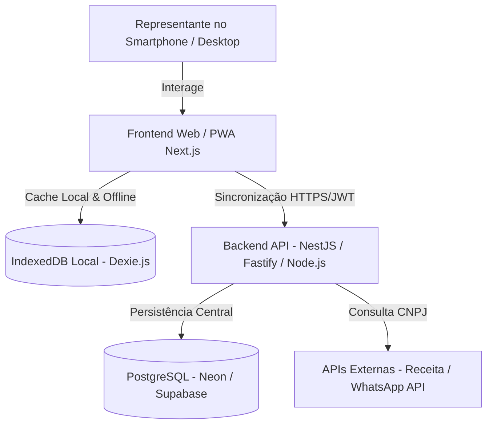

# 3. Arquitetura de Software e Stack Técnica 🏛️

## 🧱 Visão da Arquitetura C4

---

## 🛠️ Stack Tecnológica

| Camada | Tecnologia Escolhida | Racional |
|---|---|---|
| **Frontend** | React / Next.js (App Router) + Tailwind CSS | Performance SSR/SSG, interface responsiva e componentes modulares |
| **Design System** | Shadcn UI + Radix UI + Lucide Icons | Acessibilidade, velocidade de prototipação e estética moderna |
| **Offline Layer** | PWA + Workbox + Dexie.js (IndexedDB) | Permite funcionamento completo offline e cache local de pedidos |
| **Backend API** | Node.js (NestJS / Fastify) | Tipagem unificada com TypeScript e alta velocidade de resposta |
| **Banco de Dados** | PostgreSQL + Prisma ORM | Integridade relacional estrita, suporte a JSONB e consultas complexas |
| **Segurança** | NextAuth / JWT + Row-Level Security (RLS) | Isolamento completo entre contas de representantes |
| **Geração de PDF** | @react-pdf/renderer | Geração de PDFs de pedidos diretamente no client/server sem gargalos |
