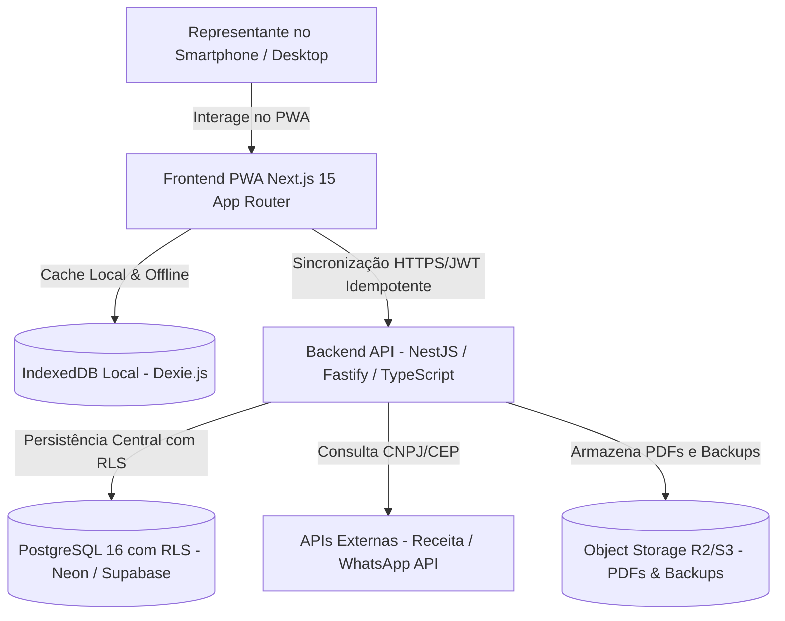

# 3. Arquitetura de Software e Stack Técnica 🏛️

> 📄 **Documento Oficial de Engenharia:** Para o detalhamento completo do Modelo C4 (Contexto, Containers e Componentes), diagramas e os 6 Registros de Decisão Arquitetural (ADRs), consulte: [ARQUITETURA-DE-SOLUCAO-E-STACK.md](../architecture/ARQUITETURA-DE-SOLUCAO-E-STACK.md).

---

## 🧱 Visão da Arquitetura C4 (Nível 2: Containers)

---

## 🛠️ Stack Tecnológica Consolidada

| Camada | Tecnologia Escolhida | Racional & Metas de Engenharia |
|---|---|---|
| **Frontend** | React 19 / Next.js 15 (App Router) + Tailwind CSS | Performance SSR/SSG, LCP $\le 1.2\text{s}$, bundle inicial $\le 160\text{ KB}$ |
| **Design System** | Shadcn UI + Radix UI + Lucide Icons | Acessibilidade WCAG AA, botões com touch target $\ge 48\text{px}$ e modo solar |
| **Offline Layer** | PWA + Workbox + Dexie.js (IndexedDB) | Operação 100% offline de catálogo e pedidos com sincronização assíncrona |
| **Backend API** | Node.js (NestJS / Fastify) | Tipagem TypeScript, latência de API $\text{P95} \le 150\text{ms}$ e rate limit ativo |
| **Banco de Dados** | PostgreSQL 16 (Drizzle / Prisma ORM) | Integridade relacional, RLS (Row-Level Security) e criptografia AES-256 |
| **Segurança & LGPD** | JWT + Refresh Tokens HttpOnly + RLS | Argon2id para senhas, TLS 1.3, RLS por tenant e anonimização de PII |
| **Geração de PDF** | @react-pdf/renderer | Geração de PDFs no client-side em $\le 800\text{ms}$ sem chamadas de rede |

---

## 📝 Registros de Decisão Arquitetural (ADRs)

1. **`ADR-001` (Frontend):** Next.js 15 App Router para renderização híbrida rápida e suporte a PWA instalável.
2. **`ADR-002` (Backend):** NestJS com Fastify e TypeScript unificado para máxima vazão e reuso de tipos/DTOs.
3. **`ADR-003` (Banco de Dados):** PostgreSQL 16 com Row-Level Security (RLS) nativa para garantia de soberania dos dados.
4. **`ADR-004` (Camada Offline):** Dexie.js sobre IndexedDB com fila de mutações idempotentes para resiliência em campo.
5. **`ADR-005` (Autenticação):** JWT com cookies HttpOnly/Secure/SameSite e injeção do Tenant ID na sessão.
6. **`ADR-006` (Documentos):** Renderização de PDF client-side via `@react-pdf/renderer` sem dependência de rede.

