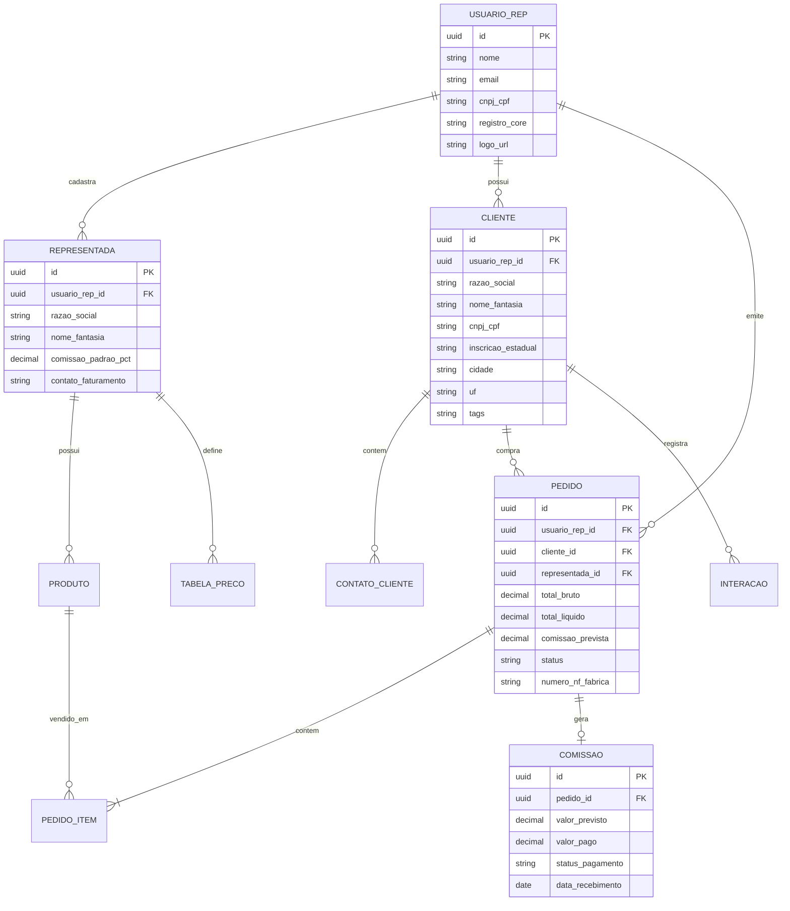

# 4. Modelagem de Dados e Entidades 🗄️

## 📊 Diagrama Entidade-Relacionamento (DER)

```mermaid
erDiagram
    USUARIO_REP ||--o{ REPRESENTADA : cadastra
    USUARIO_REP ||--o{ CLIENTE : possui
    USUARIO_REP ||--o{ PEDIDO : emite
    REPRESENTADA ||--o{ PRODUTO : possui
    REPRESENTADA ||--o{ TABELA_PRECO : define
    CLIENTE ||--o{ CONTATO_CLIENTE : contem
    CLIENTE ||--o{ PEDIDO : compra
    PEDIDO ||--|{ PEDIDO_ITEM : contem
    PRODUTO ||--o{ PEDIDO_ITEM : vendido_em
    PEDIDO ||--o| COMISSAO : gera
    CLIENTE ||--o{ INTERACAO : registra

    USUARIO_REP {
        uuid id PK
        string nome
        string email
        string cnpj_cpf
        string registro_core
        string logo_url
    }

    REPRESENTADA {
        uuid id PK
        uuid usuario_rep_id FK
        string razao_social
        string nome_fantasia
        decimal comissao_padrao_pct
        string contato_faturamento
    }

    CLIENTE {
        uuid id PK
        uuid usuario_rep_id FK
        string razao_social
        string nome_fantasia
        string cnpj_cpf
        string inscricao_estadual
        string cidade
        string uf
        string tags
    }

    PEDIDO {
        uuid id PK
        uuid usuario_rep_id FK
        uuid cliente_id FK
        uuid representada_id FK
        decimal total_bruto
        decimal total_liquido
        decimal comissao_prevista
        string status
        string numero_nf_fabrica
    }

    COMISSAO {
        uuid id PK
        uuid pedido_id FK
        decimal valor_previsto
        decimal valor_pago
        string status_pagamento
        date data_recebimento
    }
```
