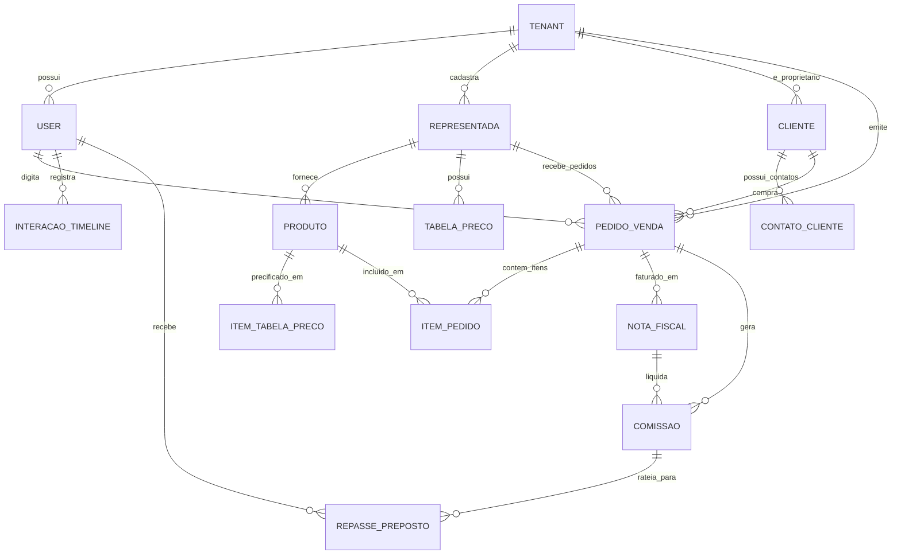

# 4. Modelagem de Dados e Entidades 🗄️

> 📄 **Documento Oficial de Engenharia:** Para o Diagrama Entidade-Relacionamento completo, dicionário de dados exaustivo de todas as 15 entidades, tipos de dados, chaves PK/FK e enums, consulte: [MODELAGEM-CONCEITUAL-DE-DOMINIO.md](../requirements/MODELAGEM-CONCEITUAL-DE-DOMINIO.md).

---

## 📊 Visão Geral do Modelo de Domínio

O modelo do **CRM-RC** é fundamentado na **soberania da carteira de clientes** e no **isolamento multi-representadas**:

---

## 📋 Resumo das Principais Entidades

| Entidade | Papel no Domínio | Chave de Isolamento |
| :--- | :--- | :--- |
| **`Tenant`** | Conta mestre do representante (Organização PJ ou Autônomo). | Raiz do Multi-Tenancy (RLS) |
| **`User`** | Usuários da conta: Administrador/Titular, Prepostos e Backoffice. | `tenant_id` |
| **`Representada`** | Indústrias parceiras com políticas comerciais e frete padrão. | `tenant_id` |
| **`Produto`** | Catálogo com código de fábrica, EAN, NCM e múltiplo de embalagem (`RN-03`). | `tenant_id`, `representada_id` |
| **`TabelaPreco`** | Tabelas de preços por canal/prazo com vigência e limite de desconto. | `tenant_id`, `representada_id` |
| **`Cliente`** | Carteira de clientes (PF/PJ) com CNPJ, endereço e limite de crédito. | `tenant_id` (Propriedade Soberana) |
| **`ContatoCliente`** | Compradores, diretores e financeiros com acionamento WhatsApp direto. | `cliente_id` |
| **`PedidoVenda`** | Pedido emitido em campo com cálculo de impostos, frete e comissão prevista. | `tenant_id`, `cliente_id`, `representada_id` |
| **`ItemPedido`** | Itens do pedido com validação de caixa fechada e descontos unitários. | `pedido_id`, `produto_id` |
| **`NotaFiscal`** | DANFE/NF-e emitida pela fábrica com rastreamento de faturamento parcial. | `pedido_id` |
| **`Comissao`** | Título financeiro com status (Prevista, Faturada, Liquidada, Glosada) e IRRF 1,5%. | `tenant_id`, `pedido_id` |
| **`RepassePreposto`** | Rateio de comissões apurado para prepostos e vendedores de campo. | `comissao_id`, `preposto_id` |

