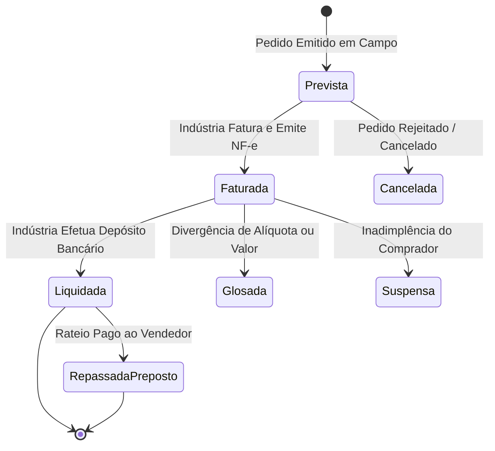

# 6. Módulo de Comissões e Financeiro 💰

> 📄 **Documento de Requisitos Funcionais:** Para as regras de negócio normativas e casos de uso de conciliação (`UC-09` e `UC-10`), consulte o [FRD Oficial](../requirements/FRD-Especificacao-Requisitos-Funcionais.md).

---

## 📊 Como Funciona o Acompanhamento de Comissões

O representante comercial depende de previsibilidade financeira e controle rigoroso de recebimentos. O **CRM-RC** modela o ciclo de vida completo da comissão em conformidade com as regras de negócio (`RN-04`, `RN-05`, `RN-06`, `RN-14`, `RN-15`):

---

## 🔢 Regras de Cálculo e Comissionamento

### 1. Comissão Prevista (Emissão do Pedido)
- Calculada no momento exato em que o pedido é digitado (`UC-05`), aplicando a regra da representada:
  - **Percentual Fixo:** Ex: 5,0% sobre o total dos produtos.
  - **Tabela Escalonada por Desconto:** Descontos comerciais concedidos reduzem proporcionalmente a margem de comissão (ex: 0% desc. = 6% comissão; 5% desc. = 4% comissão).
  - **Diferenciação por Linha de Produto:** Alíquotas distintas para peças, insumos ou máquinas.

### 2. Comissão Faturada & Faturamentos Parciais
- Quando a indústria emite a NF-e (`UC-08`), o representante registra o número da nota, valor faturado e data acordada de pagamento.
- Se houver corte de itens pela fábrica, o sistema calcula a comissão estritamente sobre os itens faturados na NF-e (`RN-07`).

### 3. Liquidação, Conciliação e Deduções Legais
- No momento em que a indústria efetua o pagamento (`UC-09`), o representante realiza a conciliação bancária:
  - **Retenção de IRRF (1,5%):** Previsão para apuração fiscal contábil conforme Lei nº 4.886/65 (`RN-14`).
  - **Apontamento de Glosas:** Registro de divergências entre a comissão calculada pelo CRM e o crédito bancário da indústria.
  - **Estornos por Devolução:** Abatimento de valores de mercadorias devolvidas pelo cliente com emissão de NF de devolução.

### 4. Gestão de Repasse a Prepostos (Vendedores de Campo)
- Para escritórios com equipe (`UC-10`), o sistema apura automaticamente a comissão do preposto (ex: 60% da comissão recebida pelo escritório), desconta adiantamentos e emite o **Extrato de Repasse em PDF**.

