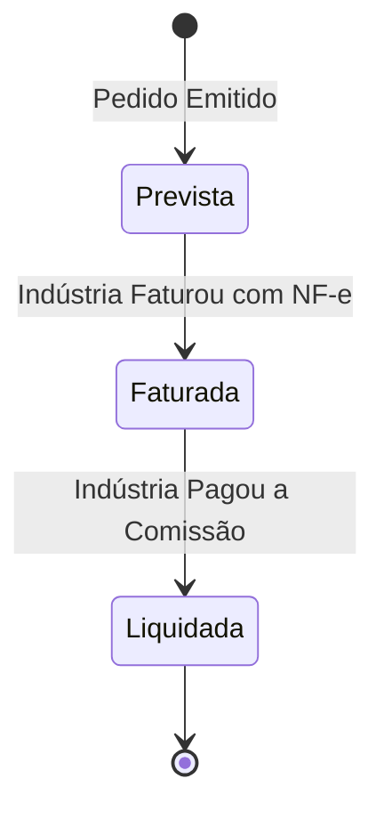

# 6. Módulo de Comissões e Financeiro 💰

## 📊 Como Funciona o Acompanhamento de Comissões

O representante comercial depende de previsibilidade financeira. O CRM-RC separa o fluxo de comissões em 3 estágios:

### 1. Comissão Prevista
- Calculada no momento exato em que o pedido é digitado, com base nas regras de comissionamento da representada e na tabela de preços aplicada.

### 2. Comissão Faturada
- Quando a indústria aprova e fatura o pedido (emitindo a NF-e), o representante atualiza o pedido informando o número da nota fiscal e a data de vencimento da comissão.

### 3. Liquidação e Conciliação
- No momento em que a indústria efetua o depósito da comissão, o representante acessa o **Extrato de Comissões** e marca o valor como recebido.
- Caso haja divergência (por exemplo, abatimento por devolução parcial ou inadimplência), o sistema permite registrar o valor líquido recebido e a justificativa da diferença para auditoria futura.
